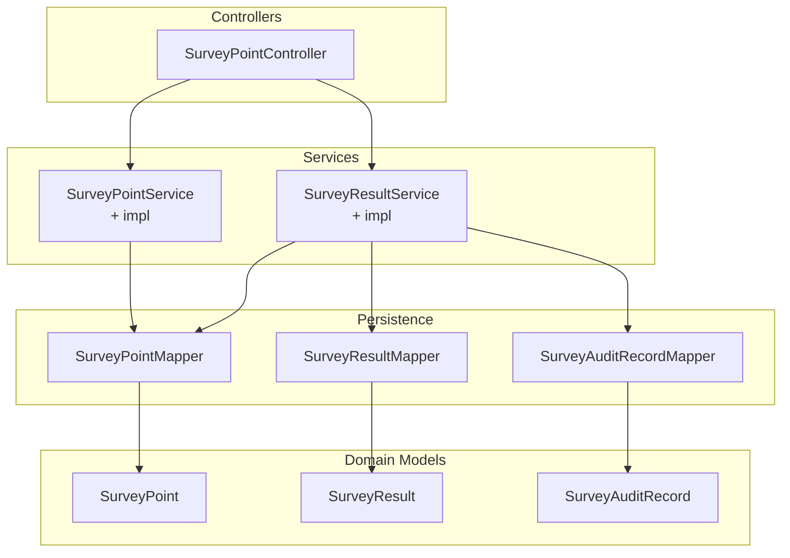
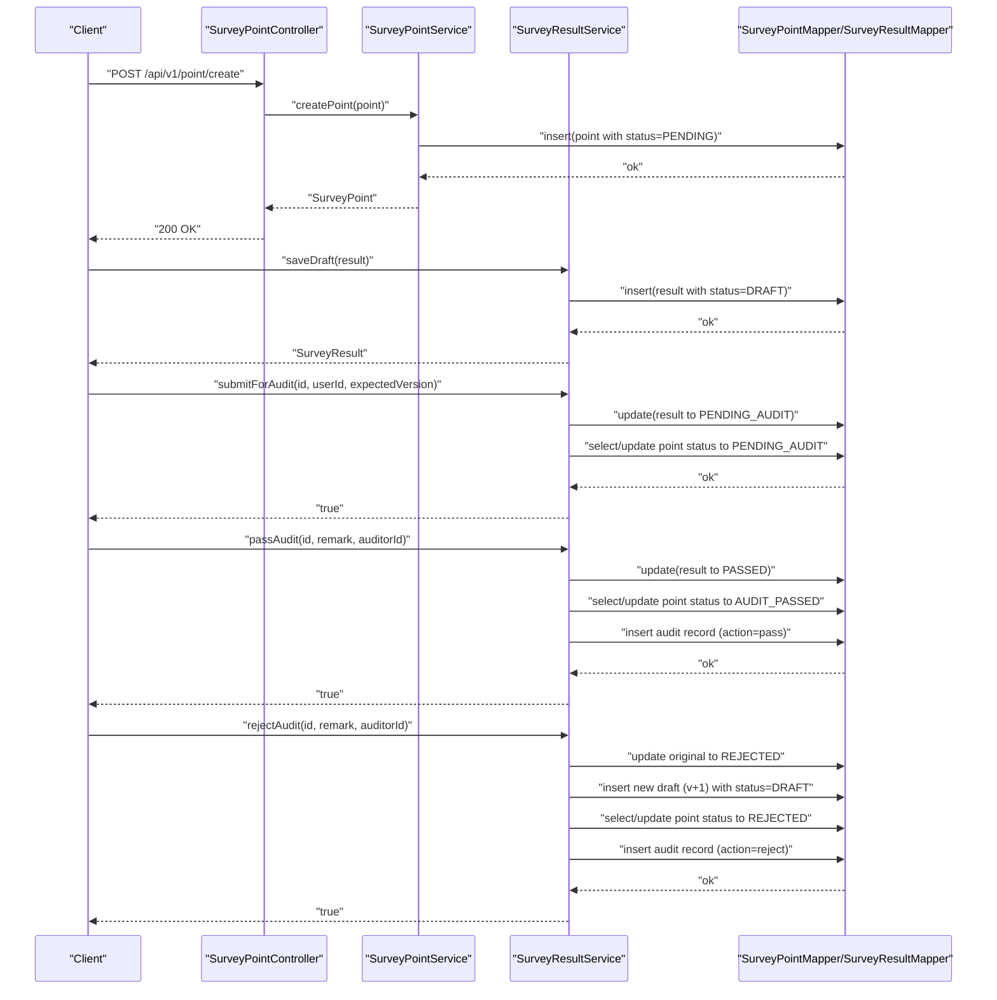
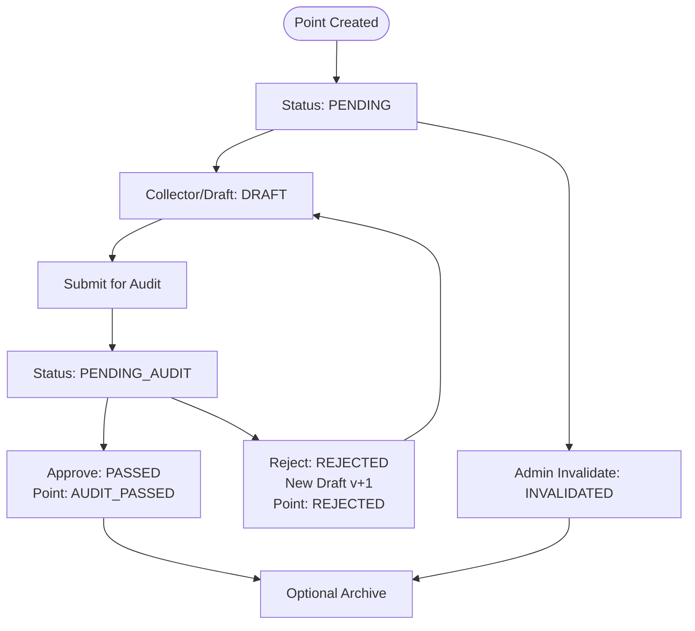
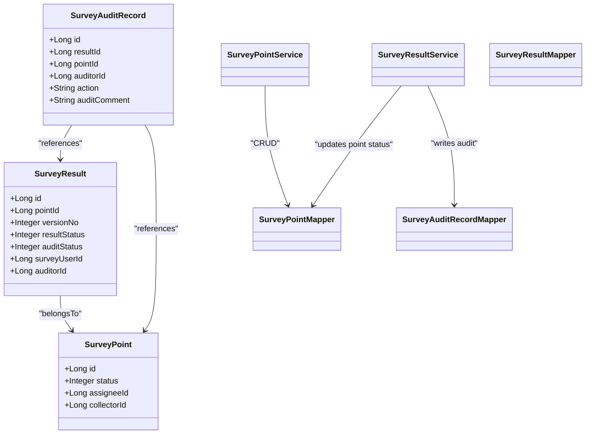

# Status Workflow & Lifecycle Management

<cite>
**Referenced Files in This Document**
- [SurveyPointStatus.java](file://admin-backend/src/main/java/com/qhiot/survey/common/enums/SurveyPointStatus.java)
- [ResultStatus.java](file://admin-backend/src/main/java/com/qhiot/survey/common/enums/ResultStatus.java)
- [SurveyPoint.java](file://admin-backend/src/main/java/com/qhiot/survey/entity/SurveyPoint.java)
- [SurveyResult.java](file://admin-backend/src/main/java/com/qhiot/survey/entity/SurveyResult.java)
- [SurveyAuditRecord.java](file://admin-backend/src/main/java/com/qhiot/survey/entity/SurveyAuditRecord.java)
- [SurveyPointService.java](file://admin-backend/src/main/java/com/qhiot/survey/service/SurveyPointService.java)
- [SurveyPointServiceImpl.java](file://admin-backend/src/main/java/com/qhiot/survey/service/impl/SurveyPointServiceImpl.java)
- [SurveyPointController.java](file://admin-backend/src/main/java/com/qhiot/survey/controller/SurveyPointController.java)
- [SurveyResultService.java](file://admin-backend/src/main/java/com/qhiot/survey/service/SurveyResultService.java)
- [SurveyResultServiceImpl.java](file://admin-backend/src/main/java/com/qhiot/survey/service/impl/SurveyResultServiceImpl.java)
- [SurveyPointMapper.java](file://admin-backend/src/main/java/com/qhiot/survey/mapper/SurveyPointMapper.java)
- [05-database-indexes.sql](file://admin-backend/init-data/05-database-indexes.sql)
- [SurveyResultServiceTest.java](file://admin-backend/src/test/java/com/qhiot/survey/service/SurveyResultServiceTest.java)
</cite>

## Table of Contents
1. [Introduction](#introduction)
2. [Project Structure](#project-structure)
3. [Core Components](#core-components)
4. [Architecture Overview](#architecture-overview)
5. [Detailed Component Analysis](#detailed-component-analysis)
6. [Dependency Analysis](#dependency-analysis)
7. [Performance Considerations](#performance-considerations)
8. [Troubleshooting Guide](#troubleshooting-guide)
9. [Conclusion](#conclusion)
10. [Appendices](#appendices)

## Introduction
This document describes the survey point status workflow and lifecycle management system. It defines all status states, state transition rules, authorization requirements, workflow triggers, notifications, responsible parties, routing and approval chains, escalation procedures, impacts on related entities (survey results and project timelines), exceptions and rollbacks, and audit trail requirements. The system centers around two core entities:
- SurveyPoint: represents a geographic sampling point with lifecycle status.
- SurveyResult: represents versioned submissions for a point, with separate result and audit statuses.

## Project Structure
The workflow spans backend domain models, services, controllers, and persistence layers. Key locations:
- Enums define canonical statuses for both SurveyPoint and SurveyResult.
- Entities model persistent attributes and relationships.
- Services encapsulate business logic for creation, updates, auditing, and history.
- Controllers expose REST endpoints for external integrations.
- Mappers and SQL indexes support efficient querying and reporting.

**Diagram sources**
- [SurveyPoint.java:14-84](file://admin-backend/src/main/java/com/qhiot/survey/entity/SurveyPoint.java#L14-L84)
- [SurveyResult.java:11-93](file://admin-backend/src/main/java/com/qhiot/survey/entity/SurveyResult.java#L11-L93)
- [SurveyAuditRecord.java:10-37](file://admin-backend/src/main/java/com/qhiot/survey/entity/SurveyAuditRecord.java#L10-L37)
- [SurveyPointService.java:12-78](file://admin-backend/src/main/java/com/qhiot/survey/service/SurveyPointService.java#L12-L78)
- [SurveyResultService.java:11-81](file://admin-backend/src/main/java/com/qhiot/survey/service/SurveyResultService.java#L11-L81)
- [SurveyPointController.java:22-142](file://admin-backend/src/main/java/com/qhiot/survey/controller/SurveyPointController.java#L22-L142)
- [SurveyPointMapper.java:12-26](file://admin-backend/src/main/java/com/qhiot/survey/mapper/SurveyPointMapper.java#L12-L26)

**Section sources**
- [SurveyPointController.java:22-142](file://admin-backend/src/main/java/com/qhiot/survey/controller/SurveyPointController.java#L22-L142)
- [SurveyPointService.java:12-78](file://admin-backend/src/main/java/com/qhiot/survey/service/SurveyPointService.java#L12-L78)
- [SurveyResultService.java:11-81](file://admin-backend/src/main/java/com/qhiot/survey/service/SurveyResultService.java#L11-L81)

## Core Components
- SurveyPointStatus (point-level): PENDING, DRAFT, PENDING_AUDIT, AUDIT_PASSED, REJECTED, ARCHIVED, INVALIDATED.
- ResultStatus (result-level): DRAFT, SUBMITTED, PENDING_AUDIT, PASSED, REJECTED, ARCHIVED.
- Responsible parties:
  - Assignee: person responsible for collecting at a point.
  - Collector: person who performs the fieldwork.
  - Survey user: creator/updater of a result.
  - Auditor: reviewer who approves or rejects results.
- Related entities:
  - SurveyResult: versioned submissions per point.
  - SurveyAuditRecord: immutable audit trail entries.

Key implementation references:
- Enum definitions and mappings: [SurveyPointStatus.java:9-16](file://admin-backend/src/main/java/com/qhiot/survey/common/enums/SurveyPointStatus.java#L9-L16), [ResultStatus.java:9-15](file://admin-backend/src/main/java/com/qhiot/survey/common/enums/ResultStatus.java#L9-L15)
- Entity fields and constraints: [SurveyPoint.java:56-84](file://admin-backend/src/main/java/com/qhiot/survey/entity/SurveyPoint.java#L56-L84), [SurveyResult.java:44-93](file://admin-backend/src/main/java/com/qhiot/survey/entity/SurveyResult.java#L44-L93)
- Audit record model: [SurveyAuditRecord.java:18-37](file://admin-backend/src/main/java/com/qhiot/survey/entity/SurveyAuditRecord.java#L18-L37)

**Section sources**
- [SurveyPointStatus.java:9-34](file://admin-backend/src/main/java/com/qhiot/survey/common/enums/SurveyPointStatus.java#L9-L34)
- [ResultStatus.java:9-33](file://admin-backend/src/main/java/com/qhiot/survey/common/enums/ResultStatus.java#L9-L33)
- [SurveyPoint.java:56-84](file://admin-backend/src/main/java/com/qhiot/survey/entity/SurveyPoint.java#L56-L84)
- [SurveyResult.java:44-93](file://admin-backend/src/main/java/com/qhiot/survey/entity/SurveyResult.java#L44-L93)
- [SurveyAuditRecord.java:18-37](file://admin-backend/src/main/java/com/qhiot/survey/entity/SurveyAuditRecord.java#L18-L37)

## Architecture Overview
The workflow integrates point and result lifecycles. Creation initializes a point to PENDING. Field data is captured via SurveyResult drafts. Submissions move results to PENDING_AUDIT; auditors approve (PASSED → point AUDIT_PASSED) or reject (REJECTED → point REJECTED). Archival and invalidation finalize states.

**Diagram sources**
- [SurveyPointController.java:62-66](file://admin-backend/src/main/java/com/qhiot/survey/controller/SurveyPointController.java#L62-L66)
- [SurveyPointServiceImpl.java:44-58](file://admin-backend/src/main/java/com/qhiot/survey/service/impl/SurveyPointServiceImpl.java#L44-L58)
- [SurveyResultServiceImpl.java:55-81](file://admin-backend/src/main/java/com/qhiot/survey/service/impl/SurveyResultServiceImpl.java#L55-L81)
- [SurveyResultServiceImpl.java:270-311](file://admin-backend/src/main/java/com/qhiot/survey/service/impl/SurveyResultServiceImpl.java#L270-L311)
- [SurveyResultServiceImpl.java:158-189](file://admin-backend/src/main/java/com/qhiot/survey/service/impl/SurveyResultServiceImpl.java#L158-L189)
- [SurveyResultServiceImpl.java:191-237](file://admin-backend/src/main/java/com/qhiot/survey/service/impl/SurveyResultServiceImpl.java#L191-L237)

## Detailed Component Analysis

### Status States and Definitions
- SurveyPointStatus (point-level):
  - PENDING: newly created, awaiting assignment and collection.
  - DRAFT: collection started by collector/assignee.
  - PENDING_AUDIT: submitted for review.
  - AUDIT_PASSED: approved; point considered valid.
  - REJECTED: returned for corrections; new draft created automatically.
  - ARCHIVED: historical/closed state.
  - INVALIDATED: invalidated by admin with reason.
- ResultStatus (result-level):
  - DRAFT, SUBMITTED, PENDING_AUDIT, PASSED, REJECTED, ARCHIVED.

Authorization and ownership:
- Survey user must own the result to edit/save/draft.
- Only pending results can be approved; only draft results can be submitted.

**Section sources**
- [SurveyPointStatus.java:9-16](file://admin-backend/src/main/java/com/qhiot/survey/common/enums/SurveyPointStatus.java#L9-L16)
- [ResultStatus.java:9-15](file://admin-backend/src/main/java/com/qhiot/survey/common/enums/ResultStatus.java#L9-L15)
- [SurveyResultServiceImpl.java:278-286](file://admin-backend/src/main/java/com/qhiot/survey/service/impl/SurveyResultServiceImpl.java#L278-L286)
- [SurveyResultServiceImpl.java:97-100](file://admin-backend/src/main/java/com/qhiot/survey/service/impl/SurveyResultServiceImpl.java#L97-L100)

### State Transition Rules

**Diagram sources**
- [SurveyPointServiceImpl.java:44-58](file://admin-backend/src/main/java/com/qhiot/survey/service/impl/SurveyPointServiceImpl.java#L44-L58)
- [SurveyResultServiceImpl.java:270-311](file://admin-backend/src/main/java/com/qhiot/survey/service/impl/SurveyResultServiceImpl.java#L270-L311)
- [SurveyResultServiceImpl.java:158-189](file://admin-backend/src/main/java/com/qhiot/survey/service/impl/SurveyResultServiceImpl.java#L158-L189)
- [SurveyResultServiceImpl.java:191-237](file://admin-backend/src/main/java/com/qhiot/survey/service/impl/SurveyResultServiceImpl.java#L191-L237)

### Authorization and Ownership
- Submit for audit requires:
  - Result status is DRAFT.
  - Caller matches surveyUserId.
  - Optional version validation ensures concurrency safety.
- Approve/Reject requires:
  - Result status is PENDING_AUDIT.
  - Authorized auditor.
- Invalidate point requires administrative capability.

Evidence:
- Version conflict checks and ownership checks during submit: [SurveyResultServiceImpl.java:283-306](file://admin-backend/src/main/java/com/qhiot/survey/service/impl/SurveyResultServiceImpl.java#L283-L306)
- Ownership check during saveDraft: [SurveyResultServiceImpl.java:316-331](file://admin-backend/src/main/java/com/qhiot/survey/service/impl/SurveyResultServiceImpl.java#L316-L331)
- Approve precondition: [SurveyResultServiceImpl.java:165-168](file://admin-backend/src/main/java/com/qhiot/survey/service/impl/SurveyResultServiceImpl.java#L165-L168)
- Reject precondition: [SurveyResultServiceImpl.java:199-202](file://admin-backend/src/main/java/com/qhiot/survey/service/impl/SurveyResultServiceImpl.java#L199-L202)
- Invalidate point: [SurveyPointServiceImpl.java:200-209](file://admin-backend/src/main/java/com/qhiot/survey/service/impl/SurveyPointServiceImpl.java#L200-L209)

**Section sources**
- [SurveyResultServiceImpl.java:278-331](file://admin-backend/src/main/java/com/qhiot/survey/service/impl/SurveyResultServiceImpl.java#L278-L331)
- [SurveyResultServiceImpl.java:158-202](file://admin-backend/src/main/java/com/qhiot/survey/service/impl/SurveyResultServiceImpl.java#L158-L202)
- [SurveyPointServiceImpl.java:200-209](file://admin-backend/src/main/java/com/qhiot/survey/service/impl/SurveyPointServiceImpl.java#L200-L209)

### Workflow Triggers
- Automatic transitions:
  - Creation sets point to PENDING.
  - Submitting a draft moves result to PENDING_AUDIT and point to PENDING_AUDIT.
  - Approving a pending result moves result to PASSED and point to AUDIT_PASSED.
  - Rejecting a pending result marks original as REJECTED, creates a new DRAFT v+1, and sets point to REJECTED.
- Manual approvals:
  - Auditors call passAudit or rejectAudit.
- System events:
  - Version conflict detection during submit prevents stale updates.
  - Audit records persist for all decisions.

**Section sources**
- [SurveyPointServiceImpl.java:44-58](file://admin-backend/src/main/java/com/qhiot/survey/service/impl/SurveyPointServiceImpl.java#L44-L58)
- [SurveyResultServiceImpl.java:270-311](file://admin-backend/src/main/java/com/qhiot/survey/service/impl/SurveyResultServiceImpl.java#L270-L311)
- [SurveyResultServiceImpl.java:158-237](file://admin-backend/src/main/java/com/qhiot/survey/service/impl/SurveyResultServiceImpl.java#L158-L237)

### Notification Mechanisms and Responsible Parties
- Responsible parties:
  - Assignee: assigned to a point; may receive notifications upon status changes.
  - Collector: primary owner of the result; receives notifications for draft updates and submission outcomes.
  - Auditor: receives notifications for items assigned to review; audit actions recorded in SurveyAuditRecord.
- Notifications:
  - Not visible in the provided code; implement via message center or event bus in production.
- Audit trail:
  - Every pass/reject generates a SurveyAuditRecord with action, comment, and timestamps.

**Section sources**
- [SurveyResultServiceImpl.java:242-251](file://admin-backend/src/main/java/com/qhiot/survey/service/impl/SurveyResultServiceImpl.java#L242-L251)
- [SurveyAuditRecord.java:27-30](file://admin-backend/src/main/java/com/qhiot/survey/entity/SurveyAuditRecord.java#L27-L30)

### Examples: Routing, Approval Chains, Escalation
- Routing:
  - Results are routed to PENDING_AUDIT after submission; auditors review by querying audit pages filtered by status.
- Approval chains:
  - Single-tier approval supported; extend by adding hierarchical roles and multi-stage checks.
- Escalation:
  - Not implemented in code; can be modeled by assigning higher-level auditors or increasing thresholds.

Note: These are design patterns; no explicit escalation logic exists in the provided code.

**Section sources**
- [SurveyResultService.java:39-41](file://admin-backend/src/main/java/com/qhiot/survey/service/SurveyResultService.java#L39-L41)
- [SurveyResultServiceImpl.java:120-155](file://admin-backend/src/main/java/com/qhiot/survey/service/impl/SurveyResultServiceImpl.java#L120-L155)

### Impact on Related Entities
- Survey results:
  - Versioning: rejecting a result duplicates data into a new DRAFT with incremented version number.
  - Status propagation: point status mirrors result audit outcome.
- Project timelines:
  - Point status influences downstream scheduling and reporting; archived or invalidated points are excluded from active workstreams.

**Section sources**
- [SurveyResultServiceImpl.java:212-224](file://admin-backend/src/main/java/com/qhiot/survey/service/impl/SurveyResultServiceImpl.java#L212-L224)
- [SurveyResultServiceImpl.java:178-183](file://admin-backend/src/main/java/com/qhiot/survey/service/impl/SurveyResultServiceImpl.java#L178-L183)

### Exceptions, Rollback, and Audit Trail
- Exceptions:
  - Non-draft submission attempts, non-pending audits, unauthorized edits, and version conflicts raise business exceptions.
- Rollback:
  - Reject does not delete data; it preserves the rejected version and creates a new editable draft.
- Audit trail:
  - All approvals and rejections write immutable records with action, comment, and timestamps.

**Section sources**
- [SurveyResultServiceImpl.java:165-168](file://admin-backend/src/main/java/com/qhiot/survey/service/impl/SurveyResultServiceImpl.java#L165-L168)
- [SurveyResultServiceImpl.java:199-202](file://admin-backend/src/main/java/com/qhiot/survey/service/impl/SurveyResultServiceImpl.java#L199-L202)
- [SurveyResultServiceImpl.java:289-306](file://admin-backend/src/main/java/com/qhiot/survey/service/impl/SurveyResultServiceImpl.java#L289-L306)
- [SurveyResultServiceImpl.java:242-251](file://admin-backend/src/main/java/com/qhiot/survey/service/impl/SurveyResultServiceImpl.java#L242-L251)

## Dependency Analysis

**Diagram sources**
- [SurveyPoint.java:19-84](file://admin-backend/src/main/java/com/qhiot/survey/entity/SurveyPoint.java#L19-L84)
- [SurveyResult.java:19-93](file://admin-backend/src/main/java/com/qhiot/survey/entity/SurveyResult.java#L19-L93)
- [SurveyAuditRecord.java:18-37](file://admin-backend/src/main/java/com/qhiot/survey/entity/SurveyAuditRecord.java#L18-L37)
- [SurveyResultServiceImpl.java:178-183](file://admin-backend/src/main/java/com/qhiot/survey/service/impl/SurveyResultServiceImpl.java#L178-L183)
- [SurveyResultServiceImpl.java:242-251](file://admin-backend/src/main/java/com/qhiot/survey/service/impl/SurveyResultServiceImpl.java#L242-L251)
- [SurveyPointMapper.java:12-26](file://admin-backend/src/main/java/com/qhiot/survey/mapper/SurveyPointMapper.java#L12-L26)

**Section sources**
- [SurveyResultServiceImpl.java:178-183](file://admin-backend/src/main/java/com/qhiot/survey/service/impl/SurveyResultServiceImpl.java#L178-L183)
- [SurveyResultServiceImpl.java:242-251](file://admin-backend/src/main/java/com/qhiot/survey/service/impl/SurveyResultServiceImpl.java#L242-L251)
- [SurveyPointMapper.java:12-26](file://admin-backend/src/main/java/com/qhiot/survey/mapper/SurveyPointMapper.java#L12-L26)

## Performance Considerations
- Database indexes support efficient filtering and pagination:
  - survey_point: composite (project_id, status), assignee_id, outfall_type, create_time.
  - survey_result: (point_id, version_no), survey_user_id, result_status, audit_status, create_time.
  - survey_audit_record: result_id, point_id, auditor_id, create_time.
- Recommendations:
  - Use paginated queries for large datasets.
  - Indexes on frequently filtered fields reduce query latency.
  - Batch operations for bulk assignments and imports.

**Section sources**
- [05-database-indexes.sql:74-99](file://admin-backend/init-data/05-database-indexes.sql#L74-L99)

## Troubleshooting Guide
Common issues and resolutions:
- Submitting a non-draft result:
  - Symptom: Business exception indicating only draft results can be submitted.
  - Resolution: Ensure the result is in DRAFT status before submitting.
  - Evidence: [SurveyResultServiceImpl.java:278-281](file://admin-backend/src/main/java/com/qhiot/survey/service/impl/SurveyResultServiceImpl.java#L278-L281)
- Unauthorized operation:
  - Symptom: Business exception for “no permission” when editing or submitting.
  - Resolution: Verify the caller matches the surveyUserId.
  - Evidence: [SurveyResultServiceImpl.java:284-286](file://admin-backend/src/main/java/com/qhiot/survey/service/impl/SurveyResultServiceImpl.java#L284-L286)
- Version conflict:
  - Symptom: Business exception indicating version mismatch or outdated version.
  - Resolution: Refresh UI and resubmit with matching version.
  - Evidence: [SurveyResultServiceImpl.java:289-306](file://admin-backend/src/main/java/com/qhiot/survey/service/impl/SurveyResultServiceImpl.java#L289-L306)
- Rejecting a non-pending result:
  - Symptom: Business exception stating only pending results can be audited.
  - Resolution: Approve or re-submit the result to PENDING_AUDIT first.
  - Evidence: [SurveyResultServiceImpl.java:199-202](file://admin-backend/src/main/java/com/qhiot/survey/service/impl/SurveyResultServiceImpl.java#L199-L202)
- Approving a non-pending result:
  - Symptom: Business exception stating only pending results can be approved.
  - Resolution: Ensure the result is in PENDING_AUDIT.
  - Evidence: [SurveyResultServiceImpl.java:165-168](file://admin-backend/src/main/java/com/qhiot/survey/service/impl/SurveyResultServiceImpl.java#L165-L168)

**Section sources**
- [SurveyResultServiceImpl.java:278-306](file://admin-backend/src/main/java/com/qhiot/survey/service/impl/SurveyResultServiceImpl.java#L278-L306)
- [SurveyResultServiceImpl.java:165-202](file://admin-backend/src/main/java/com/qhiot/survey/service/impl/SurveyResultServiceImpl.java#L165-L202)

## Conclusion
The system enforces a clear, auditable lifecycle for survey points and their results. It supports safe concurrent editing, robust approval workflows, and comprehensive audit trails. Extensions for multi-level approvals, escalation, and notifications can be layered on top of the existing services and entities.

## Appendices

### Appendix A: Endpoints and Responsibilities
- Point management:
  - Create, update, delete, batch-create, import from Excel, batch assign, invalidate, history.
  - Controller: [SurveyPointController.java:62-131](file://admin-backend/src/main/java/com/qhiot/survey/controller/SurveyPointController.java#L62-L131)
  - Service: [SurveyPointService.java:12-78](file://admin-backend/src/main/java/com/qhiot/survey/service/SurveyPointService.java#L12-L78)
  - Implementation: [SurveyPointServiceImpl.java:44-209](file://admin-backend/src/main/java/com/qhiot/survey/service/impl/SurveyPointServiceImpl.java#L44-L209)

**Section sources**
- [SurveyPointController.java:62-131](file://admin-backend/src/main/java/com/qhiot/survey/controller/SurveyPointController.java#L62-L131)
- [SurveyPointService.java:12-78](file://admin-backend/src/main/java/com/qhiot/survey/service/SurveyPointService.java#L12-L78)
- [SurveyPointServiceImpl.java:44-209](file://admin-backend/src/main/java/com/qhiot/survey/service/impl/SurveyPointServiceImpl.java#L44-L209)

### Appendix B: Tests Demonstrating Behavior
- Submit for audit from draft:
  - [SurveyResultServiceTest.java:112-128](file://admin-backend/src/test/java/com/qhiot/survey/service/SurveyResultServiceTest.java#L112-L128)
- Reject audit and new draft creation:
  - [SurveyResultServiceTest.java:213-231](file://admin-backend/src/test/java/com/qhiot/survey/service/SurveyResultServiceTest.java#L213-L231)
- Pass audit and point status update:
  - [SurveyResultServiceTest.java:171-187](file://admin-backend/src/test/java/com/qhiot/survey/service/SurveyResultServiceTest.java#L171-L187)

**Section sources**
- [SurveyResultServiceTest.java:112-128](file://admin-backend/src/test/java/com/qhiot/survey/service/SurveyResultServiceTest.java#L112-L128)
- [SurveyResultServiceTest.java:213-231](file://admin-backend/src/test/java/com/qhiot/survey/service/SurveyResultServiceTest.java#L213-L231)
- [SurveyResultServiceTest.java:171-187](file://admin-backend/src/test/java/com/qhiot/survey/service/SurveyResultServiceTest.java#L171-L187)