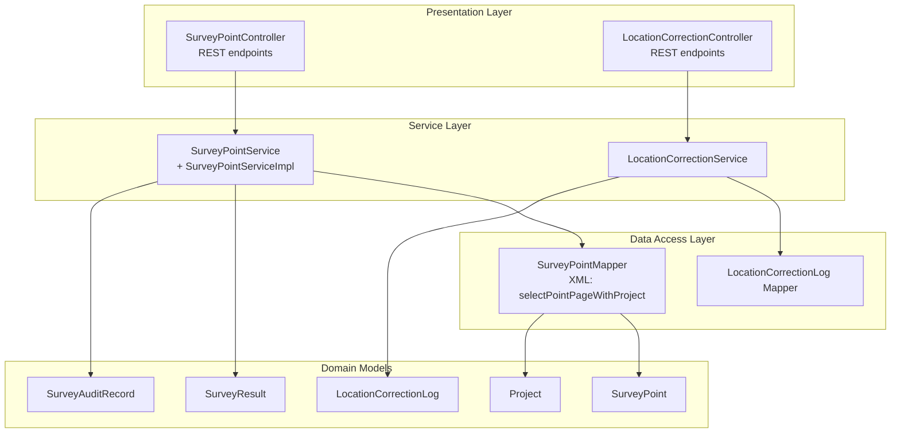
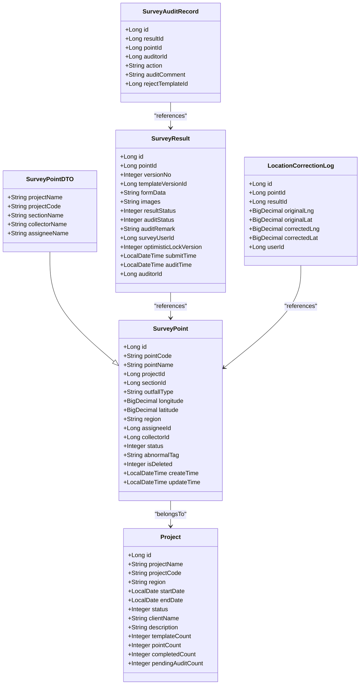
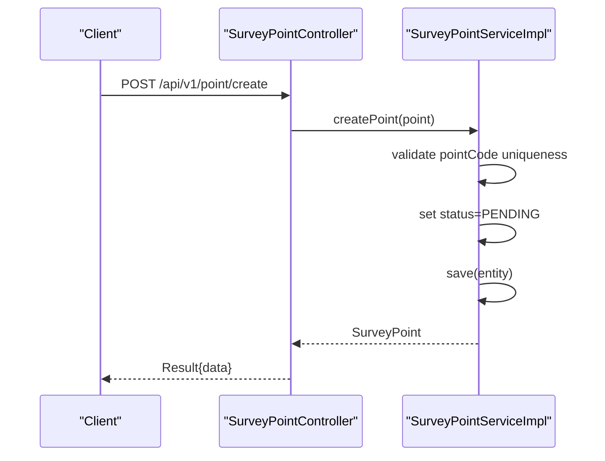
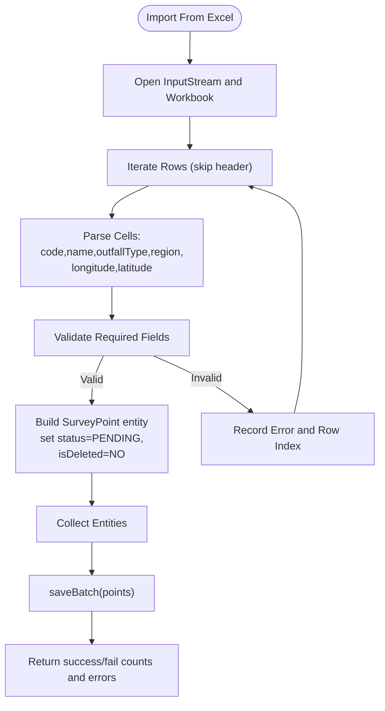
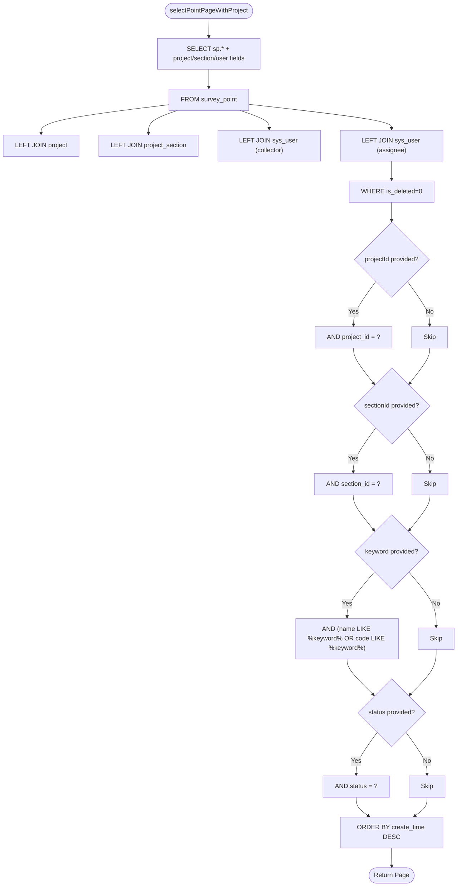
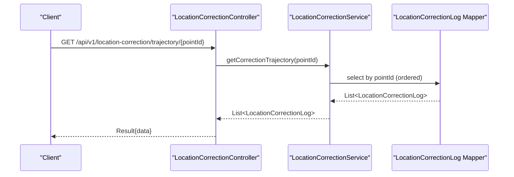
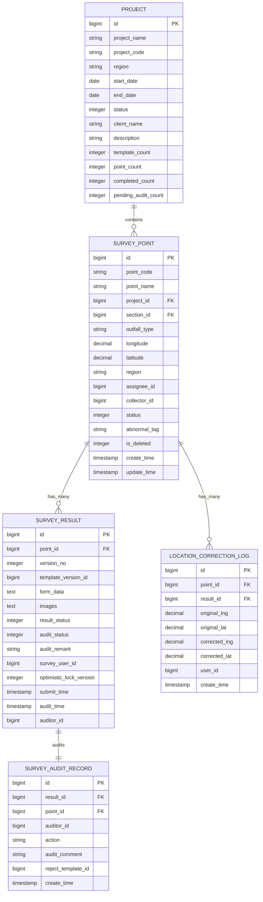
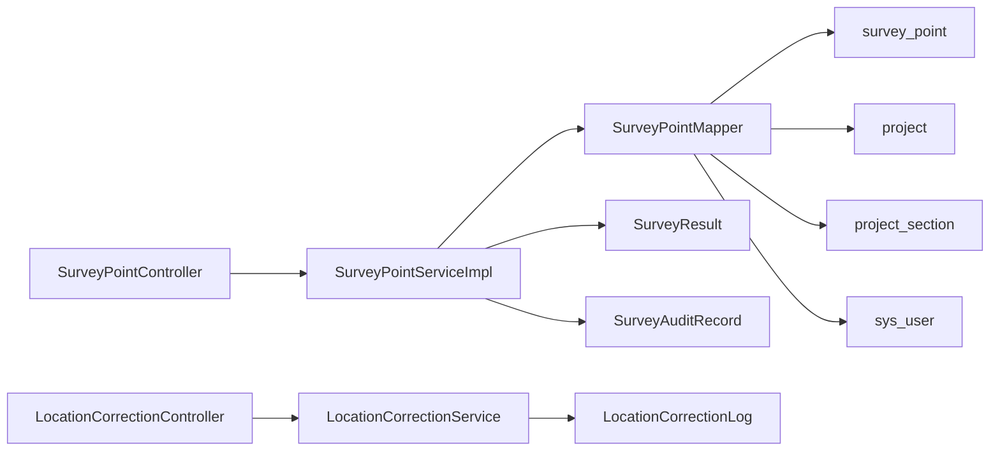

# Survey Point Management

<cite>
**Referenced Files in This Document**
- [SurveyPoint.java](file://admin-backend/src/main/java/com/qhiot/survey/entity/SurveyPoint.java)
- [SurveyPointDTO.java](file://admin-backend/src/main/java/com/qhiot/survey/dto/SurveyPointDTO.java)
- [SurveyPointController.java](file://admin-backend/src/main/java/com/qhiot/survey/controller/SurveyPointController.java)
- [SurveyPointService.java](file://admin-backend/src/main/java/com/qhiot/survey/service/SurveyPointService.java)
- [SurveyPointServiceImpl.java](file://admin-backend/src/main/java/com/qhiot/survey/service/impl/SurveyPointServiceImpl.java)
- [SurveyPointMapper.java](file://admin-backend/src/main/java/com/qhiot/survey/mapper/SurveyPointMapper.java)
- [SurveyPointMapper.xml](file://admin-backend/src/main/resources/mapper/SurveyPointMapper.xml)
- [SurveyPointStatus.java](file://admin-backend/src/main/java/com/qhiot/survey/common/enums/SurveyPointStatus.java)
- [Project.java](file://admin-backend/src/main/java/com/qhiot/survey/entity/Project.java)
- [SurveyResult.java](file://admin-backend/src/main/java/com/qhiot/survey/entity/SurveyResult.java)
- [LocationCorrectionLog.java](file://admin-backend/src/main/java/com/qhiot/survey/entity/LocationCorrectionLog.java)
- [LocationCorrectionService.java](file://admin-backend/src/main/java/com/qhiot/survey/service/LocationCorrectionService.java)
- [LocationCorrectionController.java](file://admin-backend/src/main/java/com/qhiot/survey/controller/LocationCorrectionController.java)
- [SurveyAuditRecord.java](file://admin-backend/src/main/java/com/qhiot/survey/entity/SurveyAuditRecord.java)
</cite>

## Table of Contents
1. [Introduction](#introduction)
2. [Project Structure](#project-structure)
3. [Core Components](#core-components)
4. [Architecture Overview](#architecture-overview)
5. [Detailed Component Analysis](#detailed-component-analysis)
6. [Dependency Analysis](#dependency-analysis)
7. [Performance Considerations](#performance-considerations)
8. [Troubleshooting Guide](#troubleshooting-guide)
9. [Conclusion](#conclusion)
10. [Appendices](#appendices)

## Introduction
This document describes the survey point management system, focusing on the core entity model for survey points, CRUD operations, lifecycle status workflow, integrations with mapping services for location verification and manual correction, filtering and search capabilities, geographic data handling, and relationships with projects, survey results, and audit trails. It also provides guidance on performance considerations for large-scale datasets and spatial indexing strategies.

## Project Structure
The survey point management system resides primarily in the backend module under admin-backend. The key layers are:
- Entity layer: domain models for survey points, projects, survey results, and location correction logs
- Data Access: MyBatis mapper interfaces and XML SQL mappings
- Service layer: business logic for CRUD, bulk operations, status transitions, and import/export
- Controller layer: REST endpoints exposing point management APIs
- Enums and DTOs: status enumeration and enriched DTO for listing with project/user metadata

**Diagram sources**
- [SurveyPointController.java:21-140](file://admin-backend/src/main/java/com/qhiot/survey/controller/SurveyPointController.java#L21-L140)
- [LocationCorrectionController.java:19-49](file://admin-backend/src/main/java/com/qhiot/survey/controller/LocationCorrectionController.java#L19-L49)
- [SurveyPointService.java:12-79](file://admin-backend/src/main/java/com/qhiot/survey/service/SurveyPointService.java#L12-L79)
- [SurveyPointServiceImpl.java:29-261](file://admin-backend/src/main/java/com/qhiot/survey/service/impl/SurveyPointServiceImpl.java#L29-L261)
- [SurveyPointMapper.java:12-26](file://admin-backend/src/main/java/com/qhiot/survey/mapper/SurveyPointMapper.java#L12-L26)
- [SurveyPointMapper.xml:5-48](file://admin-backend/src/main/resources/mapper/SurveyPointMapper.xml#L5-L48)
- [SurveyPoint.java:17-84](file://admin-backend/src/main/java/com/qhiot/survey/entity/SurveyPoint.java#L17-L84)
- [Project.java:16-84](file://admin-backend/src/main/java/com/qhiot/survey/entity/Project.java#L16-L84)
- [SurveyResult.java:14-93](file://admin-backend/src/main/java/com/qhiot/survey/entity/SurveyResult.java#L14-L93)
- [LocationCorrectionLog.java:14-37](file://admin-backend/src/main/java/com/qhiot/survey/entity/LocationCorrectionLog.java#L14-L37)
- [SurveyAuditRecord.java:13-37](file://admin-backend/src/main/java/com/qhiot/survey/entity/SurveyAuditRecord.java#L13-L37)

**Section sources**
- [SurveyPointController.java:21-140](file://admin-backend/src/main/java/com/qhiot/survey/controller/SurveyPointController.java#L21-L140)
- [SurveyPointService.java:12-79](file://admin-backend/src/main/java/com/qhiot/survey/service/SurveyPointService.java#L12-L79)
- [SurveyPointServiceImpl.java:29-261](file://admin-backend/src/main/java/com/qhiot/survey/service/impl/SurveyPointServiceImpl.java#L29-L261)
- [SurveyPointMapper.java:12-26](file://admin-backend/src/main/java/com/qhiot/survey/mapper/SurveyPointMapper.java#L12-L26)
- [SurveyPointMapper.xml:5-48](file://admin-backend/src/main/resources/mapper/SurveyPointMapper.xml#L5-L48)

## Core Components
- SurveyPoint entity: captures point identity, project association, spatial coordinates, administrative region, assignee/collector, status, abnormal tag, and timestamps. It uses logical deletion via a dedicated flag.
- SurveyPointDTO: extends SurveyPoint with enriched metadata for listing, including project name/code, section name, and usernames for collector and assignee.
- SurveyPointService and SurveyPointServiceImpl: define and implement CRUD, pagination, bulk operations, Excel import, batch assignment, invalidation, and history retrieval.
- SurveyPointMapper and XML: encapsulate SQL for paginated queries with joins to project, section, and user tables, enabling filtered and searchable listings.
- Status enumeration: SurveyPointStatus defines lifecycle states (pending, draft, pending audit, audit passed, rejected, archived, invalidated).
- Related entities: Project, SurveyResult, LocationCorrectionLog, and SurveyAuditRecord connect points to projects, results, and correction/trail records.

**Section sources**
- [SurveyPoint.java:17-84](file://admin-backend/src/main/java/com/qhiot/survey/entity/SurveyPoint.java#L17-L84)
- [SurveyPointDTO.java:13-42](file://admin-backend/src/main/java/com/qhiot/survey/dto/SurveyPointDTO.java#L13-L42)
- [SurveyPointService.java:12-79](file://admin-backend/src/main/java/com/qhiot/survey/service/SurveyPointService.java#L12-L79)
- [SurveyPointServiceImpl.java:29-261](file://admin-backend/src/main/java/com/qhiot/survey/service/impl/SurveyPointServiceImpl.java#L29-L261)
- [SurveyPointMapper.java:12-26](file://admin-backend/src/main/java/com/qhiot/survey/mapper/SurveyPointMapper.java#L12-L26)
- [SurveyPointMapper.xml:5-48](file://admin-backend/src/main/resources/mapper/SurveyPointMapper.xml#L5-L48)
- [SurveyPointStatus.java:8-34](file://admin-backend/src/main/java/com/qhiot/survey/common/enums/SurveyPointStatus.java#L8-L34)
- [Project.java:16-84](file://admin-backend/src/main/java/com/qhiot/survey/entity/Project.java#L16-L84)
- [SurveyResult.java:14-93](file://admin-backend/src/main/java/com/qhiot/survey/entity/SurveyResult.java#L14-L93)
- [LocationCorrectionLog.java:14-37](file://admin-backend/src/main/java/com/qhiot/survey/entity/LocationCorrectionLog.java#L14-L37)
- [SurveyAuditRecord.java:13-37](file://admin-backend/src/main/java/com/qhiot/survey/entity/SurveyAuditRecord.java#L13-L37)

## Architecture Overview
The system follows a layered architecture:
- Controllers expose REST endpoints for point management and location correction
- Services encapsulate business logic and orchestrate data access
- Mappers execute SQL queries and map results to entities/DTOs
- Entities represent domain data with JPA-style annotations and logical deletion

**Diagram sources**
- [SurveyPoint.java:17-84](file://admin-backend/src/main/java/com/qhiot/survey/entity/SurveyPoint.java#L17-L84)
- [SurveyPointDTO.java:13-42](file://admin-backend/src/main/java/com/qhiot/survey/dto/SurveyPointDTO.java#L13-L42)
- [Project.java:16-84](file://admin-backend/src/main/java/com/qhiot/survey/entity/Project.java#L16-L84)
- [SurveyResult.java:14-93](file://admin-backend/src/main/java/com/qhiot/survey/entity/SurveyResult.java#L14-L93)
- [LocationCorrectionLog.java:14-37](file://admin-backend/src/main/java/com/qhiot/survey/entity/LocationCorrectionLog.java#L14-L37)
- [SurveyAuditRecord.java:13-37](file://admin-backend/src/main/java/com/qhiot/survey/entity/SurveyAuditRecord.java#L13-L37)

## Detailed Component Analysis

### Entity Model: SurveyPoint
- Identity and associations: unique identifiers for point, project, section, assignee, and collector
- Spatial data: longitude and latitude as precise decimal values
- Administrative context: region and outfall type
- Lifecycle: status tracks progression; abnormal tag stores invalidation reasons; logical deletion flag supports soft deletes
- Timestamps: creation and update times

**Section sources**
- [SurveyPoint.java:17-84](file://admin-backend/src/main/java/com/qhiot/survey/entity/SurveyPoint.java#L17-L84)

### DTO: SurveyPointDTO
- Extends SurveyPoint with enriched metadata for UI listing: project name/code, section name, and usernames for collector and assignee
- Enables efficient rendering without additional round-trips

**Section sources**
- [SurveyPointDTO.java:13-42](file://admin-backend/src/main/java/com/qhiot/survey/dto/SurveyPointDTO.java#L13-L42)

### Status Workflow: SurveyPointStatus
- States: pending, draft, pending audit, audit passed, rejected, archived, invalidated
- Provides a controlled lifecycle for point progression and compliance

**Section sources**
- [SurveyPointStatus.java:8-34](file://admin-backend/src/main/java/com/qhiot/survey/common/enums/SurveyPointStatus.java#L8-L34)

### Controller: SurveyPointController
- Endpoints:
  - Pagination and listing by project/section/status/keyword
  - Get by ID
  - Create, update, delete
  - Batch create
  - Import from Excel
  - Batch assign
  - Invalidate point
  - Retrieve point history
  - Batch set outfall type

**Diagram sources**
- [SurveyPointController.java:60-65](file://admin-backend/src/main/java/com/qhiot/survey/controller/SurveyPointController.java#L60-L65)
- [SurveyPointServiceImpl.java:44-58](file://admin-backend/src/main/java/com/qhiot/survey/service/impl/SurveyPointServiceImpl.java#L44-L58)

**Section sources**
- [SurveyPointController.java:29-140](file://admin-backend/src/main/java/com/qhiot/survey/controller/SurveyPointController.java#L29-L140)

### Service: SurveyPointService and Implementation
- CRUD and lifecycle:
  - Create: validates uniqueness of pointCode, sets initial status to pending, persists
  - Update: updates attributes by ID
  - Delete: performs logical deletion
  - Get by status and project
- Bulk operations:
  - Batch create: inserts multiple points efficiently
  - Batch assign: assigns multiple points to a user within a project
  - Batch set outfall type: bulk update of outfall classification
- Import:
  - Excel parsing with robust row-wise validation and batch persistence
- History:
  - Retrieves historical survey results for a point to build a version trail
- Pagination and filtering:
  - Supports project/section filters, keyword search across name/code, and status filter
  - Returns enriched DTOs with project/user metadata

**Diagram sources**
- [SurveyPointServiceImpl.java:127-185](file://admin-backend/src/main/java/com/qhiot/survey/service/impl/SurveyPointServiceImpl.java#L127-L185)

**Section sources**
- [SurveyPointService.java:12-79](file://admin-backend/src/main/java/com/qhiot/survey/service/SurveyPointService.java#L12-L79)
- [SurveyPointServiceImpl.java:36-246](file://admin-backend/src/main/java/com/qhiot/survey/service/impl/SurveyPointServiceImpl.java#L36-L246)

### Data Access: SurveyPointMapper and XML
- SQL paginates and filters points with optional project/section/status/keyword criteria
- Joins with project, project_section, and sys_user to enrich DTO fields
- Orders by creation time descending

**Diagram sources**
- [SurveyPointMapper.xml:5-48](file://admin-backend/src/main/resources/mapper/SurveyPointMapper.xml#L5-L48)

**Section sources**
- [SurveyPointMapper.java:12-26](file://admin-backend/src/main/java/com/qhiot/survey/mapper/SurveyPointMapper.java#L12-L26)
- [SurveyPointMapper.xml:5-48](file://admin-backend/src/main/resources/mapper/SurveyPointMapper.xml#L5-L48)

### Mapping Services Integration: Location Correction
- LocationCorrectionLog captures original and corrected coordinates, associated result and point, and the user who performed the correction
- LocationCorrectionController exposes endpoints to list logs, fetch trajectory, and save correction logs
- This enables manual correction workflows and auditability of location changes

**Diagram sources**
- [LocationCorrectionController.java:36-40](file://admin-backend/src/main/java/com/qhiot/survey/controller/LocationCorrectionController.java#L36-L40)
- [LocationCorrectionLog.java:14-37](file://admin-backend/src/main/java/com/qhiot/survey/entity/LocationCorrectionLog.java#L14-L37)

**Section sources**
- [LocationCorrectionController.java:19-49](file://admin-backend/src/main/java/com/qhiot/survey/controller/LocationCorrectionController.java#L19-L49)
- [LocationCorrectionService.java:11-27](file://admin-backend/src/main/java/com/qhiot/survey/service/LocationCorrectionService.java#L11-L27)
- [LocationCorrectionLog.java:14-37](file://admin-backend/src/main/java/com/qhiot/survey/entity/LocationCorrectionLog.java#L14-L37)

### Relationships with Projects, Survey Results, and Audit Trails
- Project association: SurveyPoint belongs to a Project; listing endpoints join with Project to enrich DTOs
- Survey results: Each point can have multiple results with versioning; history endpoint aggregates result statuses and audit info
- Audit trail: SurveyAuditRecord captures reviewer actions per result, enabling traceability

**Diagram sources**
- [Project.java:16-84](file://admin-backend/src/main/java/com/qhiot/survey/entity/Project.java#L16-L84)
- [SurveyPoint.java:17-84](file://admin-backend/src/main/java/com/qhiot/survey/entity/SurveyPoint.java#L17-L84)
- [SurveyResult.java:14-93](file://admin-backend/src/main/java/com/qhiot/survey/entity/SurveyResult.java#L14-L93)
- [LocationCorrectionLog.java:14-37](file://admin-backend/src/main/java/com/qhiot/survey/entity/LocationCorrectionLog.java#L14-L37)
- [SurveyAuditRecord.java:13-37](file://admin-backend/src/main/java/com/qhiot/survey/entity/SurveyAuditRecord.java#L13-L37)

**Section sources**
- [SurveyPointMapper.xml:23-32](file://admin-backend/src/main/resources/mapper/SurveyPointMapper.xml#L23-L32)
- [SurveyResult.java:14-93](file://admin-backend/src/main/java/com/qhiot/survey/entity/SurveyResult.java#L14-L93)
- [SurveyAuditRecord.java:13-37](file://admin-backend/src/main/java/com/qhiot/survey/entity/SurveyAuditRecord.java#L13-L37)

### CRUD Operations and Business Logic
- Create: Enforces unique pointCode, initializes status to pending, and persists
- Update: Replaces attributes by ID and returns refreshed entity
- Delete: Soft deletes by setting logical deletion flag
- Batch create: Efficiently persists multiple points
- Batch assign: Updates assignee for selected points within a project
- Invalidate: Transitions point to invalidated state with abnormal tag
- History: Aggregates result versions and audit statuses for traceability

**Section sources**
- [SurveyPointServiceImpl.java:44-82](file://admin-backend/src/main/java/com/qhiot/survey/service/impl/SurveyPointServiceImpl.java#L44-L82)
- [SurveyPointServiceImpl.java:92-95](file://admin-backend/src/main/java/com/qhiot/survey/service/impl/SurveyPointServiceImpl.java#L92-L95)
- [SurveyPointServiceImpl.java:187-197](file://admin-backend/src/main/java/com/qhiot/survey/service/impl/SurveyPointServiceImpl.java#L187-L197)
- [SurveyPointServiceImpl.java:200-209](file://admin-backend/src/main/java/com/qhiot/survey/service/impl/SurveyPointServiceImpl.java#L200-L209)
- [SurveyPointServiceImpl.java:211-234](file://admin-backend/src/main/java/com/qhiot/survey/service/impl/SurveyPointServiceImpl.java#L211-L234)

### Filtering, Search, and Geographic Queries
- Filtering: By project, section, status, and keyword (name or code)
- Search: Full-text-like substring match on point name and code
- Geographic handling: Coordinates stored as precise decimals; mapping services can consume these fields for verification and manual correction workflows

**Section sources**
- [SurveyPointMapper.xml:34-46](file://admin-backend/src/main/resources/mapper/SurveyPointMapper.xml#L34-L46)
- [SurveyPointServiceImpl.java:97-119](file://admin-backend/src/main/java/com/qhiot/survey/service/impl/SurveyPointServiceImpl.java#L97-L119)

### Examples
- Point creation: Use POST /api/v1/point/create with a SurveyPoint payload; the service sets status to pending and validates uniqueness
- Bulk operations: Use POST /api/v1/point/batch to create multiple points
- Filtering and search: Use GET /api/v1/point/page with projectId, sectionId, keyword, status, pageNum, pageSize
- Geographic queries: Combine filters with coordinate fields for mapping overlays and verification
- Location correction: Use LocationCorrectionController endpoints to manage correction logs and trajectories

**Section sources**
- [SurveyPointController.java:60-104](file://admin-backend/src/main/java/com/qhiot/survey/controller/SurveyPointController.java#L60-L104)
- [SurveyPointController.java:29-51](file://admin-backend/src/main/java/com/qhiot/survey/controller/SurveyPointController.java#L29-L51)
- [LocationCorrectionController.java:27-48](file://admin-backend/src/main/java/com/qhiot/survey/controller/LocationCorrectionController.java#L27-L48)

## Dependency Analysis
- Controllers depend on Services
- Services depend on Mappers and Entities
- Mappers depend on database tables and join with Project, ProjectSection, and SysUser for enriched DTOs
- Entities are loosely coupled; SurveyResult and LocationCorrectionLog reference SurveyPoint; SurveyAuditRecord references SurveyResult

**Diagram sources**
- [SurveyPointController.java:21-140](file://admin-backend/src/main/java/com/qhiot/survey/controller/SurveyPointController.java#L21-L140)
- [SurveyPointServiceImpl.java:29-261](file://admin-backend/src/main/java/com/qhiot/survey/service/impl/SurveyPointServiceImpl.java#L29-L261)
- [SurveyPointMapper.java:12-26](file://admin-backend/src/main/java/com/qhiot/survey/mapper/SurveyPointMapper.java#L12-L26)
- [SurveyPointMapper.xml:23-32](file://admin-backend/src/main/resources/mapper/SurveyPointMapper.xml#L23-L32)
- [LocationCorrectionController.java:19-49](file://admin-backend/src/main/java/com/qhiot/survey/controller/LocationCorrectionController.java#L19-L49)

**Section sources**
- [SurveyPointController.java:21-140](file://admin-backend/src/main/java/com/qhiot/survey/controller/SurveyPointController.java#L21-L140)
- [SurveyPointServiceImpl.java:29-261](file://admin-backend/src/main/java/com/qhiot/survey/service/impl/SurveyPointServiceImpl.java#L29-L261)
- [SurveyPointMapper.java:12-26](file://admin-backend/src/main/java/com/qhiot/survey/mapper/SurveyPointMapper.java#L12-L26)
- [SurveyPointMapper.xml:23-32](file://admin-backend/src/main/resources/mapper/SurveyPointMapper.xml#L23-L32)
- [LocationCorrectionController.java:19-49](file://admin-backend/src/main/java/com/qhiot/survey/controller/LocationCorrectionController.java#L19-L49)

## Performance Considerations
- Indexing strategies:
  - Add database indexes on survey_point(project_id), survey_point(section_id), survey_point(status), survey_point(point_code), and survey_point(create_time) to accelerate filtering and pagination
  - Consider composite indexes for frequent filter combinations (e.g., project_id + status)
- Spatial indexing:
  - For geographic queries, consider adding a spatial index on longitude/latitude pairs or using a geography/geometric column type if supported by the RDBMS
- Pagination:
  - Prefer server-side pagination with ORDER BY indexed columns to avoid full scans
- Batch operations:
  - Use batch insert/update for bulk imports and assignments to reduce round-trips
- DTO projection:
  - Continue using DTOs with selective field selection to minimize payload sizes
- Caching:
  - Cache frequently accessed project metadata and user names to reduce JOIN overhead during listing

[No sources needed since this section provides general guidance]

## Troubleshooting Guide
- Point creation fails with “pointCode already exists”: Verify uniqueness constraints and ensure the pointCode is not duplicated within the same project scope
- Update/delete failures: Confirm the point exists and is not logically deleted
- Excel import errors: Inspect returned error list for row indices and messages; ensure required fields are present and numeric fields are parseable
- Location correction not visible: Ensure the pointId matches the correction logs and the trajectory endpoint is called with the correct identifier

**Section sources**
- [SurveyPointServiceImpl.java:48-53](file://admin-backend/src/main/java/com/qhiot/survey/service/impl/SurveyPointServiceImpl.java#L48-L53)
- [SurveyPointServiceImpl.java:74-82](file://admin-backend/src/main/java/com/qhiot/survey/service/impl/SurveyPointServiceImpl.java#L74-L82)
- [SurveyPointServiceImpl.java:127-185](file://admin-backend/src/main/java/com/qhiot/survey/service/impl/SurveyPointServiceImpl.java#L127-L185)

## Conclusion
The survey point management system provides a robust foundation for managing survey points with strong support for CRUD operations, lifecycle status tracking, bulk processing, and integration with mapping services for location verification and manual correction. Its layered architecture, enriched DTOs, and clear relationships with projects, results, and audit records enable scalable and maintainable operations. Applying recommended indexing and caching strategies will further enhance performance for large-scale deployments.

## Appendices
- API endpoints summary:
  - GET /api/v1/point/page: Paginated listing with filters
  - GET /api/v1/point/list: List by project or all
  - GET /api/v1/point/{id}: Get point by ID
  - POST /api/v1/point/create: Create point
  - PUT /api/v1/point/update/{id}: Update point
  - DELETE /api/v1/point/delete/{id}: Delete point (soft delete)
  - POST /api/v1/point/batch: Batch create points
  - GET /api/v1/point/status/{status}: List by status
  - POST /api/v1/point/import: Import from Excel
  - POST /api/v1/point/batch-assign: Batch assign points
  - POST /api/v1/point/{id}/invalidate: Invalidate point
  - GET /api/v1/point/{id}/history: Point history
  - POST /api/v1/point/batch-set-outfall-type: Batch set outfall type
  - GET /api/v1/location-correction/page: Paginated correction logs
  - GET /api/v1/location-correction/trajectory/{pointId}: Trajectory
  - POST /api/v1/location-correction: Save correction log

[No sources needed since this section summarizes endpoints without analyzing specific files]