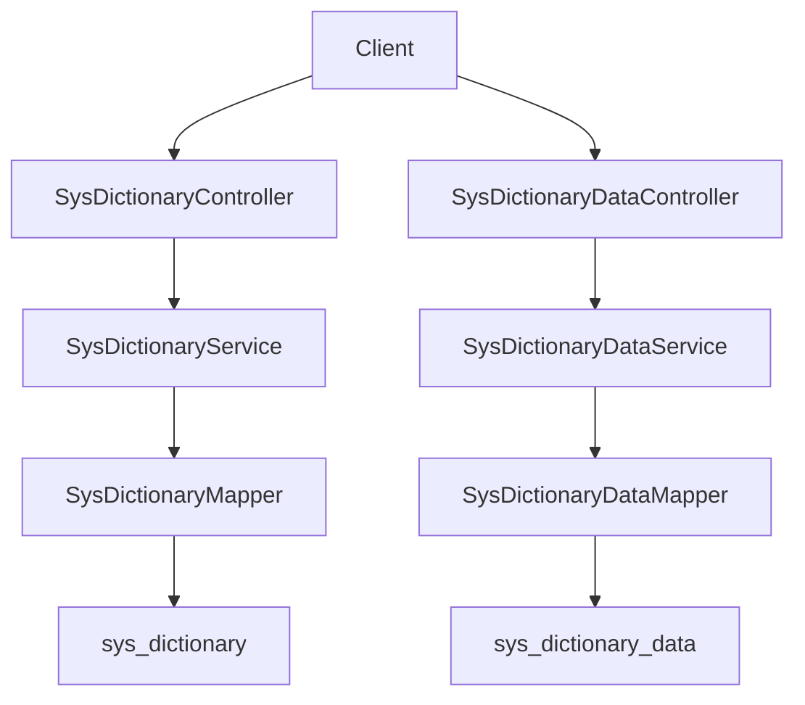
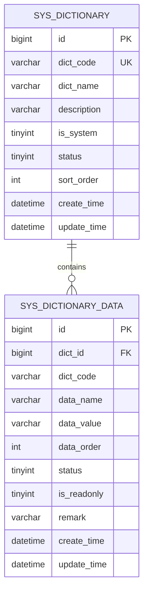
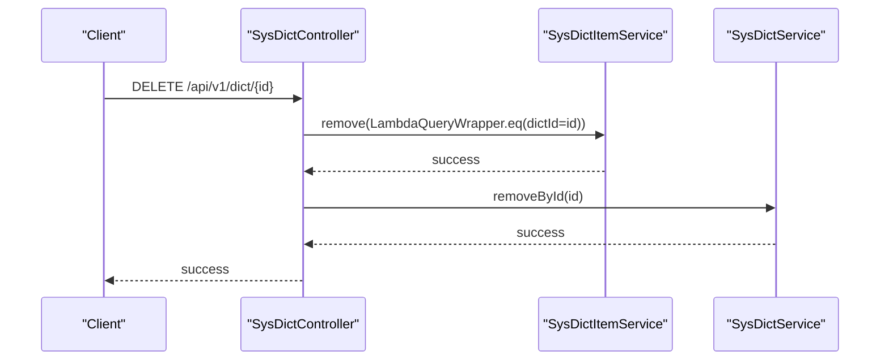
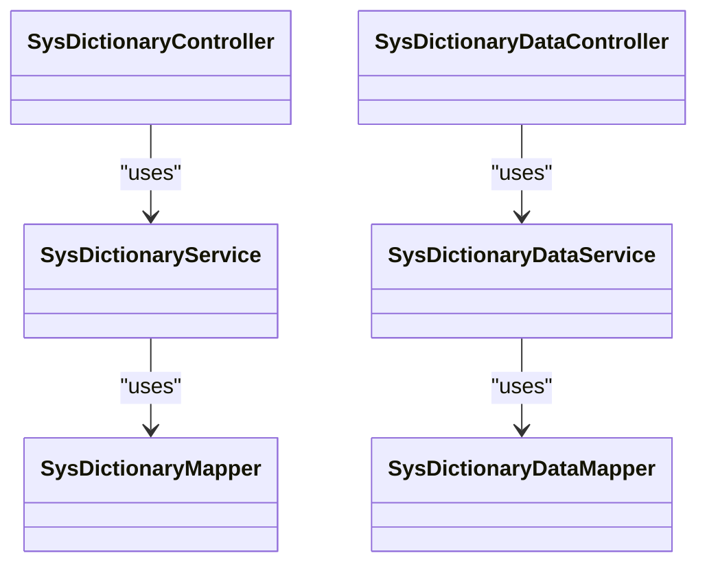

# Dictionary Management

<cite>
**Referenced Files in This Document**
- [SysDictionary.java](file://admin-backend/src/main/java/com/qhiot/survey/entity/SysDictionary.java)
- [SysDict.java](file://admin-backend/src/main/java/com/qhiot/survey/entity/SysDict.java)
- [SysDictionaryData.java](file://admin-backend/src/main/java/com/qhiot/survey/entity/SysDictionaryData.java)
- [SysDictItem.java](file://admin-backend/src/main/java/com/qhiot/survey/entity/SysDictItem.java)
- [SysDictionaryService.java](file://admin-backend/src/main/java/com/qhiot/survey/service/SysDictionaryService.java)
- [SysDictService.java](file://admin-backend/src/main/java/com/qhiot/survey/service/SysDictService.java)
- [SysDictionaryDataService.java](file://admin-backend/src/main/java/com/qhiot/survey/service/SysDictionaryDataService.java)
- [SysDictItemService.java](file://admin-backend/src/main/java/com/qhiot/survey/service/SysDictItemService.java)
- [SysDictionaryController.java](file://admin-backend/src/main/java/com/qhiot/survey/controller/SysDictionaryController.java)
- [SysDictController.java](file://admin-backend/src/main/java/com/qhiot/survey/controller/SysDictController.java)
- [SysDictionaryDataController.java](file://admin-backend/src/main/java/com/qhiot/survey/controller/SysDictionaryDataController.java)
- [SysDictionaryMapper.java](file://admin-backend/src/main/java/com/qhiot/survey/mapper/SysDictionaryMapper.java)
- [SysDictMapper.java](file://admin-backend/src/main/java/com/qhiot/survey/mapper/SysDictMapper.java)
- [SysDictionaryDataMapper.java](file://admin-backend/src/main/java/com/qhiot/survey/mapper/SysDictionaryDataMapper.java)
- [SysDictItemMapper.java](file://admin-backend/src/main/java/com/qhiot/survey/mapper/SysDictItemMapper.java)
- [SysDictionaryServiceImpl.java](file://admin-backend/src/main/java/com/qhiot/survey/service/impl/SysDictionaryServiceImpl.java)
- [SysDictServiceImpl.java](file://admin-backend/src/main/java/com/qhiot/survey/service/impl/SysDictServiceImpl.java)
- [SysDictionaryDataServiceImpl.java](file://admin-backend/src/main/java/com/qhiot/survey/service/impl/SysDictionaryDataServiceImpl.java)
- [SysDictItemServiceImpl.java](file://admin-backend/src/main/java/com/qhiot/survey/service/impl/SysDictItemServiceImpl.java)
- [dictionary_tables.sql](file://admin-backend/src/resources/db/dictionary_tables.sql)
- [DictUtil.java](file://admin-backend/src/main/java/com/qhiot/survey/common/util/DictUtil.java)
</cite>

## Table of Contents
1. [Introduction](#introduction)
2. [Project Structure](#project-structure)
3. [Core Components](#core-components)
4. [Architecture Overview](#architecture-overview)
5. [Detailed Component Analysis](#detailed-component-analysis)
6. [Dependency Analysis](#dependency-analysis)
7. [Performance Considerations](#performance-considerations)
8. [Troubleshooting Guide](#troubleshooting-guide)
9. [Conclusion](#conclusion)
10. [Appendices](#appendices)

## Introduction
This document describes the dictionary management system used to maintain hierarchical classification and items for system configuration and enumerations. It covers:
- Hierarchical dictionary structure: dictionary categories and dictionary items
- Lookup table functionality for retrieving configuration values by code and value/name
- CRUD operations, ordering, and status control
- Relationships between dictionaries and their items
- Validation rules, data integrity constraints, and cascading operations
- Caching strategies and performance optimization

## Project Structure
The dictionary management system is implemented in the backend module under the admin-backend package. It consists of:
- Entities representing dictionary categories and items
- Services and controllers exposing CRUD and lookup APIs
- Mappers for persistence
- Initialization SQL defining tables and seed data
- Utility for dictionary-related operations

```mermaid
graph TB
subgraph "Entities"
E1["SysDictionary<br/>Category"]
E2["SysDictionaryData<br/>Item"]
end
subgraph "Services"
S1["SysDictionaryService"]
S2["SysDictionaryDataService"]
end
subgraph "Controllers"
C1["SysDictionaryController"]
C2["SysDictionaryDataController"]
end
subgraph "Mappers"
M1["SysDictionaryMapper"]
M2["SysDictionaryDataMapper"]
end
subgraph "Persistence"
DB["MySQL Tables<br/>sys_dictionary<br/>sys_dictionary_data"]
end
C1 --> S1
C2 --> S2
S1 --> M1
S2 --> M2
M1 --> DB
M2 --> DB
E1 < --> E2
```

**Diagram sources**
- [SysDictionary.java:14-46](file://admin-backend/src/main/java/com/qhiot/survey/entity/SysDictionary.java#L14-L46)
- [SysDictionaryData.java:14-52](file://admin-backend/src/main/java/com/qhiot/survey/entity/SysDictionaryData.java#L14-L52)
- [SysDictionaryService.java:13-39](file://admin-backend/src/main/java/com/qhiot/survey/service/SysDictionaryService.java#L13-L39)
- [SysDictionaryDataService.java:13-65](file://admin-backend/src/main/java/com/qhiot/survey/service/SysDictionaryDataService.java#L13-L65)
- [SysDictionaryController.java:20-98](file://admin-backend/src/main/java/com/qhiot/survey/controller/SysDictionaryController.java#L20-L98)
- [SysDictionaryDataController.java:17-101](file://admin-backend/src/main/java/com/qhiot/survey/controller/SysDictionaryDataController.java#L17-L101)
- [SysDictionaryMapper.java](file://admin-backend/src/main/java/com/qhiot/survey/mapper/SysDictionaryMapper.java)
- [SysDictionaryDataMapper.java](file://admin-backend/src/main/java/com/qhiot/survey/mapper/SysDictionaryDataMapper.java)
- [dictionary_tables.sql:1-88](file://admin-backend/src/resources/db/dictionary_tables.sql#L1-L88)

**Section sources**
- [SysDictionary.java:14-46](file://admin-backend/src/main/java/com/qhiot/survey/entity/SysDictionary.java#L14-L46)
- [SysDictionaryData.java:14-52](file://admin-backend/src/main/java/com/qhiot/survey/entity/SysDictionaryData.java#L14-L52)
- [SysDictionaryController.java:20-98](file://admin-backend/src/main/java/com/qhiot/survey/controller/SysDictionaryController.java#L20-L98)
- [SysDictionaryDataController.java:17-101](file://admin-backend/src/main/java/com/qhiot/survey/controller/SysDictionaryDataController.java#L17-L101)
- [dictionary_tables.sql:1-88](file://admin-backend/src/resources/db/dictionary_tables.sql#L1-L88)

## Core Components
- Dictionary category (SysDictionary): represents a named classification with metadata (code, description, status, sort order) and system flag.
- Dictionary item (SysDictionaryData): represents a single enumeration value with label, value, status, readonly flag, and order.
- Services:
  - SysDictionaryService: category-level operations, pagination, enabled lists, and cache management.
  - SysDictionaryDataService: item-level operations, paginated queries, lookup maps, and cache management.
- Controllers:
  - SysDictionaryController: category CRUD and listing endpoints.
  - SysDictionaryDataController: item CRUD and lookup endpoints.
- Persistence:
  - Mappers for category and item tables.
  - MySQL schema with unique constraints and indexes.

Key capabilities:
- Hierarchical relationship: items belong to a category via dict_id and dict_code.
- Lookup functions: value-to-name, name-to-value maps, and list retrieval by code.
- Status control: enable/disable categories/items.
- Ordering: per-category and per-item sort orders.
- Cascading: deleting a category removes its items.

**Section sources**
- [SysDictionary.java:14-46](file://admin-backend/src/main/java/com/qhiot/survey/entity/SysDictionary.java#L14-L46)
- [SysDictionaryData.java:14-52](file://admin-backend/src/main/java/com/qhiot/survey/entity/SysDictionaryData.java#L14-L52)
- [SysDictionaryService.java:13-39](file://admin-backend/src/main/java/com/qhiot/survey/service/SysDictionaryService.java#L13-L39)
- [SysDictionaryDataService.java:13-65](file://admin-backend/src/main/java/com/qhiot/survey/service/SysDictionaryDataService.java#L13-L65)
- [SysDictionaryController.java:20-98](file://admin-backend/src/main/java/com/qhiot/survey/controller/SysDictionaryController.java#L20-L98)
- [SysDictionaryDataController.java:17-101](file://admin-backend/src/main/java/com/qhiot/survey/controller/SysDictionaryDataController.java#L17-L101)
- [dictionary_tables.sql:1-88](file://admin-backend/src/resources/db/dictionary_tables.sql#L1-L88)

## Architecture Overview
The system follows a layered architecture:
- Presentation: REST controllers expose endpoints for categories and items.
- Application: services encapsulate business logic and coordinate persistence.
- Persistence: MyBatis-Plus mappers map to MySQL tables.



**Diagram sources**
- [SysDictionaryController.java:20-98](file://admin-backend/src/main/java/com/qhiot/survey/controller/SysDictionaryController.java#L20-L98)
- [SysDictionaryDataController.java:17-101](file://admin-backend/src/main/java/com/qhiot/survey/controller/SysDictionaryDataController.java#L17-L101)
- [SysDictionaryService.java:13-39](file://admin-backend/src/main/java/com/qhiot/survey/service/SysDictionaryService.java#L13-L39)
- [SysDictionaryDataService.java:13-65](file://admin-backend/src/main/java/com/qhiot/survey/service/SysDictionaryDataService.java#L13-L65)
- [SysDictionaryMapper.java](file://admin-backend/src/main/java/com/qhiot/survey/mapper/SysDictionaryMapper.java)
- [SysDictionaryDataMapper.java](file://admin-backend/src/main/java/com/qhiot/survey/mapper/SysDictionaryDataMapper.java)
- [dictionary_tables.sql:1-88](file://admin-backend/src/resources/db/dictionary_tables.sql#L1-L88)

## Detailed Component Analysis

### Entity Model and Relationships
The model defines a strict hierarchy:
- Category (SysDictionary) has a unique dict_code and optional description.
- Item (SysDictionaryData) belongs to a category via dict_id and carries dict_code for efficient filtering.
- Items carry status, readonly flag, and sort order for presentation and control.



**Diagram sources**
- [SysDictionary.java:14-46](file://admin-backend/src/main/java/com/qhiot/survey/entity/SysDictionary.java#L14-L46)
- [SysDictionaryData.java:14-52](file://admin-backend/src/main/java/com/qhiot/survey/entity/SysDictionaryData.java#L14-L52)
- [dictionary_tables.sql:1-88](file://admin-backend/src/resources/db/dictionary_tables.sql#L1-L88)

**Section sources**
- [SysDictionary.java:14-46](file://admin-backend/src/main/java/com/qhiot/survey/entity/SysDictionary.java#L14-L46)
- [SysDictionaryData.java:14-52](file://admin-backend/src/main/java/com/qhiot/survey/entity/SysDictionaryData.java#L14-L52)
- [dictionary_tables.sql:1-88](file://admin-backend/src/resources/db/dictionary_tables.sql#L1-L88)

### Category Management (SysDictionary)
Responsibilities:
- Pagination and filtering by keyword/status
- Listing enabled categories
- Retrieving items by category code
- Refreshing caches and bulk data provisioning

Endpoints:
- GET /api/v1/dictionary/page
- GET /api/v1/dictionary/enabled
- GET /api/v1/dictionary/{id}
- POST /api/v1/dictionary/create
- PUT /api/v1/dictionary/update/{id}
- DELETE /api/v1/dictionary/delete/{id}
- GET /api/v1/dictionary/{id}/items
- GET /api/v1/dictionary/all
- POST /api/v1/dictionary/refresh-cache

Validation and constraints:
- Unique dict_code enforced at DB level.
- Status defaults to enabled if not provided.
- Sorting controlled by sort_order.

Cascading operations:
- Deleting a category removes all its items (controller orchestrates removal before category deletion).

**Section sources**
- [SysDictionaryController.java:20-98](file://admin-backend/src/main/java/com/qhiot/survey/controller/SysDictionaryController.java#L20-L98)
- [SysDictionaryService.java:13-39](file://admin-backend/src/main/java/com/qhiot/survey/service/SysDictionaryService.java#L13-L39)
- [SysDictionaryMapper.java](file://admin-backend/src/main/java/com/qhiot/survey/mapper/SysDictionaryMapper.java)
- [dictionary_tables.sql:1-88](file://admin-backend/src/resources/db/dictionary_tables.sql#L1-L88)

### Item Management (SysDictionaryData)
Responsibilities:
- Paginated listing filtered by category, keyword, and status
- Retrieval by dictCode and by id
- Lookup maps: value-to-name and name-to-value
- CRUD operations with selective updates
- Cache refresh and bulk data provisioning

Endpoints:
- GET /api/v1/dictionary-data/page
- GET /api/v1/dictionary-data/list/{dictCode}
- GET /api/v1/dictionary-data/{id}
- POST /api/v1/dictionary-data/create
- PUT /api/v1/dictionary-data/update/{id}
- DELETE /api/v1/dictionary-data/delete/{id}
- GET /api/v1/dictionary-data/map/{dictCode}
- GET /api/v1/dictionary-data/name/{dictCode}/{dataValue}
- GET /api/v1/dictionary-data/value/{dictCode}/{dataName}
- POST /api/v1/dictionary-data/refresh-cache

Lookup table functionality:
- getDictMap(dictCode): returns value->name map for UI selection
- getDictName(dictCode, dataValue): resolves display name
- getDictValue(dictCode, dataName): resolves stored value

**Section sources**
- [SysDictionaryDataController.java:17-101](file://admin-backend/src/main/java/com/qhiot/survey/controller/SysDictionaryDataController.java#L17-L101)
- [SysDictionaryDataService.java:13-65](file://admin-backend/src/main/java/com/qhiot/survey/service/SysDictionaryDataService.java#L13-L65)
- [SysDictionaryDataMapper.java](file://admin-backend/src/main/java/com/qhiot/survey/mapper/SysDictionaryDataMapper.java)

### Combined Dictionary Management (SysDict)
The SysDict and SysDictItem entities represent an extended model with additional fields and a separate controller for batch operations. They share similar relationships and operations:
- Category: SysDict with dictCode, dictName, description, isSystem, status, sortOrder
- Item: SysDictItem with dictId, dictCode, itemLabel, itemValue, sortOrder, status, isReadonly, remark

Batch operations:
- Batch save items for a category with automatic dictCode propagation and default field initialization.

Cascading:
- Deleting a SysDict deletes all related SysDictItem entries.

**Section sources**
- [SysDict.java:14-60](file://admin-backend/src/main/java/com/qhiot/survey/entity/SysDict.java#L14-L60)
- [SysDictItem.java:14-74](file://admin-backend/src/main/java/com/qhiot/survey/entity/SysDictItem.java#L14-L74)
- [SysDictController.java:20-196](file://admin-backend/src/main/java/com/qhiot/survey/controller/SysDictController.java#L20-L196)
- [SysDictService.java:11-28](file://admin-backend/src/main/java/com/qhiot/survey/service/SysDictService.java#L11-L28)
- [SysDictItemService.java:11-23](file://admin-backend/src/main/java/com/qhiot/survey/service/SysDictItemService.java#L11-L23)

### Example Workflows

#### Create a Dictionary Category
- Endpoint: POST /api/v1/dictionary/create
- Request body: category fields (dictCode, dictName, description, status, isSystem, sortOrder)
- Behavior: unique dictCode enforced; defaults applied if omitted; persisted to sys_dictionary

**Section sources**
- [SysDictionaryController.java:50-56](file://admin-backend/src/main/java/com/qhiot/survey/controller/SysDictionaryController.java#L50-L56)
- [dictionary_tables.sql:2-14](file://admin-backend/src/resources/db/dictionary_tables.sql#L2-L14)

#### Create Dictionary Items for a Category
- Endpoint: POST /api/v1/dict/{id}/items/batch
- Request body: array of items with itemLabel, itemValue, status, isReadonly, sortOrder
- Behavior: sets dictId and dictCode; applies defaults; clears existing items and reinserts batch; invalidates cache

**Section sources**
- [SysDictController.java:163-194](file://admin-backend/src/main/java/com/qhiot/survey/controller/SysDictController.java#L163-L194)

#### Retrieve Lookup Values
- Value-to-name map: GET /api/v1/dictionary-data/map/{dictCode}
- Name-to-value resolution: GET /api/v1/dictionary-data/value/{dictCode}/{dataName}
- Name-to-value resolution: GET /api/v1/dictionary-data/name/{dictCode}/{dataValue}

**Section sources**
- [SysDictionaryDataController.java:74-92](file://admin-backend/src/main/java/com/qhiot/survey/controller/SysDictionaryDataController.java#L74-L92)
- [SysDictionaryDataService.java:26-38](file://admin-backend/src/main/java/com/qhiot/survey/service/SysDictionaryDataService.java#L26-L38)

### Validation Rules and Data Integrity
- Unique constraint on dict_code for categories (DB-level).
- Indexes on dict_code and dict_id for efficient lookups.
- Defaults:
  - Categories: status=enabled, isSystem=not-system, sortOrder=0
  - Items: status=enabled, isReadonly=false, sortOrder=0
- Status control: enable/disable categories and items via status field.
- Readonly protection: items marked as readonly cannot be modified through standard update operations.

**Section sources**
- [dictionary_tables.sql:1-88](file://admin-backend/src/resources/db/dictionary_tables.sql#L1-L88)
- [SysDictController.java:170-186](file://admin-backend/src/main/java/com/qhiot/survey/controller/SysDictController.java#L170-L186)
- [SysDictionaryController.java:50-56](file://admin-backend/src/main/java/com/qhiot/survey/controller/SysDictionaryController.java#L50-L56)

### Cascading Operations
- Category deletion cascades to items: controller removes items by dictId before removing the category.
- Batch save replaces all items for a category, ensuring consistency.



**Diagram sources**
- [SysDictController.java:128-147](file://admin-backend/src/main/java/com/qhiot/survey/controller/SysDictController.java#L128-L147)

**Section sources**
- [SysDictController.java:128-147](file://admin-backend/src/main/java/com/qhiot/survey/controller/SysDictController.java#L128-L147)

## Dependency Analysis
The controllers depend on services, which depend on mappers and repositories. The mappers map to the sys_dictionary and sys_dictionary_data tables.



**Diagram sources**
- [SysDictionaryController.java:20-98](file://admin-backend/src/main/java/com/qhiot/survey/controller/SysDictionaryController.java#L20-L98)
- [SysDictionaryDataController.java:17-101](file://admin-backend/src/main/java/com/qhiot/survey/controller/SysDictionaryDataController.java#L17-L101)
- [SysDictionaryService.java:13-39](file://admin-backend/src/main/java/com/qhiot/survey/service/SysDictionaryService.java#L13-L39)
- [SysDictionaryDataService.java:13-65](file://admin-backend/src/main/java/com/qhiot/survey/service/SysDictionaryDataService.java#L13-L65)
- [SysDictionaryMapper.java](file://admin-backend/src/main/java/com/qhiot/survey/mapper/SysDictionaryMapper.java)
- [SysDictionaryDataMapper.java](file://admin-backend/src/main/java/com/qhiot/survey/mapper/SysDictionaryDataMapper.java)

**Section sources**
- [SysDictionaryController.java:20-98](file://admin-backend/src/main/java/com/qhiot/survey/controller/SysDictionaryController.java#L20-L98)
- [SysDictionaryDataController.java:17-101](file://admin-backend/src/main/java/com/qhiot/survey/controller/SysDictionaryDataController.java#L17-L101)
- [SysDictionaryService.java:13-39](file://admin-backend/src/main/java/com/qhiot/survey/service/SysDictionaryService.java#L13-L39)
- [SysDictionaryDataService.java:13-65](file://admin-backend/src/main/java/com/qhiot/survey/service/SysDictionaryDataService.java#L13-L65)

## Performance Considerations
- Database indexes:
  - Category: unique dict_code
  - Items: indexes on dict_code and dict_id
- Pagination: controllers support pageNum/pageSize for large datasets.
- Caching:
  - Services expose getAllDictItems and getAllDictMaps for bulk provisioning.
  - refreshCache and evictDictCache methods allow manual cache invalidation after writes.
- Defaults and normalization:
  - Default status and sort order reduce client-side logic and improve consistency.
- Batch operations:
  - Batch save for items minimizes round-trips and ensures atomic replacement.

[No sources needed since this section provides general guidance]

## Troubleshooting Guide
Common issues and resolutions:
- Duplicate dictCode on category creation:
  - Symptom: error response indicating dictCode exists.
  - Resolution: choose a unique dictCode.
- Missing category when fetching items:
  - Symptom: error when requesting items by category ID.
  - Resolution: ensure category exists and status is enabled.
- Lookup returns empty:
  - Symptom: map or name/value lookup returns null/empty.
  - Resolution: verify dictCode correctness and that items exist with enabled status.
- Cache stale after edits:
  - Symptom: changes not reflected immediately.
  - Resolution: call refresh-cache endpoint for categories or items.

**Section sources**
- [SysDictController.java:87-92](file://admin-backend/src/main/java/com/qhiot/survey/controller/SysDictController.java#L87-L92)
- [SysDictionaryController.java:78-82](file://admin-backend/src/main/java/com/qhiot/survey/controller/SysDictionaryController.java#L78-L82)
- [SysDictionaryDataController.java:74-92](file://admin-backend/src/main/java/com/qhiot/survey/controller/SysDictionaryDataController.java#L74-L92)

## Conclusion
The dictionary management system provides a robust, hierarchical model for maintaining system configuration enumerations. It supports:
- Clear separation between categories and items
- Rich lookup capabilities (value/name maps and reverse lookups)
- Strong validation and integrity constraints
- Controlled ordering and status management
- Efficient pagination and caching strategies

[No sources needed since this section summarizes without analyzing specific files]

## Appendices

### API Reference Summary
- Categories
  - GET /api/v1/dictionary/page
  - GET /api/v1/dictionary/enabled
  - GET /api/v1/dictionary/{id}
  - POST /api/v1/dictionary/create
  - PUT /api/v1/dictionary/update/{id}
  - DELETE /api/v1/dictionary/delete/{id}
  - GET /api/v1/dictionary/{id}/items
  - GET /api/v1/dictionary/all
  - POST /api/v1/dictionary/refresh-cache
- Items
  - GET /api/v1/dictionary-data/page
  - GET /api/v1/dictionary-data/list/{dictCode}
  - GET /api/v1/dictionary-data/{id}
  - POST /api/v1/dictionary-data/create
  - PUT /api/v1/dictionary-data/update/{id}
  - DELETE /api/v1/dictionary-data/delete/{id}
  - GET /api/v1/dictionary-data/map/{dictCode}
  - GET /api/v1/dictionary-data/name/{dictCode}/{dataValue}
  - GET /api/v1/dictionary-data/value/{dictCode}/{dataName}
  - POST /api/v1/dictionary-data/refresh-cache

**Section sources**
- [SysDictionaryController.java:28-98](file://admin-backend/src/main/java/com/qhiot/survey/controller/SysDictionaryController.java#L28-L98)
- [SysDictionaryDataController.java:28-101](file://admin-backend/src/main/java/com/qhiot/survey/controller/SysDictionaryDataController.java#L28-L101)

### Initialization Data
The system ships with predefined categories and items for common statuses and flags.

**Section sources**
- [dictionary_tables.sql:34-88](file://admin-backend/src/resources/db/dictionary_tables.sql#L34-L88)