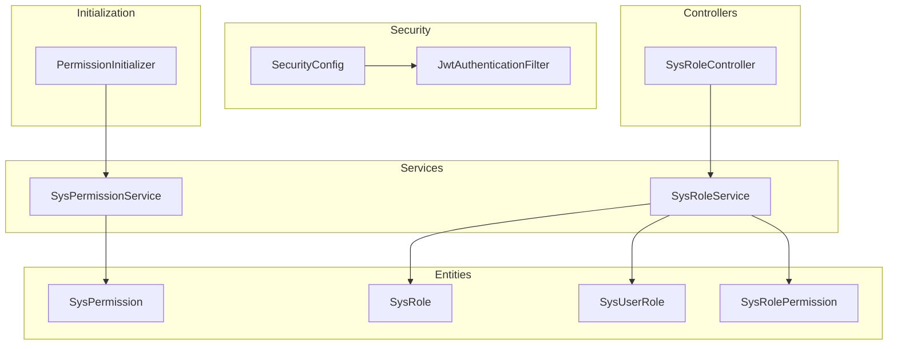
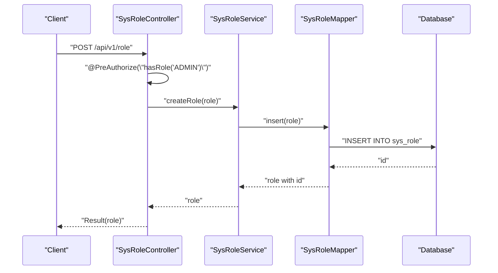
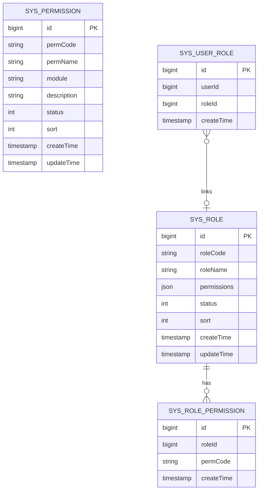
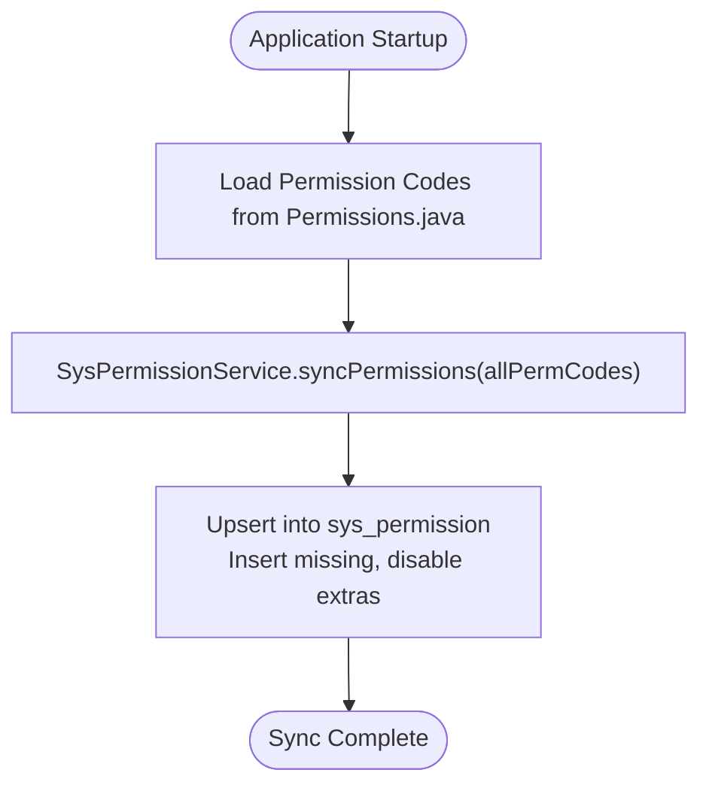
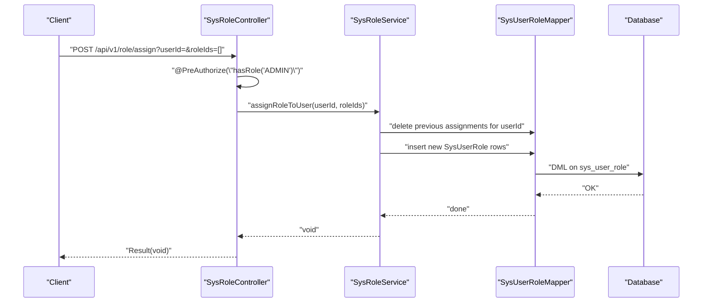
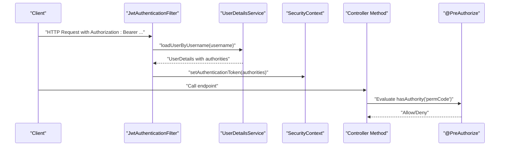
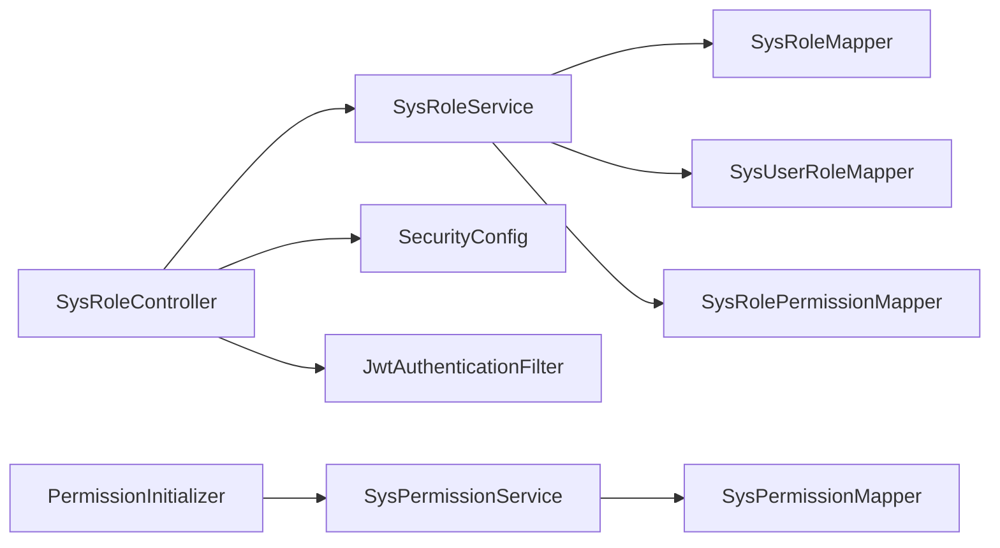

# Role & Permission Management

<cite>
**Referenced Files in This Document**
- [SysRole.java](file://admin-backend/src/main/java/com/qhiot/survey/entity/SysRole.java)
- [SysPermission.java](file://admin-backend/src/main/java/com/qhiot/survey/entity/SysPermission.java)
- [SysUserRole.java](file://admin-backend/src/main/java/com/qhiot/survey/entity/SysUserRole.java)
- [SysRolePermission.java](file://admin-backend/src/main/java/com/qhiot/survey/entity/SysRolePermission.java)
- [Permissions.java](file://admin-backend/src/main/java/com/qhiot/survey/common/constant/Permissions.java)
- [SysRoleService.java](file://admin-backend/src/main/java/com/qhiot/survey/service/SysRoleService.java)
- [SysPermissionService.java](file://admin-backend/src/main/java/com/qhiot/survey/service/SysPermissionService.java)
- [SysRoleController.java](file://admin-backend/src/main/java/com/qhiot/survey/controller/SysRoleController.java)
- [SysRoleMapper.java](file://admin-backend/src/main/java/com/qhiot/survey/mapper/SysRoleMapper.java)
- [SysPermissionMapper.java](file://admin-backend/src/main/java/com/qhiot/survey/mapper/SysPermissionMapper.java)
- [SecurityConfig.java](file://admin-backend/src/main/java/com/qhiot/survey/security/SecurityConfig.java)
- [JwtAuthenticationFilter.java](file://admin-backend/src/main/java/com/qhiot/survey/security/JwtAuthenticationFilter.java)
- [PermissionInitializer.java](file://admin-backend/src/main/java/com/qhiot/survey/common/init/PermissionInitializer.java)
</cite>

## Table of Contents
1. [Introduction](#introduction)
2. [Project Structure](#project-structure)
3. [Core Components](#core-components)
4. [Architecture Overview](#architecture-overview)
5. [Detailed Component Analysis](#detailed-component-analysis)
6. [Dependency Analysis](#dependency-analysis)
7. [Performance Considerations](#performance-considerations)
8. [Troubleshooting Guide](#troubleshooting-guide)
9. [Conclusion](#conclusion)
10. [Appendices](#appendices)

## Introduction
This document describes the role and permission management system used in the backend service. It explains the hierarchical role structure, permission model, role-to-user assignment, and dynamic permission checking. It also documents the permission registry and synchronization mechanism, along with examples of role creation, permission assignment, and access control enforcement. Finally, it outlines permission auditing and compliance reporting capabilities.

## Project Structure
The role and permission subsystem is implemented in the admin-backend module. Key elements include:
- Entities representing roles, permissions, and associations
- Services and controllers for managing roles and permissions
- Security configuration enabling method-level and request-level authorization
- A permission initializer that synchronizes declared permissions into the database

**Diagram sources**
- [SysRole.java:1-40](file://admin-backend/src/main/java/com/qhiot/survey/entity/SysRole.java#L1-L40)
- [SysPermission.java:1-56](file://admin-backend/src/main/java/com/qhiot/survey/entity/SysPermission.java#L1-L56)
- [SysUserRole.java:1-26](file://admin-backend/src/main/java/com/qhiot/survey/entity/SysUserRole.java#L1-L26)
- [SysRolePermission.java:1-34](file://admin-backend/src/main/java/com/qhiot/survey/entity/SysRolePermission.java#L1-L34)
- [SysRoleService.java:1-64](file://admin-backend/src/main/java/com/qhiot/survey/service/SysRoleService.java#L1-L64)
- [SysPermissionService.java:1-35](file://admin-backend/src/main/java/com/qhiot/survey/service/SysPermissionService.java#L1-L35)
- [SysRoleController.java:1-138](file://admin-backend/src/main/java/com/qhiot/survey/controller/SysRoleController.java#L1-L138)
- [SecurityConfig.java:1-99](file://admin-backend/src/main/java/com/qhiot/survey/security/SecurityConfig.java#L1-L99)
- [JwtAuthenticationFilter.java:1-135](file://admin-backend/src/main/java/com/qhiot/survey/security/JwtAuthenticationFilter.java#L1-L135)
- [PermissionInitializer.java:1-38](file://admin-backend/src/main/java/com/qhiot/survey/common/init/PermissionInitializer.java#L1-L38)

**Section sources**
- [SysRoleController.java:1-138](file://admin-backend/src/main/java/com/qhiot/survey/controller/SysRoleController.java#L1-L138)
- [SysRoleService.java:1-64](file://admin-backend/src/main/java/com/qhiot/survey/service/SysRoleService.java#L1-L64)
- [SysPermissionService.java:1-35](file://admin-backend/src/main/java/com/qhiot/survey/service/SysPermissionService.java#L1-L35)
- [SecurityConfig.java:1-99](file://admin-backend/src/main/java/com/qhiot/survey/security/SecurityConfig.java#L1-L99)
- [JwtAuthenticationFilter.java:1-135](file://admin-backend/src/main/java/com/qhiot/survey/security/JwtAuthenticationFilter.java#L1-L135)
- [PermissionInitializer.java:1-38](file://admin-backend/src/main/java/com/qhiot/survey/common/init/PermissionInitializer.java#L1-L38)

## Core Components
- Roles: Represented by SysRole with attributes including roleCode, roleName, permissions JSON, status, sort order, and timestamps.
- Permissions: Represented by SysPermission with permCode, permName, module, description, status, sort order, and timestamps.
- Associations:
  - SysUserRole links users to roles.
  - SysRolePermission links roles to permission codes.
- Controllers: SysRoleController exposes endpoints for role CRUD, status toggling, role assignment to users, and permission retrieval/updates.
- Services: SysRoleService and SysPermissionService encapsulate business logic for role management and permission synchronization.
- Security: Method-level authorization via @PreAuthorize and request-level filtering via JwtAuthenticationFilter and SecurityConfig.
- Initialization: PermissionInitializer synchronizes declared permissions into the database after application startup.

**Section sources**
- [SysRole.java:1-40](file://admin-backend/src/main/java/com/qhiot/survey/entity/SysRole.java#L1-L40)
- [SysPermission.java:1-56](file://admin-backend/src/main/java/com/qhiot/survey/entity/SysPermission.java#L1-L56)
- [SysUserRole.java:1-26](file://admin-backend/src/main/java/com/qhiot/survey/entity/SysUserRole.java#L1-L26)
- [SysRolePermission.java:1-34](file://admin-backend/src/main/java/com/qhiot/survey/entity/SysRolePermission.java#L1-L34)
- [SysRoleController.java:1-138](file://admin-backend/src/main/java/com/qhiot/survey/controller/SysRoleController.java#L1-L138)
- [SysRoleService.java:1-64](file://admin-backend/src/main/java/com/qhiot/survey/service/SysRoleService.java#L1-L64)
- [SysPermissionService.java:1-35](file://admin-backend/src/main/java/com/qhiot/survey/service/SysPermissionService.java#L1-L35)
- [SecurityConfig.java:1-99](file://admin-backend/src/main/java/com/qhiot/survey/security/SecurityConfig.java#L1-L99)
- [JwtAuthenticationFilter.java:1-135](file://admin-backend/src/main/java/com/qhiot/survey/security/JwtAuthenticationFilter.java#L1-L135)
- [PermissionInitializer.java:1-38](file://admin-backend/src/main/java/com/qhiot/survey/common/init/PermissionInitializer.java#L1-L38)

## Architecture Overview
The system uses a classic RBAC model with explicit role-to-permission associations and method-level authorization. JWT tokens carry authorities derived from a user’s roles. The permission registry ensures all permission codes are known and synchronized into the database.

**Diagram sources**
- [SysRoleController.java:52-64](file://admin-backend/src/main/java/com/qhiot/survey/controller/SysRoleController.java#L52-L64)
- [SysRoleService.java:27-37](file://admin-backend/src/main/java/com/qhiot/survey/service/SysRoleService.java#L27-L37)
- [SysRoleMapper.java:1-9](file://admin-backend/src/main/java/com/qhiot/survey/mapper/SysRoleMapper.java#L1-L9)

## Detailed Component Analysis

### Entities and Data Model
The entities define the core RBAC data model:
- SysRole: Holds role metadata and a JSON field for permissions.
- SysPermission: Defines permission codes, names, modules, and statuses.
- SysUserRole: Links users to roles.
- SysRolePermission: Links roles to permission codes.

**Diagram sources**
- [SysRole.java:1-40](file://admin-backend/src/main/java/com/qhiot/survey/entity/SysRole.java#L1-L40)
- [SysPermission.java:1-56](file://admin-backend/src/main/java/com/qhiot/survey/entity/SysPermission.java#L1-L56)
- [SysUserRole.java:1-26](file://admin-backend/src/main/java/com/qhiot/survey/entity/SysUserRole.java#L1-L26)
- [SysRolePermission.java:1-34](file://admin-backend/src/main/java/com/qhiot/survey/entity/SysRolePermission.java#L1-L34)

**Section sources**
- [SysRole.java:1-40](file://admin-backend/src/main/java/com/qhiot/survey/entity/SysRole.java#L1-L40)
- [SysPermission.java:1-56](file://admin-backend/src/main/java/com/qhiot/survey/entity/SysPermission.java#L1-L56)
- [SysUserRole.java:1-26](file://admin-backend/src/main/java/com/qhiot/survey/entity/SysUserRole.java#L1-L26)
- [SysRolePermission.java:1-34](file://admin-backend/src/main/java/com/qhiot/survey/entity/SysRolePermission.java#L1-L34)

### Permission Registry and Synchronization
- Permissions.java defines a centralized registry of permission codes with a naming convention module:permission.
- PermissionInitializer listens for application startup and synchronizes all registered permission codes into the sys_permission table via SysPermissionService.syncPermissions.

**Diagram sources**
- [Permissions.java:1-81](file://admin-backend/src/main/java/com/qhiot/survey/common/constant/Permissions.java#L1-L81)
- [PermissionInitializer.java:22-36](file://admin-backend/src/main/java/com/qhiot/survey/common/init/PermissionInitializer.java#L22-L36)
- [SysPermissionService.java:30-33](file://admin-backend/src/main/java/com/qhiot/survey/service/SysPermissionService.java#L30-L33)

**Section sources**
- [Permissions.java:1-81](file://admin-backend/src/main/java/com/qhiot/survey/common/constant/Permissions.java#L1-L81)
- [PermissionInitializer.java:1-38](file://admin-backend/src/main/java/com/qhiot/survey/common/init/PermissionInitializer.java#L1-L38)
- [SysPermissionService.java:1-35](file://admin-backend/src/main/java/com/qhiot/survey/service/SysPermissionService.java#L1-L35)

### Role Management API
- Role CRUD, status toggling, pagination, and listing are exposed via SysRoleController.
- Method-level authorization is enforced using @PreAuthorize("hasRole('ADMIN')") for sensitive operations.
- Role-to-user assignment supports assigning multiple roles to a single user.

**Diagram sources**
- [SysRoleController.java:104-113](file://admin-backend/src/main/java/com/qhiot/survey/controller/SysRoleController.java#L104-L113)
- [SysRoleService.java:47-47](file://admin-backend/src/main/java/com/qhiot/survey/service/SysRoleService.java#L47-L47)
- [SysUserRole.java:1-26](file://admin-backend/src/main/java/com/qhiot/survey/entity/SysUserRole.java#L1-L26)

**Section sources**
- [SysRoleController.java:1-138](file://admin-backend/src/main/java/com/qhiot/survey/controller/SysRoleController.java#L1-L138)
- [SysRoleService.java:1-64](file://admin-backend/src/main/java/com/qhiot/survey/service/SysRoleService.java#L1-L64)

### Permission Retrieval and Dynamic Checking
- Users’ effective permissions are derived from their roles and the sys_role_permission table.
- At authentication time, JwtAuthenticationFilter loads UserDetails and sets authorities in SecurityContext.
- Method-level checks use @PreAuthorize("hasAuthority('...')") against these authorities.

**Diagram sources**
- [JwtAuthenticationFilter.java:44-81](file://admin-backend/src/main/java/com/qhiot/survey/security/JwtAuthenticationFilter.java#L44-L81)
- [SecurityConfig.java:40-61](file://admin-backend/src/main/java/com/qhiot/survey/security/SecurityConfig.java#L40-L61)
- [SysRoleController.java:53-53](file://admin-backend/src/main/java/com/qhiot/survey/controller/SysRoleController.java#L53-L53)

**Section sources**
- [JwtAuthenticationFilter.java:1-135](file://admin-backend/src/main/java/com/qhiot/survey/security/JwtAuthenticationFilter.java#L1-L135)
- [SecurityConfig.java:1-99](file://admin-backend/src/main/java/com/qhiot/survey/security/SecurityConfig.java#L1-L99)
- [SysRoleController.java:1-138](file://admin-backend/src/main/java/com/qhiot/survey/controller/SysRoleController.java#L1-L138)

### Hierarchical Role Structure and Access Levels
- The system defines roles via roleCode and associates them with permission codes stored in sys_role_permission.
- Access control is enforced at the method level using @PreAuthorize("hasRole('...')" and @PreAuthorize("hasAuthority('...')").
- The permission registry centralizes permission codes to ensure consistent enforcement across the application.

Note: The codebase does not define a formal hierarchy among roles (e.g., ADMIN > REVIEWER > SURVEYOR > CLIENT). Instead, access is granted by assigning specific permission codes to roles and checking those codes during runtime.

**Section sources**
- [Permissions.java:1-81](file://admin-backend/src/main/java/com/qhiot/survey/common/constant/Permissions.java#L1-L81)
- [SysRoleController.java:53-53](file://admin-backend/src/main/java/com/qhiot/survey/controller/SysRoleController.java#L53-L53)
- [SysRoleController.java:123-123](file://admin-backend/src/main/java/com/qhiot/survey/controller/SysRoleController.java#L123-L123)

### Examples

- Role creation
  - Endpoint: POST /api/v1/role
  - Authorization: ADMIN
  - Behavior: Creates a new role and persists it to sys_role.

- Permission assignment to a role
  - Endpoint: PUT /api/v1/role/{id}/permissions
  - Authorization: ADMIN
  - Behavior: Updates the permission codes associated with the given role.

- Assigning roles to a user
  - Endpoint: POST /api/v1/role/assign
  - Authorization: ADMIN
  - Behavior: Replaces a user’s current roles with the provided set.

- Retrieving a user’s roles
  - Endpoint: GET /api/v1/role/user/{userId}
  - Behavior: Returns the list of roles assigned to the user.

- Enforcing access control
  - Annotation: @PreAuthorize("hasRole('ADMIN')") or @PreAuthorize("hasAuthority('module:permission')")

**Section sources**
- [SysRoleController.java:52-64](file://admin-backend/src/main/java/com/qhiot/survey/controller/SysRoleController.java#L52-L64)
- [SysRoleController.java:121-130](file://admin-backend/src/main/java/com/qhiot/survey/controller/SysRoleController.java#L121-L130)
- [SysRoleController.java:104-113](file://admin-backend/src/main/java/com/qhiot/survey/controller/SysRoleController.java#L104-L113)
- [SysRoleController.java:132-136](file://admin-backend/src/main/java/com/qhiot/survey/controller/SysRoleController.java#L132-L136)
- [SysRoleController.java:53-53](file://admin-backend/src/main/java/com/qhiot/survey/controller/SysRoleController.java#L53-L53)

### Permission Auditing and Compliance Reporting
- Operation logging: Several controllers are annotated with @OperationLog to capture administrative actions (e.g., role creation, updates, status changes).
- Collaboration access logging: The collaboration security path writes access logs for external collaborator tokens.
- Compliance alignment: The permission registry and synchronization process ensure that all permission codes are auditable and traceable in the database.

**Section sources**
- [SysRoleController.java:54-54](file://admin-backend/src/main/java/com/qhiot/survey/controller/SysRoleController.java#L54-L54)
- [SysRoleController.java:69-69](file://admin-backend/src/main/java/com/qhiot/survey/controller/SysRoleController.java#L69-L69)
- [SysRoleController.java:96-96](file://admin-backend/src/main/java/com/qhiot/survey/controller/SysRoleController.java#L96-L96)
- [SysRoleController.java:127-127](file://admin-backend/src/main/java/com/qhiot/survey/controller/SysRoleController.java#L127-L127)
- [JwtAuthenticationFilter.java:86-122](file://admin-backend/src/main/java/com/qhiot/survey/security/JwtAuthenticationFilter.java#L86-L122)

## Dependency Analysis
The following diagram shows key dependencies among components involved in role and permission management.

**Diagram sources**
- [SysRoleController.java:1-138](file://admin-backend/src/main/java/com/qhiot/survey/controller/SysRoleController.java#L1-L138)
- [SysRoleService.java:1-64](file://admin-backend/src/main/java/com/qhiot/survey/service/SysRoleService.java#L1-L64)
- [SysPermissionService.java:1-35](file://admin-backend/src/main/java/com/qhiot/survey/service/SysPermissionService.java#L1-L35)
- [SecurityConfig.java:1-99](file://admin-backend/src/main/java/com/qhiot/survey/security/SecurityConfig.java#L1-L99)
- [JwtAuthenticationFilter.java:1-135](file://admin-backend/src/main/java/com/qhiot/survey/security/JwtAuthenticationFilter.java#L1-L135)
- [PermissionInitializer.java:1-38](file://admin-backend/src/main/java/com/qhiot/survey/common/init/PermissionInitializer.java#L1-L38)

**Section sources**
- [SysRoleController.java:1-138](file://admin-backend/src/main/java/com/qhiot/survey/controller/SysRoleController.java#L1-L138)
- [SysRoleService.java:1-64](file://admin-backend/src/main/java/com/qhiot/survey/service/SysRoleService.java#L1-L64)
- [SysPermissionService.java:1-35](file://admin-backend/src/main/java/com/qhiot/survey/service/SysPermissionService.java#L1-L35)
- [SecurityConfig.java:1-99](file://admin-backend/src/main/java/com/qhiot/survey/security/SecurityConfig.java#L1-L99)
- [JwtAuthenticationFilter.java:1-135](file://admin-backend/src/main/java/com/qhiot/survey/security/JwtAuthenticationFilter.java#L1-L135)
- [PermissionInitializer.java:1-38](file://admin-backend/src/main/java/com/qhiot/survey/common/init/PermissionInitializer.java#L1-L38)

## Performance Considerations
- Permission lookup: Authorities are loaded from UserDetails at authentication time; ensure user roles and permissions are cached appropriately at the service layer to minimize repeated database queries.
- Batch role assignment: When assigning multiple roles to a user, batch operations reduce round-trips to the database.
- Permission synchronization: Running PermissionInitializer at startup avoids runtime overhead for permission discovery.

## Troubleshooting Guide
- Unauthorized access errors:
  - Verify that the requesting user has the required role or authority.
  - Confirm that @PreAuthorize annotations match the permission codes configured for the user’s roles.
- Permission not found:
  - Ensure the permission code exists in the permission registry and has been synchronized to sys_permission.
- Role assignment not taking effect:
  - Confirm that the role-to-permission associations exist in sys_role_permission and that the user has the role assigned in sys_user_role.

**Section sources**
- [SysRoleController.java:53-53](file://admin-backend/src/main/java/com/qhiot/survey/controller/SysRoleController.java#L53-L53)
- [SysRoleController.java:123-123](file://admin-backend/src/main/java/com/qhiot/survey/controller/SysRoleController.java#L123-L123)
- [PermissionInitializer.java:22-36](file://admin-backend/src/main/java/com/qhiot/survey/common/init/PermissionInitializer.java#L22-L36)

## Conclusion
The system implements a robust RBAC model with centralized permission registration, method-level authorization, and dynamic permission checking. Roles are assigned to users, and permissions are enforced via authorities attached to authenticated sessions. The permission registry and initializer ensure consistency and auditability, while operation logs support compliance reporting.

## Appendices

### Permission Code Reference
- Module: project
  - project:view
  - project:edit
  - template:bind
- Module: point
  - point:view
  - point:edit
- Module: survey
  - survey:create
  - survey:edit
  - survey:submit
  - survey:assist
- Module: audit
  - audit:view
  - audit:pass
  - audit:reject
- Module: system
  - system:log
- Module: export
  - export:project
  - export:audit

**Section sources**
- [Permissions.java:1-81](file://admin-backend/src/main/java/com/qhiot/survey/common/constant/Permissions.java#L1-L81)