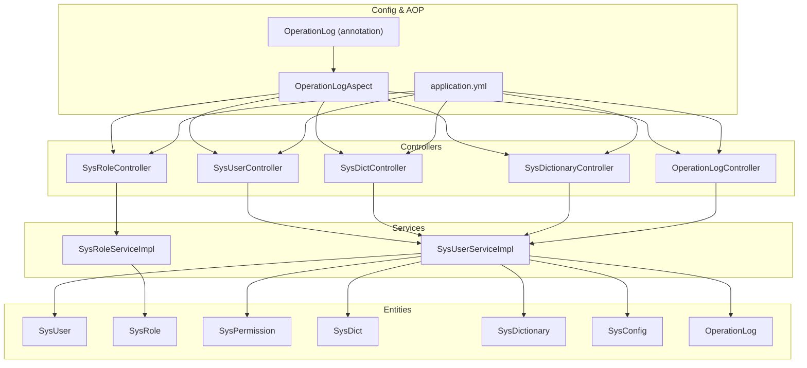
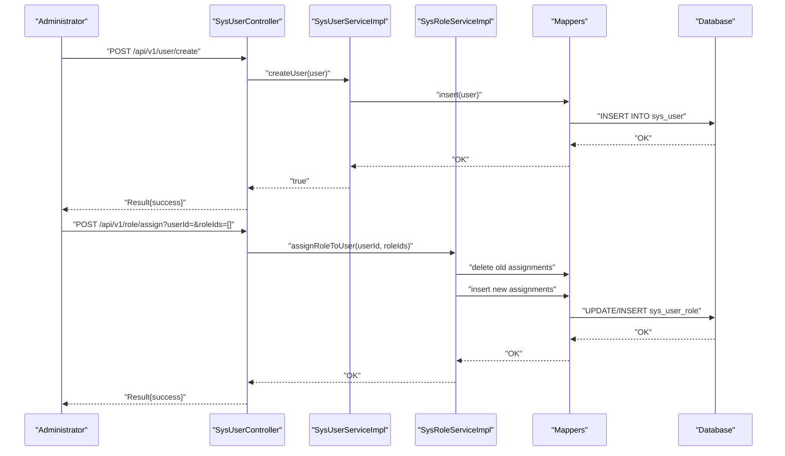
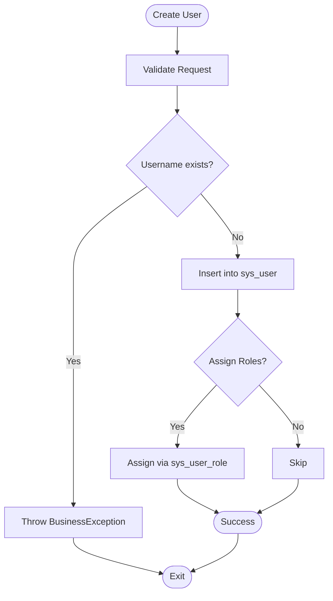
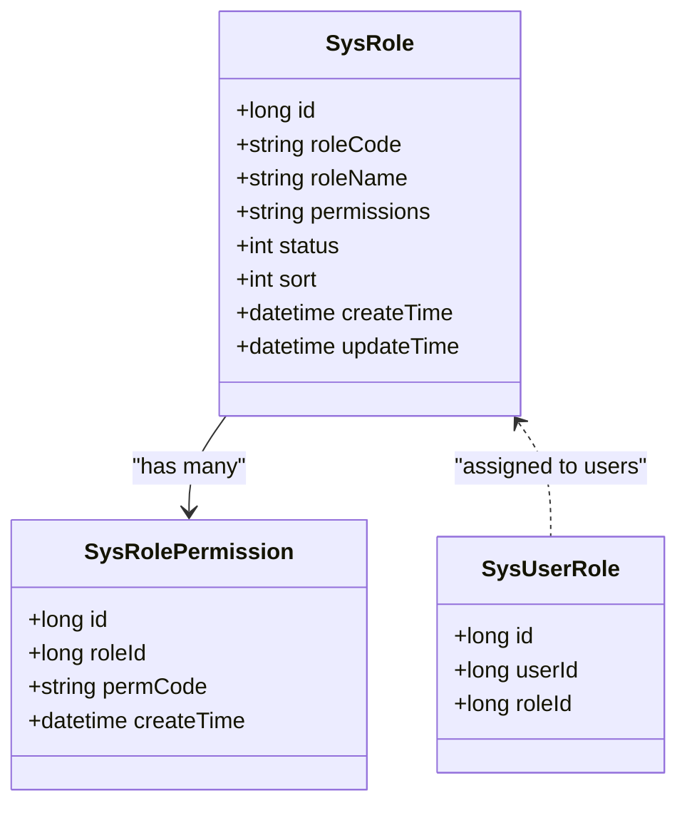
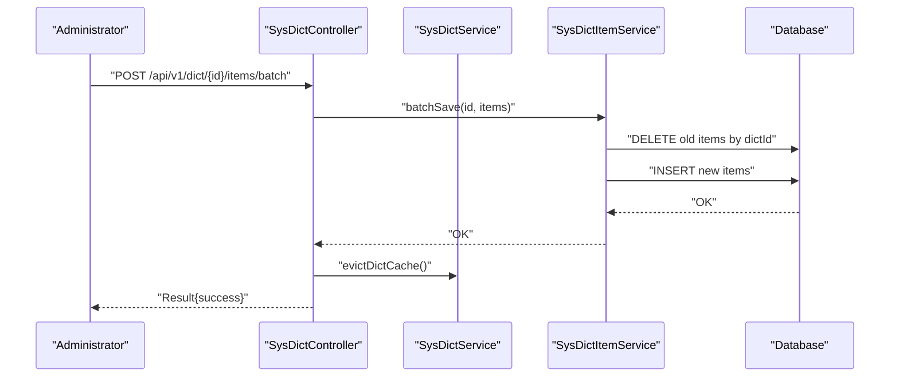
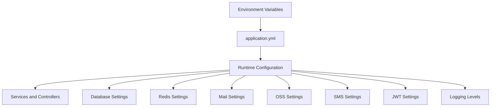
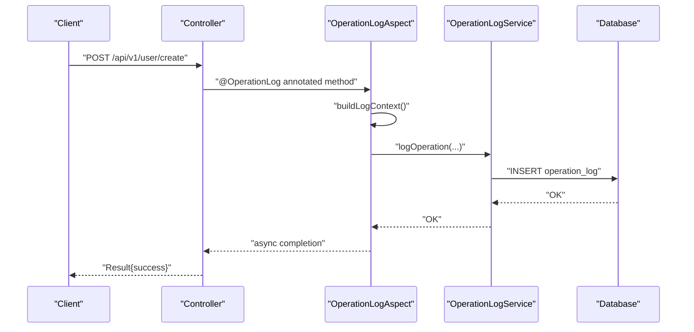
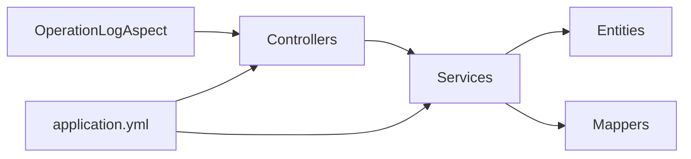

# System Administration

<cite>
**Referenced Files in This Document**
- [SysUser.java](file://admin-backend/src/main/java/com/qhiot/survey/entity/SysUser.java)
- [SysRole.java](file://admin-backend/src/main/java/com/qhiot/survey/entity/SysRole.java)
- [SysPermission.java](file://admin-backend/src/main/java/com/qhiot/survey/entity/SysPermission.java)
- [SysDict.java](file://admin-backend/src/main/java/com/qhiot/survey/entity/SysDict.java)
- [SysDictionary.java](file://admin-backend/src/main/java/com/qhiot/survey/entity/SysDictionary.java)
- [Permissions.java](file://admin-backend/src/main/java/com/qhiot/survey/common/constant/Permissions.java)
- [SysUserController.java](file://admin-backend/src/main/java/com/qhiot/survey/controller/SysUserController.java)
- [SysRoleController.java](file://admin-backend/src/main/java/com/qhiot/survey/controller/SysRoleController.java)
- [SysDictController.java](file://admin-backend/src/main/java/com/qhiot/survey/controller/SysDictController.java)
- [SysDictionaryController.java](file://admin-backend/src/main/java/com/qhiot/survey/controller/SysDictionaryController.java)
- [SysUserServiceImpl.java](file://admin-backend/src/main/java/com/qhiot/survey/service/impl/SysUserServiceImpl.java)
- [SysRoleServiceImpl.java](file://admin-backend/src/main/java/com/qhiot/survey/service/impl/SysRoleServiceImpl.java)
- [SysConfig.java](file://admin-backend/src/main/java/com/qhiot/survey/entity/SysConfig.java)
- [OperationLogController.java](file://admin-backend/src/main/java/com/qhiot/survey/controller/OperationLogController.java)
- [OperationLog.java](file://admin-backend/src/main/java/com/qhiot/survey/entity/OperationLog.java)
- [OperationLog.java (annotation)](file://admin-backend/src/main/java/com/qhiot/survey/common/annotation/OperationLog.java)
- [OperationLogAspect.java](file://admin-backend/src/main/java/com/qhiot/survey/common/aspect/OperationLogAspect.java)
- [application.yml](file://admin-backend/src/main/resources/application.yml)
</cite>

## Table of Contents
1. [Introduction](#introduction)
2. [Project Structure](#project-structure)
3. [Core Components](#core-components)
4. [Architecture Overview](#architecture-overview)
5. [Detailed Component Analysis](#detailed-component-analysis)
6. [Dependency Analysis](#dependency-analysis)
7. [Performance Considerations](#performance-considerations)
8. [Troubleshooting Guide](#troubleshooting-guide)
9. [Conclusion](#conclusion)
10. [Appendices](#appendices)

## Introduction
This document explains the system administration capabilities of the Survey-App backend. It covers:
- User lifecycle and profile management with account security controls
- Role and permission management with hierarchical permission structures and access control enforcement
- Dictionary management for lookup tables and system configuration
- System configuration management including environment settings, feature toggles, and operational parameters
- Examples of user onboarding, role assignment, dictionary updates, and system monitoring
- Administrative audit trails and compliance reporting features

## Project Structure
The administration subsystem is implemented as a Spring Boot application with layered architecture:
- Controllers expose REST endpoints for administration tasks
- Services encapsulate business logic and enforce policies
- Entities define domain models for users, roles, permissions, dictionaries, configs, and operation logs
- Configuration defines environment variables and feature flags
- Aspects and annotations support operation logging and cross-cutting concerns

**Diagram sources**
- [SysUserController.java:36-263](file://admin-backend/src/main/java/com/qhiot/survey/controller/SysUserController.java#L36-L263)
- [SysRoleController.java:21-138](file://admin-backend/src/main/java/com/qhiot/survey/controller/SysRoleController.java#L21-L138)
- [SysDictController.java:24-196](file://admin-backend/src/main/java/com/qhiot/survey/controller/SysDictController.java#L24-L196)
- [SysDictionaryController.java:19-97](file://admin-backend/src/main/java/com/qhiot/survey/controller/SysDictionaryController.java#L19-L97)
- [SysUserServiceImpl.java:40-486](file://admin-backend/src/main/java/com/qhiot/survey/service/impl/SysUserServiceImpl.java#L40-L486)
- [SysRoleServiceImpl.java:28-225](file://admin-backend/src/main/java/com/qhiot/survey/service/impl/SysRoleServiceImpl.java#L28-L225)
- [SysUser.java:16-95](file://admin-backend/src/main/java/com/qhiot/survey/entity/SysUser.java#L16-L95)
- [SysRole.java:10-40](file://admin-backend/src/main/java/com/qhiot/survey/entity/SysRole.java#L10-L40)
- [SysPermission.java:11-56](file://admin-backend/src/main/java/com/qhiot/survey/entity/SysPermission.java#L11-L56)
- [SysDict.java:11-60](file://admin-backend/src/main/java/com/qhiot/survey/entity/SysDict.java#L11-L60)
- [SysDictionary.java:10-46](file://admin-backend/src/main/java/com/qhiot/survey/entity/SysDictionary.java#L10-L46)
- [SysConfig.java:11-37](file://admin-backend/src/main/java/com/qhiot/survey/entity/SysConfig.java#L11-L37)
- [OperationLog.java:10-45](file://admin-backend/src/main/java/com/qhiot/survey/entity/OperationLog.java#L10-L45)
- [OperationLog.java (annotation):5-40](file://admin-backend/src/main/java/com/qhiot/survey/common/annotation/OperationLog.java#L5-L40)
- [OperationLogAspect.java:31-266](file://admin-backend/src/main/java/com/qhiot/survey/common/aspect/OperationLogAspect.java#L31-L266)
- [application.yml:1-149](file://admin-backend/src/main/resources/application.yml#L1-L149)

**Section sources**
- [SysUserController.java:36-263](file://admin-backend/src/main/java/com/qhiot/survey/controller/SysUserController.java#L36-L263)
- [SysRoleController.java:21-138](file://admin-backend/src/main/java/com/qhiot/survey/controller/SysRoleController.java#L21-L138)
- [SysDictController.java:24-196](file://admin-backend/src/main/java/com/qhiot/survey/controller/SysDictController.java#L24-L196)
- [SysDictionaryController.java:19-97](file://admin-backend/src/main/java/com/qhiot/survey/controller/SysDictionaryController.java#L19-L97)
- [SysUserServiceImpl.java:40-486](file://admin-backend/src/main/java/com/qhiot/survey/service/impl/SysUserServiceImpl.java#L40-L486)
- [SysRoleServiceImpl.java:28-225](file://admin-backend/src/main/java/com/qhiot/survey/service/impl/SysRoleServiceImpl.java#L28-L225)
- [application.yml:1-149](file://admin-backend/src/main/resources/application.yml#L1-L149)

## Core Components
- User Management: CRUD, status control, password reset with rate limiting, import/export, and login failure/lock handling
- Role and Permission Management: Role creation/update/delete, multi-role assignment, and permission configuration via a JSON-like field plus a dedicated relation table
- Dictionary Management: Hierarchical dictionary categories and items, batch item updates, cache invalidation, and retrieval APIs
- System Configuration: Environment-driven configuration keys and values, feature toggles (e.g., SMS), and operational parameters
- Audit and Compliance: Operation logging with risk levels, statistics, exports, and compliance-friendly records

**Section sources**
- [SysUser.java:16-95](file://admin-backend/src/main/java/com/qhiot/survey/entity/SysUser.java#L16-L95)
- [SysRole.java:10-40](file://admin-backend/src/main/java/com/qhiot/survey/entity/SysRole.java#L10-L40)
- [SysPermission.java:11-56](file://admin-backend/src/main/java/com/qhiot/survey/entity/SysPermission.java#L11-L56)
- [SysDict.java:11-60](file://admin-backend/src/main/java/com/qhiot/survey/entity/SysDict.java#L11-L60)
- [SysDictionary.java:10-46](file://admin-backend/src/main/java/com/qhiot/survey/entity/SysDictionary.java#L10-L46)
- [Permissions.java:1-81](file://admin-backend/src/main/java/com/qhiot/survey/common/constant/Permissions.java#L1-L81)
- [SysUserServiceImpl.java:66-334](file://admin-backend/src/main/java/com/qhiot/survey/service/impl/SysUserServiceImpl.java#L66-L334)
- [SysRoleServiceImpl.java:113-210](file://admin-backend/src/main/java/com/qhiot/survey/service/impl/SysRoleServiceImpl.java#L113-L210)
- [SysDictController.java:34-195](file://admin-backend/src/main/java/com/qhiot/survey/controller/SysDictController.java#L34-L195)
- [SysDictionaryController.java:27-97](file://admin-backend/src/main/java/com/qhiot/survey/controller/SysDictionaryController.java#L27-L97)
- [SysConfig.java:11-37](file://admin-backend/src/main/java/com/qhiot/survey/entity/SysConfig.java#L11-L37)
- [OperationLogController.java:30-87](file://admin-backend/src/main/java/com/qhiot/survey/controller/OperationLogController.java#L30-L87)
- [OperationLog.java:10-45](file://admin-backend/src/main/java/com/qhiot/survey/entity/OperationLog.java#L10-L45)

## Architecture Overview
The system uses a layered architecture with explicit separation of concerns:
- Presentation: REST controllers expose administrative endpoints
- Application: Services implement business rules and orchestrate operations
- Persistence: MyBatis-Plus mappers and entities map to relational tables
- Cross-cutting: AOP captures operation logs asynchronously after successful method execution
- Configuration: Environment variables drive runtime behavior and feature flags

**Diagram sources**
- [SysUserController.java:124-159](file://admin-backend/src/main/java/com/qhiot/survey/controller/SysUserController.java#L124-L159)
- [SysUserServiceImpl.java:82-93](file://admin-backend/src/main/java/com/qhiot/survey/service/impl/SysUserServiceImpl.java#L82-L93)
- [SysRoleServiceImpl.java:113-165](file://admin-backend/src/main/java/com/qhiot/survey/service/impl/SysRoleServiceImpl.java#L113-L165)

**Section sources**
- [SysUserController.java:36-263](file://admin-backend/src/main/java/com/qhiot/survey/controller/SysUserController.java#L36-L263)
- [SysRoleController.java:21-138](file://admin-backend/src/main/java/com/qhiot/survey/controller/SysRoleController.java#L21-L138)
- [SysUserServiceImpl.java:40-486](file://admin-backend/src/main/java/com/qhiot/survey/service/impl/SysUserServiceImpl.java#L40-L486)
- [SysRoleServiceImpl.java:28-225](file://admin-backend/src/main/java/com/qhiot/survey/service/impl/SysRoleServiceImpl.java#L28-L225)

## Detailed Component Analysis

### User Management System
- Lifecycle: Create, read (list/page/detail), update (profile/password), status toggle, delete, import/export
- Profile management: Real name, contact info, and role associations
- Account security:
  - Login failure tracking and temporary lockout
  - First-login mandatory password change flag
  - Password reset with rate limiting and async notifications
- Import/Export: Excel-based ingestion with strong password generation and optional role assignment; export aggregates roles and statuses

**Diagram sources**
- [SysUserServiceImpl.java:82-93](file://admin-backend/src/main/java/com/qhiot/survey/service/impl/SysUserServiceImpl.java#L82-L93)
- [SysRoleServiceImpl.java:113-165](file://admin-backend/src/main/java/com/qhiot/survey/service/impl/SysRoleServiceImpl.java#L113-L165)

**Section sources**
- [SysUser.java:16-95](file://admin-backend/src/main/java/com/qhiot/survey/entity/SysUser.java#L16-L95)
- [SysUserController.java:124-159](file://admin-backend/src/main/java/com/qhiot/survey/controller/SysUserController.java#L124-L159)
- [SysUserServiceImpl.java:66-334](file://admin-backend/src/main/java/com/qhiot/survey/service/impl/SysUserServiceImpl.java#L66-L334)
- [SysRoleServiceImpl.java:113-165](file://admin-backend/src/main/java/com/qhiot/survey/service/impl/SysRoleServiceImpl.java#L113-L165)

### Role and Permission Management
- Roles: Creation with unique role codes, enabling/disabling, listing, and pagination
- Multi-role assignment: Replaces previous assignments atomically and deduplicates inputs
- Permissions:
  - Stored in role entity as a delimited string for quick evaluation
  - Synchronized into a normalized relation table for auditing and advanced queries
  - Enforced via annotations and authorities checks in controllers
- Hierarchical permission structures: Permissions are organized by module and action (e.g., project:view, survey:create)

**Diagram sources**
- [SysRole.java:10-40](file://admin-backend/src/main/java/com/qhiot/survey/entity/SysRole.java#L10-L40)
- [SysPermission.java:11-56](file://admin-backend/src/main/java/com/qhiot/survey/entity/SysPermission.java#L11-L56)
- [SysRoleServiceImpl.java:182-210](file://admin-backend/src/main/java/com/qhiot/survey/service/impl/SysRoleServiceImpl.java#L182-L210)

**Section sources**
- [SysRoleController.java:51-130](file://admin-backend/src/main/java/com/qhiot/survey/controller/SysRoleController.java#L51-L130)
- [SysRoleServiceImpl.java:113-210](file://admin-backend/src/main/java/com/qhiot/survey/service/impl/SysRoleServiceImpl.java#L113-L210)
- [Permissions.java:13-80](file://admin-backend/src/main/java/com/qhiot/survey/common/constant/Permissions.java#L13-L80)

### Dictionary Management System
- Categories and Items: Manage dictionary categories and items per category
- Batch Operations: Bulk save items per category, clearing old entries first
- Cache Management: Evict caches after create/update/delete to ensure immediate consistency
- Retrieval APIs: By category ID, by category code, and aggregated full dataset

**Diagram sources**
- [SysDictController.java:163-195](file://admin-backend/src/main/java/com/qhiot/survey/controller/SysDictController.java#L163-L195)
- [SysDictController.java:80-147](file://admin-backend/src/main/java/com/qhiot/survey/controller/SysDictController.java#L80-147)

**Section sources**
- [SysDictController.java:34-195](file://admin-backend/src/main/java/com/qhiot/survey/controller/SysDictController.java#L34-L195)
- [SysDictionaryController.java:27-97](file://admin-backend/src/main/java/com/qhiot/survey/controller/SysDictionaryController.java#L27-L97)
- [SysDict.java:11-60](file://admin-backend/src/main/java/com/qhiot/survey/entity/SysDict.java#L11-L60)
- [SysDictionary.java:10-46](file://admin-backend/src/main/java/com/qhiot/survey/entity/SysDictionary.java#L10-L46)

### System Configuration Management
- Environment settings: Database, Redis, Mail, OSS, SMS, CORS, JWT, and application environment
- Feature toggles: SMS enablement and password reset limits
- Operational parameters: File upload sizes, slow SQL thresholds, and logging levels
- Configuration model: A generic sys_config entity supports storing key-value pairs with type hints

**Diagram sources**
- [application.yml:15-149](file://admin-backend/src/main/resources/application.yml#L15-L149)
- [SysConfig.java:11-37](file://admin-backend/src/main/java/com/qhiot/survey/entity/SysConfig.java#L11-L37)

**Section sources**
- [application.yml:15-149](file://admin-backend/src/main/resources/application.yml#L15-L149)
- [SysConfig.java:11-37](file://admin-backend/src/main/java/com/qhiot/survey/entity/SysConfig.java#L11-L37)

### Administrative Audit Trails and Compliance Reporting
- Operation logging: Annotation-driven AOP captures successful operations with user, IP, UA, module, action, description, and risk level
- Statistics and exports: Count by module/user/risk/date range; export to Excel
- Compliance-friendly records: Structured fields for auditability and trend analysis

**Diagram sources**
- [OperationLog.java (annotation):5-40](file://admin-backend/src/main/java/com/qhiot/survey/common/annotation/OperationLog.java#L5-L40)
- [OperationLogAspect.java:56-182](file://admin-backend/src/main/java/com/qhiot/survey/common/aspect/OperationLogAspect.java#L56-L182)
- [OperationLogController.java:30-87](file://admin-backend/src/main/java/com/qhiot/survey/controller/OperationLogController.java#L30-L87)
- [OperationLog.java:10-45](file://admin-backend/src/main/java/com/qhiot/survey/entity/OperationLog.java#L10-L45)

**Section sources**
- [OperationLogController.java:30-87](file://admin-backend/src/main/java/com/qhiot/survey/controller/OperationLogController.java#L30-L87)
- [OperationLogAspect.java:56-182](file://admin-backend/src/main/java/com/qhiot/survey/common/aspect/OperationLogAspect.java#L56-L182)
- [OperationLog.java:10-45](file://admin-backend/src/main/java/com/qhiot/survey/entity/OperationLog.java#L10-L45)

## Dependency Analysis
- Controllers depend on services for business logic
- Services depend on mappers/entities for persistence
- Operation logging is decoupled via AOP and annotation scanning
- Configuration is externalized via environment variables and YAML

**Diagram sources**
- [SysUserController.java:36-263](file://admin-backend/src/main/java/com/qhiot/survey/controller/SysUserController.java#L36-L263)
- [SysRoleController.java:21-138](file://admin-backend/src/main/java/com/qhiot/survey/controller/SysRoleController.java#L21-L138)
- [SysUserServiceImpl.java:40-486](file://admin-backend/src/main/java/com/qhiot/survey/service/impl/SysUserServiceImpl.java#L40-L486)
- [SysRoleServiceImpl.java:28-225](file://admin-backend/src/main/java/com/qhiot/survey/service/impl/SysRoleServiceImpl.java#L28-L225)
- [OperationLogAspect.java:35-126](file://admin-backend/src/main/java/com/qhiot/survey/common/aspect/OperationLogAspect.java#L35-L126)
- [application.yml:15-149](file://admin-backend/src/main/resources/application.yml#L15-L149)

**Section sources**
- [SysUserController.java:36-263](file://admin-backend/src/main/java/com/qhiot/survey/controller/SysUserController.java#L36-L263)
- [SysRoleController.java:21-138](file://admin-backend/src/main/java/com/qhiot/survey/controller/SysRoleController.java#L21-L138)
- [SysUserServiceImpl.java:40-486](file://admin-backend/src/main/java/com/qhiot/survey/service/impl/SysUserServiceImpl.java#L40-L486)
- [SysRoleServiceImpl.java:28-225](file://admin-backend/src/main/java/com/qhiot/survey/service/impl/SysRoleServiceImpl.java#L28-L225)
- [OperationLogAspect.java:35-126](file://admin-backend/src/main/java/com/qhiot/survey/common/aspect/OperationLogAspect.java#L35-L126)
- [application.yml:15-149](file://admin-backend/src/main/resources/application.yml#L15-L149)

## Performance Considerations
- Caching: User lookups are cached to reduce DB load; cache is evicted on write operations
- Asynchronous logging: Operation logs are recorded asynchronously to avoid blocking request threads
- Pagination: Controllers implement pagination for listing operations to limit payload sizes
- Batch operations: Dictionary batch saves replace existing items efficiently
- Redis usage: Used for rate limiting and short-lived locks during login failure handling

[No sources needed since this section provides general guidance]

## Troubleshooting Guide
- User creation fails with “username exists”: Verify uniqueness and retry
- Role deletion blocked: Confirm no user assignments remain
- Password reset throttled: Respect configured limits; check rate limiter logs
- Operation log not recorded: Ensure method is annotated with @OperationLog and succeeds; exceptions are not logged
- Dictionary changes not reflected: Trigger cache eviction or refresh cache endpoint

**Section sources**
- [SysUserServiceImpl.java:86-92](file://admin-backend/src/main/java/com/qhiot/survey/service/impl/SysUserServiceImpl.java#L86-L92)
- [SysRoleServiceImpl.java:86-99](file://admin-backend/src/main/java/com/qhiot/survey/service/impl/SysRoleServiceImpl.java#L86-L99)
- [OperationLogAspect.java:149-152](file://admin-backend/src/main/java/com/qhiot/survey/common/aspect/OperationLogAspect.java#L149-L152)
- [SysDictController.java:106-108](file://admin-backend/src/main/java/com/qhiot/survey/controller/SysDictController.java#L106-L108)

## Conclusion
The system provides a robust administration framework with clear separation of concerns, comprehensive auditability, and practical operational controls. Administrators can manage users, assign roles and permissions, maintain dictionaries, and monitor activities through structured APIs and dashboards.

[No sources needed since this section summarizes without analyzing specific files]

## Appendices

### Example Workflows

- User Onboarding
  - Create user with initial strong password
  - Optionally assign roles
  - Receive initial credentials via async notification channel

- Role Assignment
  - Assign multiple roles to a user atomically
  - Replace previous assignments safely

- Dictionary Updates
  - Create or update dictionary category
  - Batch save items under a category
  - Invalidate cache to reflect changes immediately

- System Monitoring
  - Query operation logs by module or user
  - Export logs for compliance
  - View statistics by risk level and date trends

[No sources needed since this section provides general guidance]