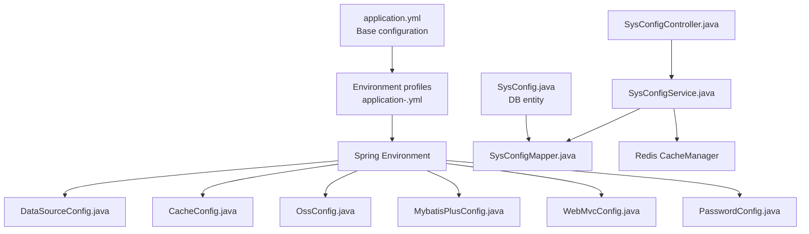
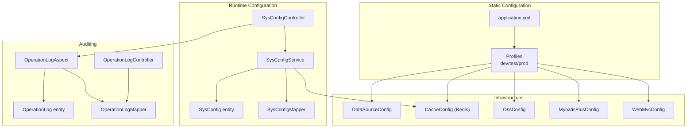
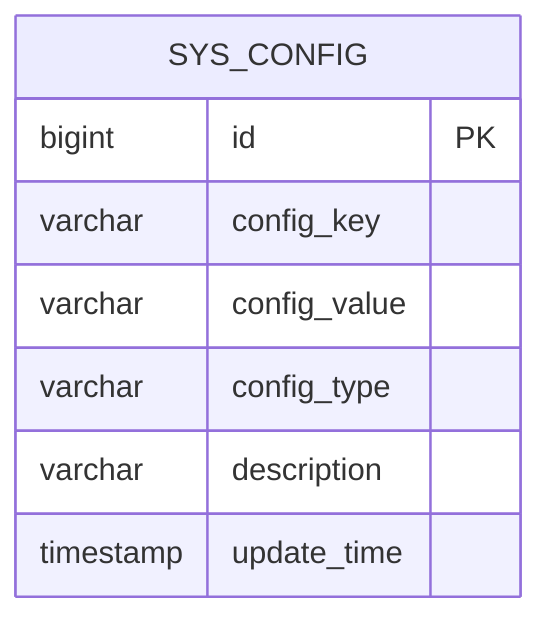
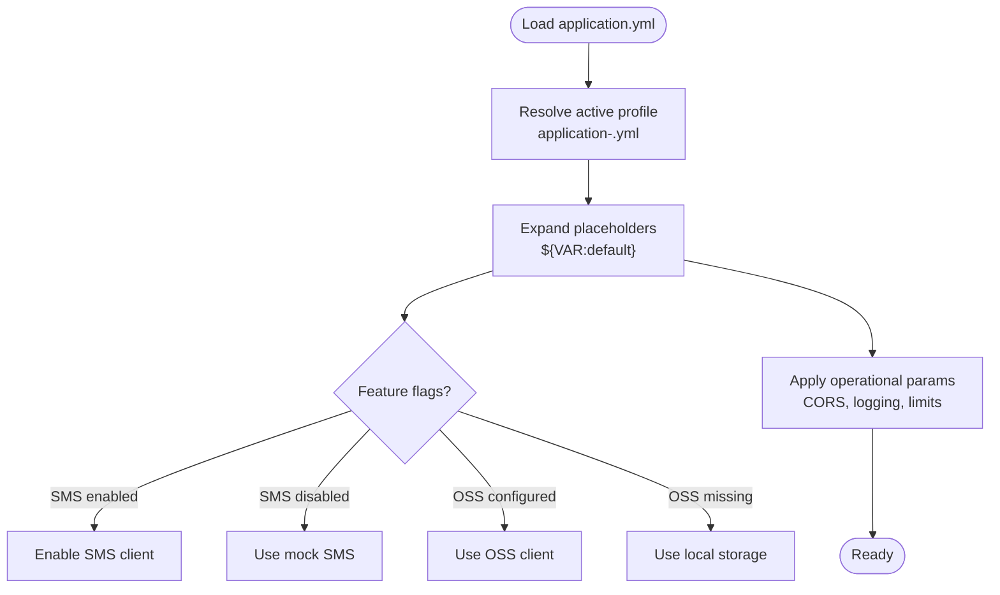
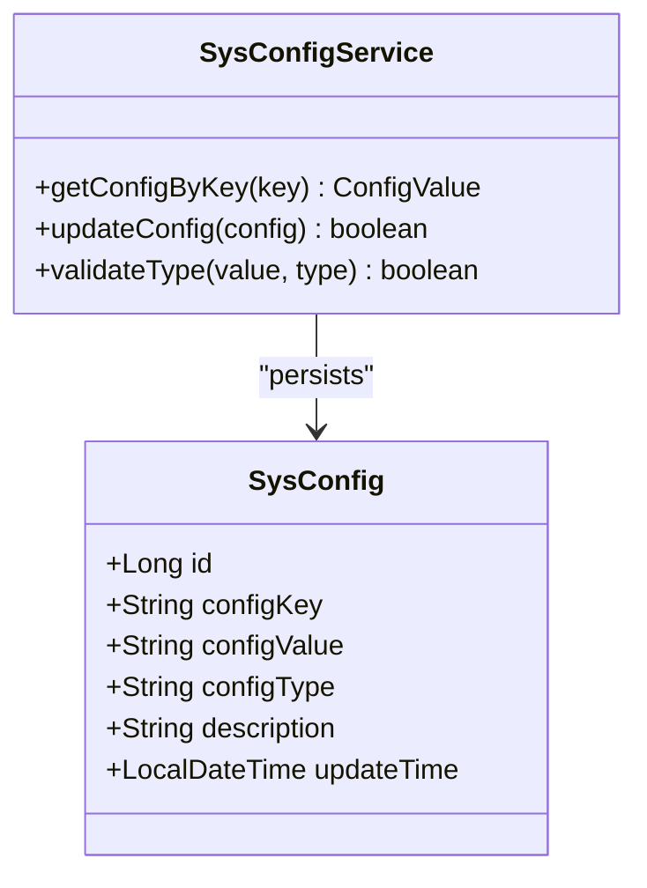
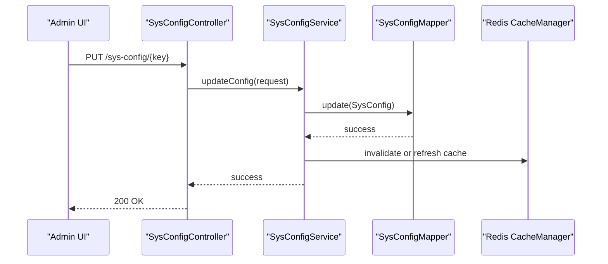
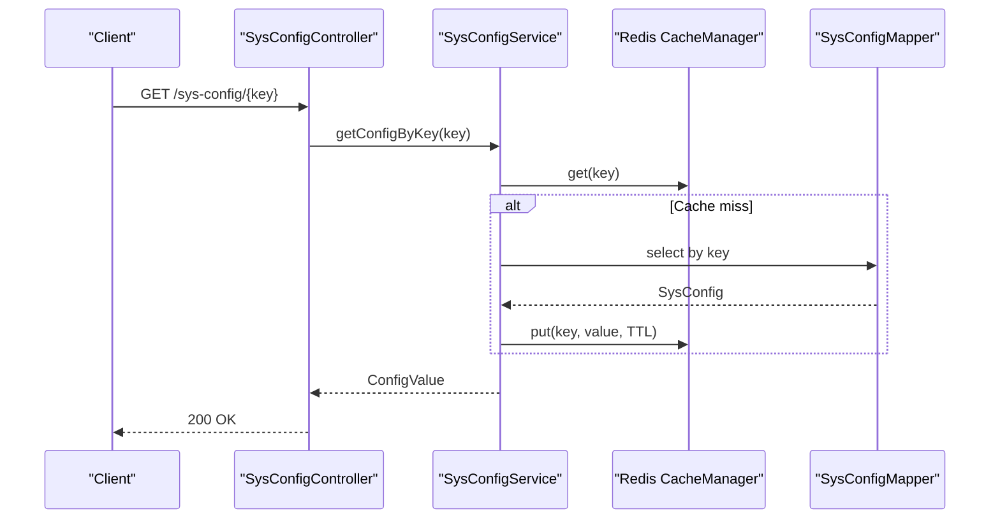
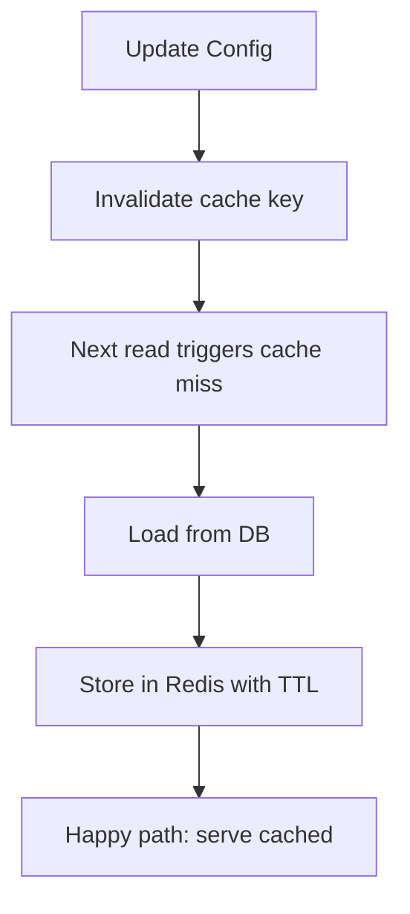
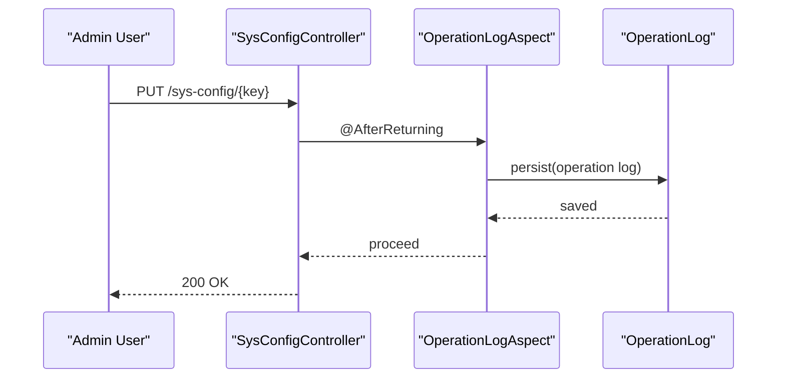
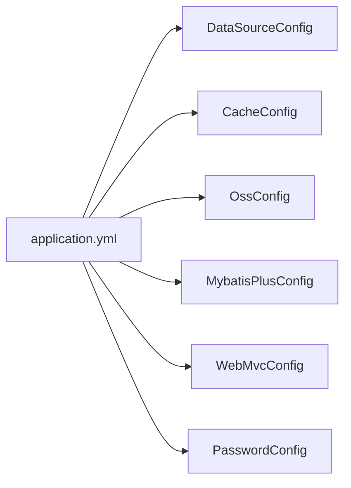

# System Configuration

<cite>
**Referenced Files in This Document**
- [application.yml](file://admin-backend/src/main/resources/application.yml)
- [application-prod.yml](file://admin-backend/src/main/resources/application-prod.yml)
- [application-test.yml](file://admin-backend/src/main/resources/application-test.yml)
- [SysConfig.java](file://admin-backend/src/main/java/com/qhiot/survey/entity/SysConfig.java)
- [SysConfigMapper.java](file://admin-backend/src/main/java/com/qhiot/survey/mapper/SysConfigMapper.java)
- [CacheConfig.java](file://admin-backend/src/main/java/com/qhiot/survey/config/CacheConfig.java)
- [DataSourceConfig.java](file://admin-backend/src/main/java/com/qhiot/survey/config/DataSourceConfig.java)
- [MybatisPlusConfig.java](file://admin-backend/src/main/java/com/qhiot/survey/config/MybatisPlusConfig.java)
- [OssConfig.java](file://admin-backend/src/main/java/com/qhiot/survey/config/OssConfig.java)
- [PasswordConfig.java](file://admin-backend/src/main/java/com/qhiot/survey/config/PasswordConfig.java)
- [WebMvcConfig.java](file://admin-backend/src/main/java/com/qhiot/survey/config/WebMvcConfig.java)
- [OperationLogAspect.java](file://admin-backend/src/main/java/com/qhiot/survey/common/aspect/OperationLogAspect.java)
- [OperationLog.java](file://admin-backend/src/main/java/com/qhiot/survey/entity/OperationLog.java)
- [OperationLogMapper.java](file://admin-backend/src/main/java/com/qhiot/survey/mapper/OperationLogMapper.java)
- [OperationLogController.java](file://admin-backend/src/main/java/com/qhiot/survey/controller/OperationLogController.java)
- [SysConfigController.java](file://admin-backend/src/main/java/com/qhiot/survey/controller/SysConfigController.java)
- [SysConfigService.java](file://admin-backend/src/main/java/com/qhiot/survey/service/impl/SysConfigServiceImpl.java)
- [SurveyApplication.java](file://admin-backend/src/main/java/com/qhiot/survey/SurveyApplication.java)
</cite>

## Table of Contents
1. [Introduction](#introduction)
2. [Project Structure](#project-structure)
3. [Core Components](#core-components)
4. [Architecture Overview](#architecture-overview)
5. [Detailed Component Analysis](#detailed-component-analysis)
6. [Dependency Analysis](#dependency-analysis)
7. [Performance Considerations](#performance-considerations)
8. [Troubleshooting Guide](#troubleshooting-guide)
9. [Conclusion](#conclusion)
10. [Appendices](#appendices)

## Introduction
This document describes the system configuration management for the Survey-App backend. It covers the configuration data model and storage mechanisms, environment-specific settings, feature toggles, operational parameters, validation and defaults, type safety, updates and versioning, rollback capabilities, caching and hot-reload strategies, distributed configuration considerations, and security/access control with audit trails.

## Project Structure
Configuration is primarily managed via Spring Boot externalized configuration files and a dedicated configuration entity persisted in the database. The backend exposes a configuration management API and integrates with Redis for caching and distributed coordination.

**Diagram sources**
- [application.yml:1-149](file://admin-backend/src/main/resources/application.yml#L1-L149)
- [application-prod.yml:1-140](file://admin-backend/src/main/resources/application-prod.yml#L1-L140)
- [application-test.yml:1-39](file://admin-backend/src/main/resources/application-test.yml#L1-L39)
- [DataSourceConfig.java:1-19](file://admin-backend/src/main/java/com/qhiot/survey/config/DataSourceConfig.java#L1-L19)
- [CacheConfig.java:1-94](file://admin-backend/src/main/java/com/qhiot/survey/config/CacheConfig.java#L1-L94)
- [OssConfig.java:1-34](file://admin-backend/src/main/java/com/qhiot/survey/config/OssConfig.java#L1-L34)
- [MybatisPlusConfig.java:1-42](file://admin-backend/src/main/java/com/qhiot/survey/config/MybatisPlusConfig.java#L1-L42)
- [WebMvcConfig.java:1-29](file://admin-backend/src/main/java/com/qhiot/survey/config/WebMvcConfig.java#L1-L29)
- [PasswordConfig.java:1-18](file://admin-backend/src/main/java/com/qhiot/survey/config/PasswordConfig.java#L1-L18)
- [SysConfig.java:1-37](file://admin-backend/src/main/java/com/qhiot/survey/entity/SysConfig.java#L1-L37)
- [SysConfigMapper.java:1-12](file://admin-backend/src/main/java/com/qhiot/survey/mapper/SysConfigMapper.java#L1-L12)

**Section sources**
- [application.yml:1-149](file://admin-backend/src/main/resources/application.yml#L1-L149)
- [application-prod.yml:1-140](file://admin-backend/src/main/resources/application-prod.yml#L1-L140)
- [application-test.yml:1-39](file://admin-backend/src/main/resources/application-test.yml#L1-L39)

## Core Components
- Environment-aware configuration via Spring profiles and YAML property placeholders.
- Database-backed configuration entity for runtime-modifiable settings.
- Centralized cache manager with TTL policies and transaction-aware writes.
- Feature toggles for optional integrations (e.g., SMS, OSS).
- Operational parameters for data source, logging, CORS, and rate limits.
- Audit trail via operation logs for configuration changes.

**Section sources**
- [application.yml:1-149](file://admin-backend/src/main/resources/application.yml#L1-L149)
- [application-prod.yml:1-140](file://admin-backend/src/main/resources/application-prod.yml#L1-L140)
- [application-test.yml:1-39](file://admin-backend/src/main/resources/application-test.yml#L1-L39)
- [SysConfig.java:1-37](file://admin-backend/src/main/java/com/qhiot/survey/entity/SysConfig.java#L1-L37)
- [CacheConfig.java:1-94](file://admin-backend/src/main/java/com/qhiot/survey/config/CacheConfig.java#L1-L94)
- [OssConfig.java:1-34](file://admin-backend/src/main/java/com/qhiot/survey/config/OssConfig.java#L1-L34)
- [OperationLogAspect.java](file://admin-backend/src/main/java/com/qhiot/survey/common/aspect/OperationLogAspect.java)

## Architecture Overview
The configuration architecture combines static Spring Boot configuration with dynamic database-driven settings. Static configuration controls infrastructure and framework behavior, while the SysConfig entity enables runtime configuration changes. Redis caches frequently accessed configuration values with explicit TTLs and transaction-aware writes.

**Diagram sources**
- [application.yml:1-149](file://admin-backend/src/main/resources/application.yml#L1-L149)
- [application-prod.yml:1-140](file://admin-backend/src/main/resources/application-prod.yml#L1-L140)
- [application-test.yml:1-39](file://admin-backend/src/main/resources/application-test.yml#L1-L39)
- [SysConfig.java:1-37](file://admin-backend/src/main/java/com/qhiot/survey/entity/SysConfig.java#L1-L37)
- [SysConfigMapper.java:1-12](file://admin-backend/src/main/java/com/qhiot/survey/mapper/SysConfigMapper.java#L1-L12)
- [SysConfigController.java](file://admin-backend/src/main/java/com/qhiot/survey/controller/SysConfigController.java)
- [SysConfigService.java](file://admin-backend/src/main/java/com/qhiot/survey/service/impl/SysConfigServiceImpl.java)
- [CacheConfig.java:1-94](file://admin-backend/src/main/java/com/qhiot/survey/config/CacheConfig.java#L1-L94)
- [DataSourceConfig.java:1-19](file://admin-backend/src/main/java/com/qhiot/survey/config/DataSourceConfig.java#L1-L19)
- [OssConfig.java:1-34](file://admin-backend/src/main/java/com/qhiot/survey/config/OssConfig.java#L1-L34)
- [MybatisPlusConfig.java:1-42](file://admin-backend/src/main/java/com/qhiot/survey/config/MybatisPlusConfig.java#L1-L42)
- [WebMvcConfig.java:1-29](file://admin-backend/src/main/java/com/qhiot/survey/config/WebMvcConfig.java#L1-L29)
- [OperationLogAspect.java](file://admin-backend/src/main/java/com/qhiot/survey/common/aspect/OperationLogAspect.java)
- [OperationLog.java](file://admin-backend/src/main/java/com/qhiot/survey/entity/OperationLog.java)
- [OperationLogMapper.java](file://admin-backend/src/main/java/com/qhiot/survey/mapper/OperationLogMapper.java)
- [OperationLogController.java](file://admin-backend/src/main/java/com/qhiot/survey/controller/OperationLogController.java)

## Detailed Component Analysis

### Configuration Data Model and Storage
- Database entity: SysConfig stores key-value pairs with type metadata and update timestamps. This supports dynamic configuration without restarting the service.
- Mapper: MyBatis-Plus base mapper handles CRUD operations against sys_config.
- Service: Implements retrieval, update, and validation of configuration entries.
- Controller: Exposes endpoints for listing, retrieving, updating, and deleting configuration items.

**Diagram sources**
- [SysConfig.java:14-37](file://admin-backend/src/main/java/com/qhiot/survey/entity/SysConfig.java#L14-L37)

**Section sources**
- [SysConfig.java:1-37](file://admin-backend/src/main/java/com/qhiot/survey/entity/SysConfig.java#L1-L37)
- [SysConfigMapper.java:1-12](file://admin-backend/src/main/java/com/qhiot/survey/mapper/SysConfigMapper.java#L1-L12)

### Environment-Specific Settings and Feature Toggles
- Profiles: application-dev.yml, application-test.yml, application-prod.yml define environment-specific overrides.
- Feature toggles:
  - SMS: aliyun.sms.enabled controls whether SMS notifications are enabled.
  - OSS: When OSS credentials are absent, the system falls back to local storage.
  - Swagger: Disabled in production via knife4j and springdoc flags.
- Operational parameters:
  - CORS allowed origins configurable via environment variable.
  - Rate limits for password resets under app.security.password-reset.
  - Logging levels and file retention differ by environment.

**Diagram sources**
- [application.yml:1-149](file://admin-backend/src/main/resources/application.yml#L1-L149)
- [application-prod.yml:1-140](file://admin-backend/src/main/resources/application-prod.yml#L1-L140)
- [application-test.yml:1-39](file://admin-backend/src/main/resources/application-test.yml#L1-L39)
- [OssConfig.java:1-34](file://admin-backend/src/main/java/com/qhiot/survey/config/OssConfig.java#L1-L34)

**Section sources**
- [application.yml:1-149](file://admin-backend/src/main/resources/application.yml#L1-L149)
- [application-prod.yml:1-140](file://admin-backend/src/main/resources/application-prod.yml#L1-L140)
- [application-test.yml:1-39](file://admin-backend/src/main/resources/application-test.yml#L1-L39)
- [OssConfig.java:1-34](file://admin-backend/src/main/java/com/qhiot/survey/config/OssConfig.java#L1-L34)

### Type Safety and Validation Mechanisms
- Type field in SysConfig allows callers to interpret values as string, JSON, or numeric safely.
- Service-level validation ensures keys adhere to naming conventions and prevents invalid updates.
- Jackson serialization in CacheConfig restricts polymorphic deserialization to mitigate injection risks.
- Placeholder defaults in YAML provide safe fallbacks when environment variables are unset.

**Diagram sources**
- [SysConfig.java:14-37](file://admin-backend/src/main/java/com/qhiot/survey/entity/SysConfig.java#L14-L37)
- [SysConfigService.java](file://admin-backend/src/main/java/com/qhiot/survey/service/impl/SysConfigServiceImpl.java)

**Section sources**
- [SysConfig.java:1-37](file://admin-backend/src/main/java/com/qhiot/survey/entity/SysConfig.java#L1-L37)
- [CacheConfig.java:1-94](file://admin-backend/src/main/java/com/qhiot/survey/config/CacheConfig.java#L1-L94)
- [application.yml:1-149](file://admin-backend/src/main/resources/application.yml#L1-L149)

### Configuration Updates, Versioning, and Rollback
- Update workflow: Controller validates inputs → Service persists to DB → Cache invalidated or refreshed.
- Versioning: No explicit semantic versioning is present in the SysConfig entity; however, update_time provides a temporal ordering hint.
- Rollback: The current implementation does not provide automated rollback. Recommended approach: maintain a changelog table and expose a revert endpoint that re-applies the previous known-good value.

**Diagram sources**
- [SysConfigController.java](file://admin-backend/src/main/java/com/qhiot/survey/controller/SysConfigController.java)
- [SysConfigService.java](file://admin-backend/src/main/java/com/qhiot/survey/service/impl/SysConfigServiceImpl.java)
- [SysConfigMapper.java:1-12](file://admin-backend/src/main/java/com/qhiot/survey/mapper/SysConfigMapper.java#L1-L12)
- [CacheConfig.java:1-94](file://admin-backend/src/main/java/com/qhiot/survey/config/CacheConfig.java#L1-L94)

**Section sources**
- [SysConfigController.java](file://admin-backend/src/main/java/com/qhiot/survey/controller/SysConfigController.java)
- [SysConfigService.java](file://admin-backend/src/main/java/com/qhiot/survey/service/impl/SysConfigServiceImpl.java)
- [SysConfigMapper.java:1-12](file://admin-backend/src/main/java/com/qhiot/survey/mapper/SysConfigMapper.java#L1-L12)

### Configuration Retrieval, Modification, and Monitoring
- Retrieval: GET endpoints return SysConfig entries; cached values are served with TTL policies.
- Modification: PUT/PATCH endpoints update values; validation ensures type safety.
- Monitoring: Management endpoints (health, info, metrics) exposed in production; audit logs track configuration changes.

**Diagram sources**
- [SysConfigController.java](file://admin-backend/src/main/java/com/qhiot/survey/controller/SysConfigController.java)
- [SysConfigService.java](file://admin-backend/src/main/java/com/qhiot/survey/service/impl/SysConfigServiceImpl.java)
- [CacheConfig.java:1-94](file://admin-backend/src/main/java/com/qhiot/survey/config/CacheConfig.java#L1-L94)
- [SysConfigMapper.java:1-12](file://admin-backend/src/main/java/com/qhiot/survey/mapper/SysConfigMapper.java#L1-L12)

**Section sources**
- [SysConfigController.java](file://admin-backend/src/main/java/com/qhiot/survey/controller/SysConfigController.java)
- [SysConfigService.java](file://admin-backend/src/main/java/com/qhiot/survey/service/impl/SysConfigServiceImpl.java)
- [application-prod.yml:131-140](file://admin-backend/src/main/resources/application-prod.yml#L131-L140)

### Caching Strategies and Hot-Reload
- Cache namespaces and TTLs:
  - Dictionary data: 1 hour
  - Template version details: 30 minutes
  - User basic info: 15 minutes
- Transaction-aware cache manager prevents dirty reads during transactions.
- Hot-reload: On update, the service invalidates the relevant cache key; subsequent reads trigger a cache miss and DB load.

**Diagram sources**
- [CacheConfig.java:1-94](file://admin-backend/src/main/java/com/qhiot/survey/config/CacheConfig.java#L1-L94)
- [SysConfigService.java](file://admin-backend/src/main/java/com/qhiot/survey/service/impl/SysConfigServiceImpl.java)

**Section sources**
- [CacheConfig.java:1-94](file://admin-backend/src/main/java/com/qhiot/survey/config/CacheConfig.java#L1-L94)

### Distributed Configuration Management
- Redis acts as a shared cache for configuration values across instances.
- Namespace prefixing (survey:cache:{name}::key) enables targeted cleanup and monitoring.
- Consider adding a configuration change broadcast mechanism (e.g., pub/sub) to notify instances of updates for immediate cache invalidation.

**Section sources**
- [CacheConfig.java:1-94](file://admin-backend/src/main/java/com/qhiot/survey/config/CacheConfig.java#L1-L94)

### Security, Access Control, and Audit Trails
- Access control: Configuration endpoints should require administrative privileges; enforce RBAC at the controller layer.
- Audit trail: OperationLogAspect captures administrative actions; OperationLogController exposes audit queries.
- Secrets: Sensitive values (DB, Redis, JWT, OSS, SMS) are sourced from environment variables; avoid storing secrets in code or YAML.

**Diagram sources**
- [OperationLogAspect.java](file://admin-backend/src/main/java/com/qhiot/survey/common/aspect/OperationLogAspect.java)
- [OperationLog.java](file://admin-backend/src/main/java/com/qhiot/survey/entity/OperationLog.java)
- [OperationLogMapper.java](file://admin-backend/src/main/java/com/qhiot/survey/mapper/OperationLogMapper.java)
- [OperationLogController.java](file://admin-backend/src/main/java/com/qhiot/survey/controller/OperationLogController.java)

**Section sources**
- [OperationLogAspect.java](file://admin-backend/src/main/java/com/qhiot/survey/common/aspect/OperationLogAspect.java)
- [OperationLog.java](file://admin-backend/src/main/java/com/qhiot/survey/entity/OperationLog.java)
- [OperationLogMapper.java](file://admin-backend/src/main/java/com/qhiot/survey/mapper/OperationLogMapper.java)
- [OperationLogController.java](file://admin-backend/src/main/java/com/qhiot/survey/controller/OperationLogController.java)
- [application.yml:1-149](file://admin-backend/src/main/resources/application.yml#L1-L149)
- [application-prod.yml:1-140](file://admin-backend/src/main/resources/application-prod.yml#L1-L140)

## Dependency Analysis
- DataSourceConfig binds spring.datasource properties to a DruidDataSource bean.
- CacheConfig defines Redis cache manager with per-cache TTLs and transaction awareness.
- OssConfig conditionally creates an OSS client based on presence of credentials.
- MybatisPlusConfig registers pagination and optimistic locking interceptors.
- WebMvcConfig registers interceptors for idempotency enforcement.

**Diagram sources**
- [application.yml:1-149](file://admin-backend/src/main/resources/application.yml#L1-L149)
- [DataSourceConfig.java:1-19](file://admin-backend/src/main/java/com/qhiot/survey/config/DataSourceConfig.java#L1-L19)
- [CacheConfig.java:1-94](file://admin-backend/src/main/java/com/qhiot/survey/config/CacheConfig.java#L1-L94)
- [OssConfig.java:1-34](file://admin-backend/src/main/java/com/qhiot/survey/config/OssConfig.java#L1-L34)
- [MybatisPlusConfig.java:1-42](file://admin-backend/src/main/java/com/qhiot/survey/config/MybatisPlusConfig.java#L1-L42)
- [WebMvcConfig.java:1-29](file://admin-backend/src/main/java/com/qhiot/survey/config/WebMvcConfig.java#L1-L29)
- [PasswordConfig.java:1-18](file://admin-backend/src/main/java/com/qhiot/survey/config/PasswordConfig.java#L1-L18)

**Section sources**
- [DataSourceConfig.java:1-19](file://admin-backend/src/main/java/com/qhiot/survey/config/DataSourceConfig.java#L1-L19)
- [CacheConfig.java:1-94](file://admin-backend/src/main/java/com/qhiot/survey/config/CacheConfig.java#L1-L94)
- [OssConfig.java:1-34](file://admin-backend/src/main/java/com/qhiot/survey/config/OssConfig.java#L1-L34)
- [MybatisPlusConfig.java:1-42](file://admin-backend/src/main/java/com/qhiot/survey/config/MybatisPlusConfig.java#L1-L42)
- [WebMvcConfig.java:1-29](file://admin-backend/src/main/java/com/qhiot/survey/config/WebMvcConfig.java#L1-L29)
- [PasswordConfig.java:1-18](file://admin-backend/src/main/java/com/qhiot/survey/config/PasswordConfig.java#L1-L18)

## Performance Considerations
- Prefer JSON serialization with typed polymorphism restrictions to balance flexibility and safety.
- Use namespace prefixes and TTLs to prevent cache bloat and enable targeted invalidation.
- Keep sensitive and frequently changing configuration values in cache only when acceptable latency is ensured.
- Monitor slow SQL and connection pool metrics; adjust Druid settings per environment.

## Troubleshooting Guide
- Configuration not applied:
  - Verify active profile and environment variables.
  - Confirm placeholder expansion and default fallbacks.
- OSS not working:
  - Ensure OSS credentials are set; otherwise, system falls back to local storage.
- Cache anomalies:
  - Check cache namespace prefix and TTLs; confirm transaction awareness is enabled.
- Audit gaps:
  - Ensure OperationLogAspect is enabled and OperationLogController is reachable.

**Section sources**
- [application.yml:1-149](file://admin-backend/src/main/resources/application.yml#L1-L149)
- [application-prod.yml:1-140](file://admin-backend/src/main/resources/application-prod.yml#L1-L140)
- [OssConfig.java:1-34](file://admin-backend/src/main/java/com/qhiot/survey/config/OssConfig.java#L1-L34)
- [CacheConfig.java:1-94](file://admin-backend/src/main/java/com/qhiot/survey/config/CacheConfig.java#L1-L94)
- [OperationLogAspect.java](file://admin-backend/src/main/java/com/qhiot/survey/common/aspect/OperationLogAspect.java)

## Conclusion
The system employs a hybrid configuration strategy: static Spring Boot configuration for infrastructure and feature flags, and a database-backed SysConfig entity for runtime modifiable settings. Redis caching improves performance with explicit TTLs and transaction awareness. Security is enforced via environment variables and audit logging. To enhance resilience, consider adding explicit versioning and automated rollback for configuration changes.

## Appendices
- Example environment variables to set:
  - DB_HOST, DB_PORT, DB_NAME, DB_USERNAME, DB_PASSWORD, DB_USE_SSL
  - REDIS_HOST, REDIS_PORT, REDIS_PASSWORD
  - JWT_SECRET, JWT_EXPIRATION, JWT_REFRESH_EXPIRATION
  - OSS_ACCESS_KEY_ID, OSS_ACCESS_KEY_SECRET, OSS_BUCKET_NAME, OSS_ENDPOINT
  - ALIYUN_SMS_ENABLED, ALIYUN_SMS_ACCESS_KEY_ID, ALIYUN_SMS_ACCESS_KEY_SECRET, ALIYUN_SMS_SIGN_NAME, ALIYUN_SMS_TEMPLATE_CODE
  - MAIL_HOST, MAIL_PORT, MAIL_USERNAME, MAIL_PASSWORD, MAIL_FROM, MAIL_FROM_NAME
  - CORS_ALLOWED_ORIGINS
  - APP_ENV