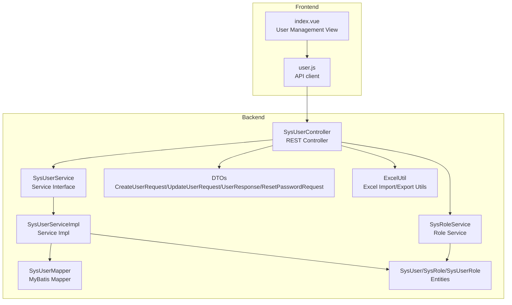
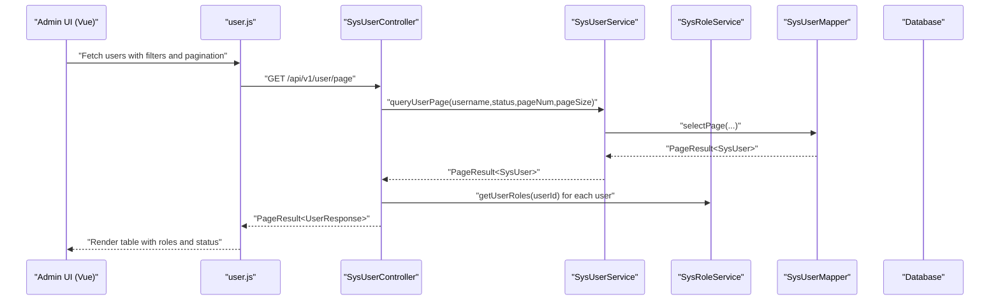
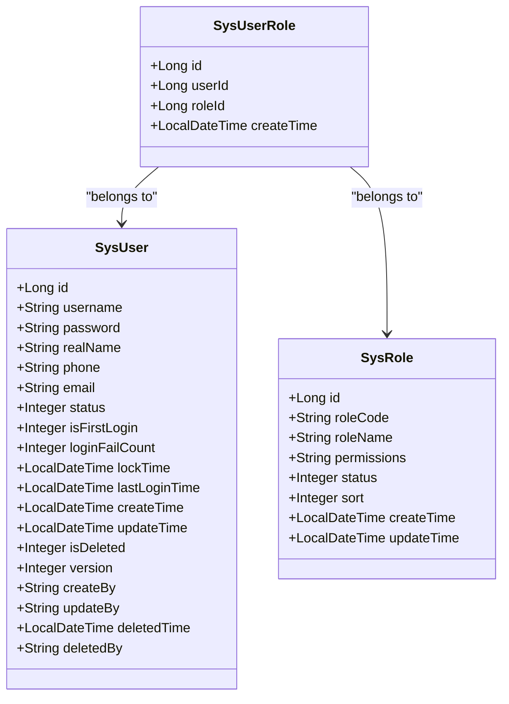
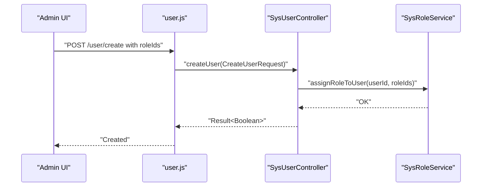
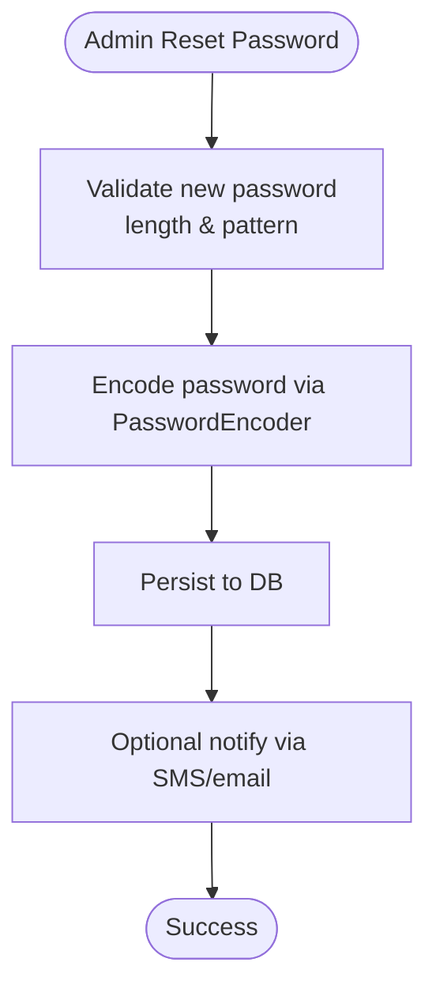
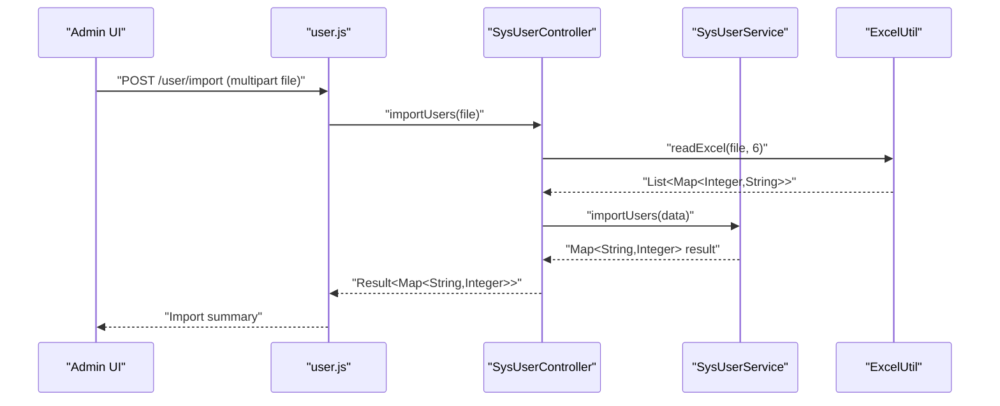
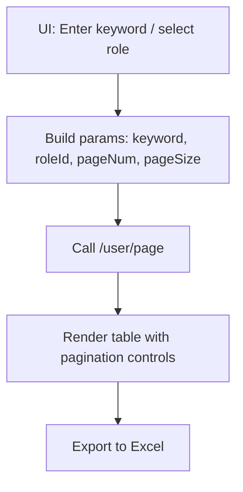
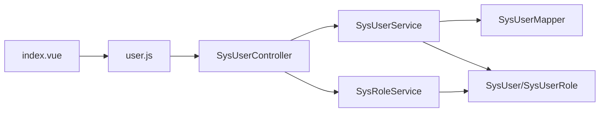

# User Management

<cite>
**Referenced Files in This Document**
- [SysUser.java](file://admin-backend/src/main/java/com/qhiot/survey/entity/SysUser.java)
- [SysRole.java](file://admin-backend/src/main/java/com/qhiot/survey/entity/SysRole.java)
- [SysUserRole.java](file://admin-backend/src/main/java/com/qhiot/survey/entity/SysUserRole.java)
- [SysUserController.java](file://admin-backend/src/main/java/com/qhiot/survey/controller/SysUserController.java)
- [SysUserService.java](file://admin-backend/src/main/java/com/qhiot/survey/service/SysUserService.java)
- [SysRoleService.java](file://admin-backend/src/main/java/com/qhiot/survey/service/SysRoleService.java)
- [CreateUserRequest.java](file://admin-backend/src/main/java/com/qhiot/survey/dto/CreateUserRequest.java)
- [UpdateUserRequest.java](file://admin-backend/src/main/java/com/qhiot/survey/dto/UpdateUserRequest.java)
- [UserResponse.java](file://admin-backend/src/main/java/com/qhiot/survey/dto/UserResponse.java)
- [ResetPasswordRequest.java](file://admin-backend/src/main/java/com/qhiot/survey/dto/ResetPasswordRequest.java)
- [ExcelUtil.java](file://admin-backend/src/main/java/com/qhiot/survey/common/util/ExcelUtil.java)
- [SysUserMapper.java](file://admin-backend/src/main/java/com/qhiot/survey/mapper/SysUserMapper.java)
- [02-role-tables.sql](file://admin-backend/init-data/02-role-tables.sql)
- [user.js](file://admin-web-soybean/src/api/user.js)
- [index.vue](file://admin-web-soybean/src/views/system/user/index.vue)
</cite>

## Table of Contents
1. [Introduction](#introduction)
2. [Project Structure](#project-structure)
3. [Core Components](#core-components)
4. [Architecture Overview](#architecture-overview)
5. [Detailed Component Analysis](#detailed-component-analysis)
6. [Dependency Analysis](#dependency-analysis)
7. [Performance Considerations](#performance-considerations)
8. [Troubleshooting Guide](#troubleshooting-guide)
9. [Conclusion](#conclusion)
10. [Appendices](#appendices)

## Introduction
This document describes the user management system of the Survey-App, covering the complete user lifecycle: creation, profile updates, status management, deletion, role assignment (including multi-role support), password management (encryption, reset procedures, first-login requirements), and bulk operations (CSV import/export). It also documents search and filtering, pagination, and data export formats. The backend is a Spring Boot application with MyBatis-Plus, while the frontend is a Vue-based admin panel.

## Project Structure
The user management feature spans backend controllers, services, entities, mappers, DTOs, and utilities, plus a Vue admin page that integrates with the backend APIs.

**Diagram sources**
- [SysUserController.java:1-263](file://admin-backend/src/main/java/com/qhiot/survey/controller/SysUserController.java#L1-263)
- [SysUserService.java:1-101](file://admin-backend/src/main/java/com/qhiot/survey/service/SysUserService.java#L1-101)
- [SysUserMapper.java:1-10](file://admin-backend/src/main/java/com/qhiot/survey/mapper/SysUserMapper.java#L1-10)
- [SysRoleService.java:1-64](file://admin-backend/src/main/java/com/qhiot/survey/service/SysRoleService.java#L1-64)
- [SysUser.java:1-95](file://admin-backend/src/main/java/com/qhiot/survey/entity/SysUser.java#L1-95)
- [SysRole.java:1-40](file://admin-backend/src/main/java/com/qhiot/survey/entity/SysRole.java#L1-40)
- [SysUserRole.java:1-26](file://admin-backend/src/main/java/com/qhiot/survey/entity/SysUserRole.java#L1-26)
- [CreateUserRequest.java:1-38](file://admin-backend/src/main/java/com/qhiot/survey/dto/CreateUserRequest.java#L1-38)
- [UpdateUserRequest.java:1-37](file://admin-backend/src/main/java/com/qhiot/survey/dto/UpdateUserRequest.java#L1-37)
- [UserResponse.java:1-54](file://admin-backend/src/main/java/com/qhiot/survey/dto/UserResponse.java#L1-54)
- [ResetPasswordRequest.java:1-25](file://admin-backend/src/main/java/com/qhiot/survey/dto/ResetPasswordRequest.java#L1-25)
- [ExcelUtil.java:1-123](file://admin-backend/src/main/java/com/qhiot/survey/common/util/ExcelUtil.java#L1-123)
- [user.js:1-102](file://admin-web-soybean/src/api/user.js#L1-102)
- [index.vue:1-586](file://admin-web-soybean/src/views/system/user/index.vue#L1-586)

**Section sources**
- [SysUserController.java:1-263](file://admin-backend/src/main/java/com/qhiot/survey/controller/SysUserController.java#L1-263)
- [SysUserService.java:1-101](file://admin-backend/src/main/java/com/qhiot/survey/service/SysUserService.java#L1-101)
- [SysRoleService.java:1-64](file://admin-backend/src/main/java/com/qhiot/survey/service/SysRoleService.java#L1-64)
- [SysUser.java:1-95](file://admin-backend/src/main/java/com/qhiot/survey/entity/SysUser.java#L1-95)
- [SysRole.java:1-40](file://admin-backend/src/main/java/com/qhiot/survey/entity/SysRole.java#L1-40)
- [SysUserRole.java:1-26](file://admin-backend/src/main/java/com/qhiot/survey/entity/SysUserRole.java#L1-26)
- [CreateUserRequest.java:1-38](file://admin-backend/src/main/java/com/qhiot/survey/dto/CreateUserRequest.java#L1-38)
- [UpdateUserRequest.java:1-37](file://admin-backend/src/main/java/com/qhiot/survey/dto/UpdateUserRequest.java#L1-37)
- [UserResponse.java:1-54](file://admin-backend/src/main/java/com/qhiot/survey/dto/UserResponse.java#L1-54)
- [ResetPasswordRequest.java:1-25](file://admin-backend/src/main/java/com/qhiot/survey/dto/ResetPasswordRequest.java#L1-25)
- [ExcelUtil.java:1-123](file://admin-backend/src/main/java/com/qhiot/survey/common/util/ExcelUtil.java#L1-123)
- [user.js:1-102](file://admin-web-soybean/src/api/user.js#L1-102)
- [index.vue:1-586](file://admin-web-soybean/src/views/system/user/index.vue#L1-586)

## Core Components
- Data Model
  - User entity fields include identifiers, credentials, personal info, account state, and audit fields. See [SysUser.java:24-65](file://admin-backend/src/main/java/com/qhiot/survey/entity/SysUser.java#L24-L65).
  - Roles and multi-role associations are modeled via separate entities and a junction table. See [SysRole.java:18-39](file://admin-backend/src/main/java/com/qhiot/survey/entity/SysRole.java#L18-L39) and [SysUserRole.java:18-25](file://admin-backend/src/main/java/com/qhiot/survey/entity/SysUserRole.java#L18-L25).
- Controllers and Services
  - REST endpoints for CRUD, status updates, password reset, pagination, and import/export. See [SysUserController.java:47-261](file://admin-backend/src/main/java/com/qhiot/survey/controller/SysUserController.java#L47-L261).
  - Service contracts define user operations, including password reset with notification, export/import, and login failure handling. See [SysUserService.java:10-100](file://admin-backend/src/main/java/com/qhiot/survey/service/SysUserService.java#L10-L100) and [SysRoleService.java:12-63](file://admin-backend/src/main/java/com/qhiot/survey/service/SysRoleService.java#L12-L63).
- DTOs and Utilities
  - Request/response DTOs for create/update and user listing. See [CreateUserRequest.java:15-36](file://admin-backend/src/main/java/com/qhiot/survey/dto/CreateUserRequest.java#L15-L36), [UpdateUserRequest.java:15-35](file://admin-backend/src/main/java/com/qhiot/survey/dto/UpdateUserRequest.java#L15-L35), [UserResponse.java:17-52](file://admin-backend/src/main/java/com/qhiot/survey/dto/UserResponse.java#L17-L52).
  - Excel import/export utilities. See [ExcelUtil.java:25-51](file://admin-backend/src/main/java/com/qhiot/survey/common/util/ExcelUtil.java#L25-L51) and [ExcelUtil.java:59-91](file://admin-backend/src/main/java/com/qhiot/survey/common/util/ExcelUtil.java#L59-L91).
- Frontend Integration
  - Vue view with search, role filter, pagination, and modals for add/edit/reset. See [index.vue:376-581](file://admin-web-soybean/src/views/system/user/index.vue#L376-L581).
  - API client mapping to backend endpoints. See [user.js:17-101](file://admin-web-soybean/src/api/user.js#L17-L101).

**Section sources**
- [SysUser.java:19-65](file://admin-backend/src/main/java/com/qhiot/survey/entity/SysUser.java#L19-L65)
- [SysRole.java:13-39](file://admin-backend/src/main/java/com/qhiot/survey/entity/SysRole.java#L13-L39)
- [SysUserRole.java:13-25](file://admin-backend/src/main/java/com/qhiot/survey/entity/SysUserRole.java#L13-L25)
- [SysUserController.java:47-261](file://admin-backend/src/main/java/com/qhiot/survey/controller/SysUserController.java#L47-L261)
- [SysUserService.java:10-100](file://admin-backend/src/main/java/com/qhiot/survey/service/SysUserService.java#L10-L100)
- [SysRoleService.java:12-63](file://admin-backend/src/main/java/com/qhiot/survey/service/SysRoleService.java#L12-L63)
- [CreateUserRequest.java:15-36](file://admin-backend/src/main/java/com/qhiot/survey/dto/CreateUserRequest.java#L15-L36)
- [UpdateUserRequest.java:15-35](file://admin-backend/src/main/java/com/qhiot/survey/dto/UpdateUserRequest.java#L15-L35)
- [UserResponse.java:17-52](file://admin-backend/src/main/java/com/qhiot/survey/dto/UserResponse.java#L17-L52)
- [ExcelUtil.java:25-51](file://admin-backend/src/main/java/com/qhiot/survey/common/util/ExcelUtil.java#L25-L51)
- [ExcelUtil.java:59-91](file://admin-backend/src/main/java/com/qhiot/survey/common/util/ExcelUtil.java#L59-L91)
- [user.js:17-101](file://admin-web-soybean/src/api/user.js#L17-L101)
- [index.vue:376-581](file://admin-web-soybean/src/views/system/user/index.vue#L376-L581)

## Architecture Overview
The backend follows layered architecture: controller handles HTTP requests, service encapsulates business logic, and mapper persists to the database. The frontend communicates via REST APIs to manage users and roles.

**Diagram sources**
- [SysUserController.java:47-90](file://admin-backend/src/main/java/com/qhiot/survey/controller/SysUserController.java#L47-L90)
- [SysUserService.java:34-35](file://admin-backend/src/main/java/com/qhiot/survey/service/SysUserService.java#L34-L35)
- [SysUserMapper.java:1-10](file://admin-backend/src/main/java/com/qhiot/survey/mapper/SysUserMapper.java#L1-10)
- [SysRoleService.java:62-62](file://admin-backend/src/main/java/com/qhiot/survey/service/SysRoleService.java#L62-L62)
- [user.js:17-23](file://admin-web-soybean/src/api/user.js#L17-L23)
- [index.vue:376-406](file://admin-web-soybean/src/views/system/user/index.vue#L376-L406)

**Section sources**
- [SysUserController.java:47-90](file://admin-backend/src/main/java/com/qhiot/survey/controller/SysUserController.java#L47-L90)
- [SysUserService.java:34-35](file://admin-backend/src/main/java/com/qhiot/survey/service/SysUserService.java#L34-L35)
- [SysUserMapper.java:1-10](file://admin-backend/src/main/java/com/qhiot/survey/mapper/SysUserMapper.java#L1-10)
- [SysRoleService.java:62-62](file://admin-backend/src/main/java/com/qhiot/survey/service/SysRoleService.java#L62-L62)
- [user.js:17-23](file://admin-web-soybean/src/api/user.js#L17-L23)
- [index.vue:376-406](file://admin-web-soybean/src/views/system/user/index.vue#L376-L406)

## Detailed Component Analysis

### User Data Model
- Fields
  - Identity: id, username, password
  - Personal: realName, phone, email
  - Status and lifecycle: status (0 disabled, 1 enabled), isFirstLogin, loginFailCount, lockTime, lastLoginTime
  - Auditing: createTime, updateTime, createBy, updateBy, version, isDeleted, deletedTime, deletedBy
- Notes
  - Password is stored encrypted; first-login flag indicates mandatory password change on next login.
  - Logical delete and optimistic locking are supported.

**Diagram sources**
- [SysUser.java:21-65](file://admin-backend/src/main/java/com/qhiot/survey/entity/SysUser.java#L21-L65)
- [SysRole.java:15-39](file://admin-backend/src/main/java/com/qhiot/survey/entity/SysRole.java#L15-L39)
- [SysUserRole.java:15-25](file://admin-backend/src/main/java/com/qhiot/survey/entity/SysUserRole.java#L15-L25)

**Section sources**
- [SysUser.java:24-65](file://admin-backend/src/main/java/com/qhiot/survey/entity/SysUser.java#L24-L65)
- [SysRole.java:18-39](file://admin-backend/src/main/java/com/qhiot/survey/entity/SysRole.java#L18-L39)
- [SysUserRole.java:18-25](file://admin-backend/src/main/java/com/qhiot/survey/entity/SysUserRole.java#L18-L25)

### Role Assignment and Multi-Role Support
- Role entities and junction table support multi-role per user.
- Backend supports assigning multiple roles to a user during creation/update.
- Frontend displays role badges and allows multi-selection in forms.

**Diagram sources**
- [SysUserController.java:124-159](file://admin-backend/src/main/java/com/qhiot/survey/controller/SysUserController.java#L124-L159)
- [SysRoleService.java:47-47](file://admin-backend/src/main/java/com/qhiot/survey/service/SysRoleService.java#L47-L47)
- [CreateUserRequest.java:32-36](file://admin-backend/src/main/java/com/qhiot/survey/dto/CreateUserRequest.java#L32-L36)
- [user.js:42-47](file://admin-web-soybean/src/api/user.js#L42-L47)
- [index.vue:157-161](file://admin-web-soybean/src/views/system/user/index.vue#L157-L161)

**Section sources**
- [SysUserController.java:124-159](file://admin-backend/src/main/java/com/qhiot/survey/controller/SysUserController.java#L124-L159)
- [SysRoleService.java:47-47](file://admin-backend/src/main/java/com/qhiot/survey/service/SysRoleService.java#L47-L47)
- [CreateUserRequest.java:32-36](file://admin-backend/src/main/java/com/qhiot/survey/dto/CreateUserRequest.java#L32-L36)
- [index.vue:157-161](file://admin-web-soybean/src/views/system/user/index.vue#L157-L161)

### Password Management
- Encryption
  - Passwords are hashed before persistence using a password encoder injected in the controller.
- First-login requirement
  - New users are created with a flag indicating first login; enforcement occurs at login time.
- Reset procedures
  - Admin resets password via endpoint with validation rules; service handles encryption and optional notifications.
- Complexity requirements
  - New passwords must meet length and character-type criteria.

**Diagram sources**
- [SysUserController.java:219-236](file://admin-backend/src/main/java/com/qhiot/survey/controller/SysUserController.java#L219-L236)
- [ResetPasswordRequest.java:16-23](file://admin-backend/src/main/java/com/qhiot/survey/dto/ResetPasswordRequest.java#L16-L23)
- [SysUserService.java:50-60](file://admin-backend/src/main/java/com/qhiot/survey/service/SysUserService.java#L50-L60)

**Section sources**
- [SysUserController.java:136-136](file://admin-backend/src/main/java/com/qhiot/survey/controller/SysUserController.java#L136-L136)
- [SysUserController.java:177-180](file://admin-backend/src/main/java/com/qhiot/survey/controller/SysUserController.java#L177-L180)
- [SysUserController.java:219-236](file://admin-backend/src/main/java/com/qhiot/survey/controller/SysUserController.java#L219-L236)
- [ResetPasswordRequest.java:16-23](file://admin-backend/src/main/java/com/qhiot/survey/dto/ResetPasswordRequest.java#L16-L23)
- [SysUserService.java:50-60](file://admin-backend/src/main/java/com/qhiot/survey/service/SysUserService.java#L50-L60)

### Bulk Operations: CSV Import/Export
- Export
  - Endpoint returns an Excel attachment containing user records.
- Import
  - Endpoint reads Excel rows and creates users in batch; the utility parses Excel cells and normalizes numeric values.

**Diagram sources**
- [SysUserController.java:251-261](file://admin-backend/src/main/java/com/qhiot/survey/controller/SysUserController.java#L251-L261)
- [ExcelUtil.java:25-51](file://admin-backend/src/main/java/com/qhiot/survey/common/util/ExcelUtil.java#L25-L51)
- [SysUserService.java:88-92](file://admin-backend/src/main/java/com/qhiot/survey/service/SysUserService.java#L88-L92)
- [user.js:7-10](file://admin-web-soybean/src/api/user.js#L7-L10)

**Section sources**
- [SysUserController.java:238-261](file://admin-backend/src/main/java/com/qhiot/survey/controller/SysUserController.java#L238-L261)
- [ExcelUtil.java:25-51](file://admin-backend/src/main/java/com/qhiot/survey/common/util/ExcelUtil.java#L25-L51)
- [SysUserService.java:88-92](file://admin-backend/src/main/java/com/qhiot/survey/service/SysUserService.java#L88-L92)
- [user.js:7-10](file://admin-web-soybean/src/api/user.js#L7-L10)

### Search, Filtering, Pagination, and Export Formats
- Search and filters
  - Backend supports filtering by username and status in paginated queries.
  - Frontend supports keyword search and role-based filtering.
- Pagination
  - Frontend controls page size and current page; backend returns total and total pages.
- Export formats
  - Export endpoint produces Excel (.xlsx).

**Diagram sources**
- [SysUserController.java:47-90](file://admin-backend/src/main/java/com/qhiot/survey/controller/SysUserController.java#L47-L90)
- [index.vue:376-406](file://admin-web-soybean/src/views/system/user/index.vue#L376-L406)
- [user.js:17-23](file://admin-web-soybean/src/api/user.js#L17-L23)

**Section sources**
- [SysUserController.java:47-90](file://admin-backend/src/main/java/com/qhiot/survey/controller/SysUserController.java#L47-L90)
- [index.vue:376-406](file://admin-web-soybean/src/views/system/user/index.vue#L376-L406)
- [user.js:17-23](file://admin-web-soybean/src/api/user.js#L17-L23)

### Administrative Actions Examples
- Create user
  - Endpoint: POST /api/v1/user/create
  - Payload includes username, password, realName, phone, email, and roleIds.
  - Behavior: encrypts password, sets default enabled status, marks first login, assigns roles.
- Update user
  - Endpoint: PUT /api/v1/user/update
  - Payload includes id, realName, optional password, phone, email, and roleIds.
  - Behavior: updates profile and/or password; reassigns roles.
- Delete user
  - Endpoint: DELETE /api/v1/user/delete/{id}
  - Behavior: logical delete.
- Update status
  - Endpoint: PUT /api/v1/user/status/{id}?status={0|1}
  - Behavior: enable/disable user.
- Reset password
  - Endpoint: PUT /api/v1/user/reset-password/{id}
  - Payload: newPassword validated by ResetPasswordRequest.

**Section sources**
- [SysUserController.java:124-159](file://admin-backend/src/main/java/com/qhiot/survey/controller/SysUserController.java#L124-L159)
- [SysUserController.java:161-198](file://admin-backend/src/main/java/com/qhiot/survey/controller/SysUserController.java#L161-L198)
- [SysUserController.java:200-207](file://admin-backend/src/main/java/com/qhiot/survey/controller/SysUserController.java#L200-L207)
- [SysUserController.java:209-217](file://admin-backend/src/main/java/com/qhiot/survey/controller/SysUserController.java#L209-L217)
- [SysUserController.java:219-236](file://admin-backend/src/main/java/com/qhiot/survey/controller/SysUserController.java#L219-L236)
- [CreateUserRequest.java:15-36](file://admin-backend/src/main/java/com/qhiot/survey/dto/CreateUserRequest.java#L15-L36)
- [UpdateUserRequest.java:15-35](file://admin-backend/src/main/java/com/qhiot/survey/dto/UpdateUserRequest.java#L15-L35)
- [ResetPasswordRequest.java:16-23](file://admin-backend/src/main/java/com/qhiot/survey/dto/ResetPasswordRequest.java#L16-L23)

## Dependency Analysis
- Controller depends on service and role service for business operations.
- Service depends on mapper for persistence and on role service for role assignments.
- Entities define relationships between users, roles, and assignments.
- Frontend depends on API client for backend integration.

**Diagram sources**
- [SysUserController.java:43-45](file://admin-backend/src/main/java/com/qhiot/survey/controller/SysUserController.java#L43-L45)
- [SysUserService.java:10-10](file://admin-backend/src/main/java/com/qhiot/survey/service/SysUserService.java#L10-L10)
- [SysUserMapper.java:1-10](file://admin-backend/src/main/java/com/qhiot/survey/mapper/SysUserMapper.java#L1-10)
- [SysRoleService.java:12-12](file://admin-backend/src/main/java/com/qhiot/survey/service/SysRoleService.java#L12-L12)
- [SysUser.java:21-21](file://admin-backend/src/main/java/com/qhiot/survey/entity/SysUser.java#L21-L21)
- [SysUserRole.java:15-15](file://admin-backend/src/main/java/com/qhiot/survey/entity/SysUserRole.java#L15-L15)
- [user.js:17-23](file://admin-web-soybean/src/api/user.js#L17-L23)
- [index.vue:376-406](file://admin-web-soybean/src/views/system/user/index.vue#L376-L406)

**Section sources**
- [SysUserController.java:43-45](file://admin-backend/src/main/java/com/qhiot/survey/controller/SysUserController.java#L43-L45)
- [SysUserService.java:10-10](file://admin-backend/src/main/java/com/qhiot/survey/service/SysUserService.java#L10-L10)
- [SysUserMapper.java:1-10](file://admin-backend/src/main/java/com/qhiot/survey/mapper/SysUserMapper.java#L1-10)
- [SysRoleService.java:12-12](file://admin-backend/src/main/java/com/qhiot/survey/service/SysRoleService.java#L12-L12)
- [SysUser.java:21-21](file://admin-backend/src/main/java/com/qhiot/survey/entity/SysUser.java#L21-L21)
- [SysUserRole.java:15-15](file://admin-backend/src/main/java/com/qhiot/survey/entity/SysUserRole.java#L15-L15)
- [user.js:17-23](file://admin-web-soybean/src/api/user.js#L17-L23)
- [index.vue:376-406](file://admin-web-soybean/src/views/system/user/index.vue#L376-L406)

## Performance Considerations
- Pagination
  - Use pageNum and pageSize to limit result sets; avoid fetching full tables.
- Batch operations
  - Prefer import/export endpoints for large datasets to reduce round trips.
- Role queries
  - Minimize repeated role lookups by caching role metadata where appropriate.
- Excel parsing
  - Ensure proper handling of numeric formats to prevent scientific notation artifacts.

[No sources needed since this section provides general guidance]

## Troubleshooting Guide
- Authentication failures and locks
  - Service tracks login failures and can lock accounts after thresholds; success resets counters.
- Password reset validation
  - Ensure newPassword meets length and pattern constraints before sending.
- Import errors
  - Verify Excel headers and data types; the utility normalizes numeric values and dates.

**Section sources**
- [SysUserService.java:63-79](file://admin-backend/src/main/java/com/qhiot/survey/service/SysUserService.java#L63-L79)
- [ResetPasswordRequest.java:16-23](file://admin-backend/src/main/java/com/qhiot/survey/dto/ResetPasswordRequest.java#L16-L23)
- [ExcelUtil.java:96-122](file://admin-backend/src/main/java/com/qhiot/survey/common/util/ExcelUtil.java#L96-L122)

## Conclusion
The user management system provides a robust foundation for user lifecycle operations with strong support for role-based access, secure password handling, and scalable bulk operations. The frontend offers intuitive controls for administrators to manage users efficiently.

[No sources needed since this section summarizes without analyzing specific files]

## Appendices

### Backend Initialization and Roles
- Role tables and initial roles are created and seeded during initialization.

**Section sources**
- [02-role-tables.sql:1-32](file://admin-backend/init-data/02-role-tables.sql#L1-L32)