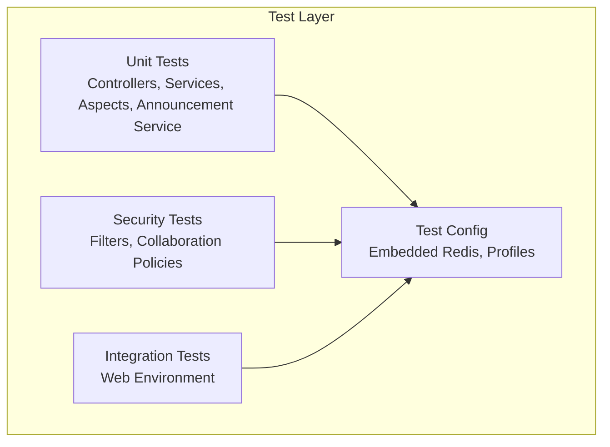
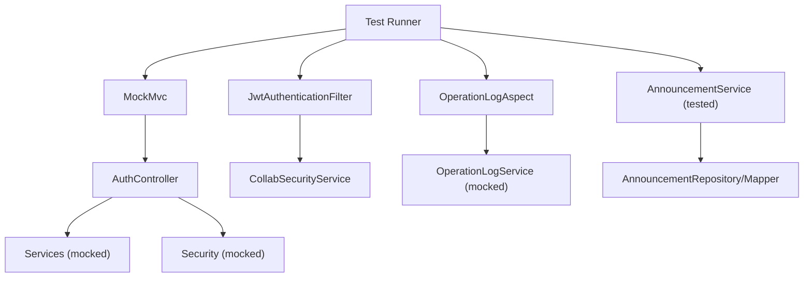
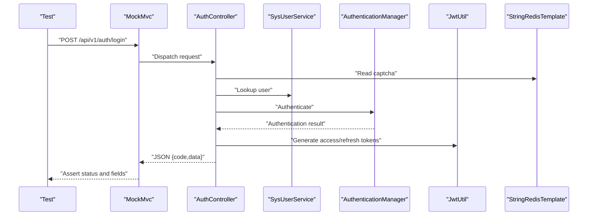
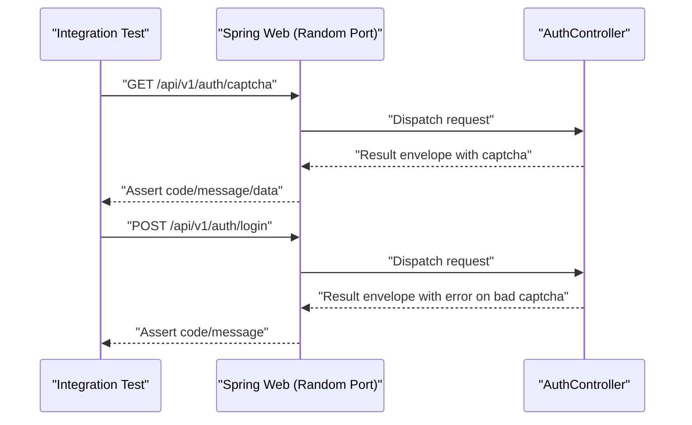
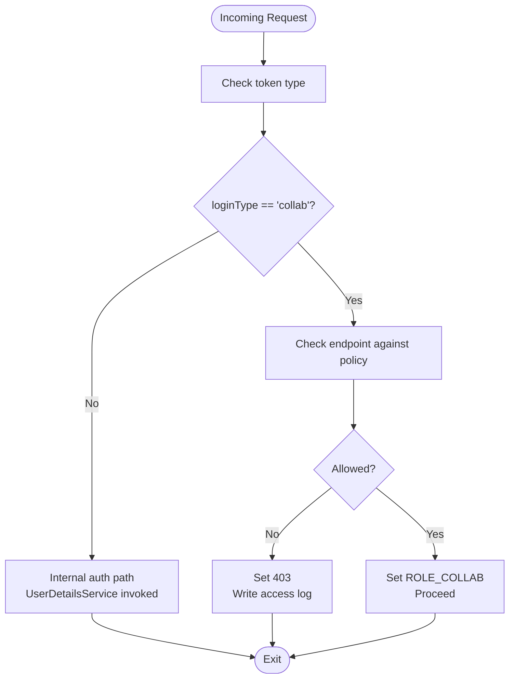
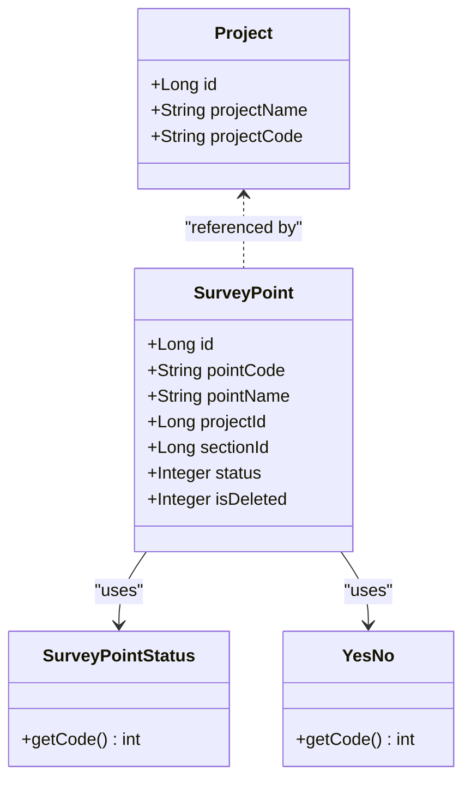
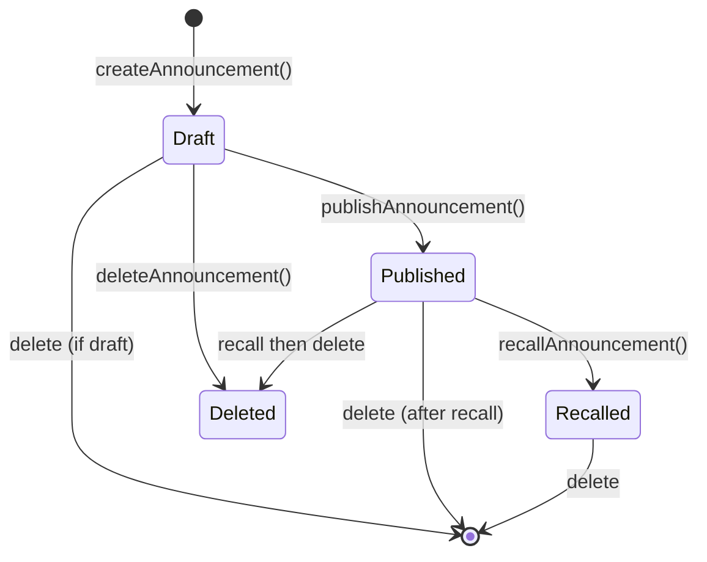
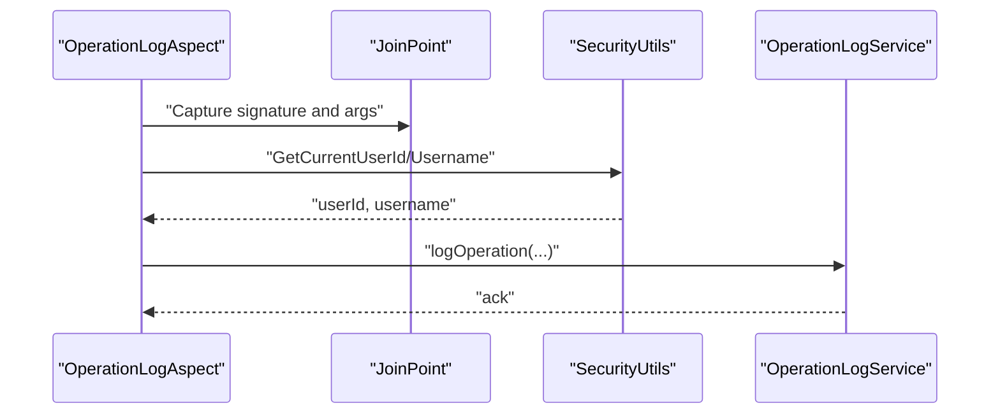
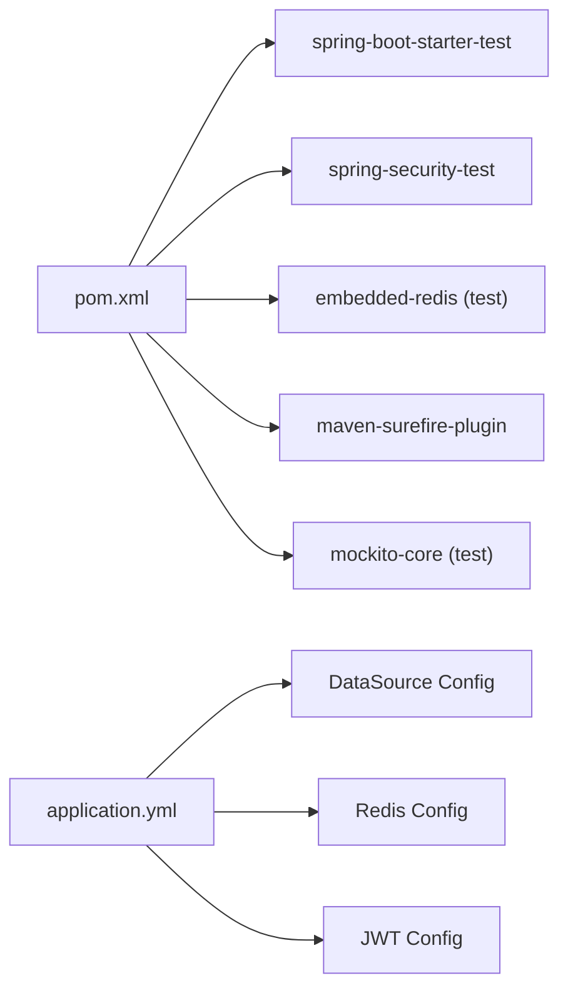

# Testing Strategy

<cite>
**Referenced Files in This Document**
- [pom.xml](file://admin-backend/pom.xml)
- [application.yml](file://admin-backend/src/main/resources/application.yml)
- [EmbeddedRedisConfig.java](file://admin-backend/src/test/java/com/qhiot/survey/config/EmbeddedRedisConfig.java)
- [SurveyApplicationTests.java](file://admin-backend/src/test/java/com/qhiot/survey/SurveyApplicationTests.java)
- [AuthControllerTest.java](file://admin-backend/src/test/java/com/qhiot/survey/controller/AuthControllerTest.java)
- [AuthControllerIntegrationTest.java](file://admin-backend/src/test/java/com/qhiot/survey/controller/AuthControllerIntegrationTest.java)
- [OperationLogAspectTest.java](file://admin-backend/src/test/java/com/qhiot/survey/common/aspect/OperationLogAspectTest.java)
- [CollabTokenSecurityTest.java](file://admin-backend/src/test/java/com/qhiot/survey/security/CollabTokenSecurityTest.java)
- [ProjectServiceImplTest.java](file://admin-backend/src/test/java/com/qhiot/survey/service/impl/ProjectServiceImplTest.java)
- [SurveyPointServiceImplTest.java](file://admin-backend/src/test/java/com/qhiot/survey/service/impl/SurveyPointServiceImplTest.java)
- [AnnouncementServiceImplTest.java](file://admin-backend/src/test/java/com/qhiot/survey/service/impl/AnnouncementServiceImplTest.java)
- [AnnouncementService.java](file://admin-backend/src/main/java/com/qhiot/survey/service/AnnouncementService.java)
- [AnnouncementServiceImpl.java](file://admin-backend/src/main/java/com/qhiot/survey/service/impl/AnnouncementServiceImpl.java)
- [AnnouncementController.java](file://admin-backend/src/main/java/com/qhiot/survey/controller/AnnouncementController.java)
- [Announcement.java](file://admin-backend/src/main/java/com/qhiot/survey/entity/Announcement.java)
- [AnnouncementMapper.java](file://admin-backend/src/main/java/com/qhiot/survey/mapper/AnnouncementMapper.java)
</cite>

## Update Summary
**Changes Made**
- Added comprehensive announcement service testing framework documentation
- Integrated announcement service unit tests with 10 test cases covering complete lifecycle
- Documented tenant-aware workflows and business rule enforcement
- Enhanced service layer testing section with announcement service examples
- Updated architecture overview to include announcement service components

## Table of Contents
1. [Introduction](#introduction)
2. [Project Structure](#project-structure)
3. [Core Components](#core-components)
4. [Architecture Overview](#architecture-overview)
5. [Detailed Component Analysis](#detailed-component-analysis)
6. [Dependency Analysis](#dependency-analysis)
7. [Performance Considerations](#performance-considerations)
8. [Troubleshooting Guide](#troubleshooting-guide)
9. [Conclusion](#conclusion)
10. [Appendices](#appendices)

## Introduction
This document presents a comprehensive testing strategy for the Survey-App backend module. It covers a multi-layered approach spanning unit tests, integration tests, and security-focused validations. The strategy leverages embedded infrastructure for isolation, service stubbing via Mockito, and realistic request/response validation using Spring MVC Test. It also documents configuration for Redis during tests, environment-driven test gating, and outlines areas for future enhancements such as performance and security scanning.

**Updated** Added comprehensive unit testing framework for announcement service with 10 test cases validating complete announcement lifecycle including tenant-aware workflows and business rule enforcement.

## Project Structure
The backend test suite is organized by layer and responsibility:
- Unit tests for controllers, services, aspects, and announcement service
- Security tests for filters and collaboration token policies
- Integration tests validating end-to-end flows under a managed web environment
- Shared configuration enabling embedded Redis for test profiles

**Diagram sources**
- [EmbeddedRedisConfig.java:17-58](file://admin-backend/src/test/java/com/qhiot/survey/config/EmbeddedRedisConfig.java#L17-L58)
- [AuthControllerTest.java:62-64](file://admin-backend/src/test/java/com/qhiot/survey/controller/AuthControllerTest.java#L62-L64)
- [AuthControllerIntegrationTest.java:24-28](file://admin-backend/src/test/java/com/qhiot/survey/controller/AuthControllerIntegrationTest.java#L24-L28)
- [AnnouncementServiceImplTest.java:33-36](file://admin-backend/src/test/java/com/qhiot/survey/service/impl/AnnouncementServiceImplTest.java#L33-L36)

**Section sources**
- [pom.xml:171-196](file://admin-backend/pom.xml#L171-L196)
- [EmbeddedRedisConfig.java:17-58](file://admin-backend/src/test/java/com/qhiot/survey/config/EmbeddedRedisConfig.java#L17-L58)
- [SurveyApplicationTests.java:1-17](file://admin-backend/src/test/java/com/qhiot/survey/SurveyApplicationTests.java#L1-L17)

## Core Components
- Unit testing framework: JUnit 5 with Mockito for stubbing and verification
- Web layer testing: Spring MVC Test for request/response validation
- Security testing: Direct filter and service behavior tests without full context
- Test configuration: Profile-driven embedded Redis and environment gating
- **New**: Announcement service testing framework with comprehensive lifecycle coverage

Key capabilities demonstrated:
- Controller behavior under success/failure conditions and token refresh
- Aspect interception and logging behavior
- Security policy enforcement for collaboration tokens
- Service-layer entity and enum validation
- **New**: Complete announcement lifecycle testing including tenant-aware workflows

**Section sources**
- [AuthControllerTest.java:116-150](file://admin-backend/src/test/java/com/qhiot/survey/controller/AuthControllerTest.java#L116-L150)
- [OperationLogAspectTest.java:44-74](file://admin-backend/src/test/java/com/qhiot/survey/common/aspect/OperationLogAspectTest.java#L44-L74)
- [CollabTokenSecurityTest.java:91-126](file://admin-backend/src/test/java/com/qhiot/survey/security/CollabTokenSecurityTest.java#L91-L126)
- [ProjectServiceImplTest.java:14-27](file://admin-backend/src/test/java/com/qhiot/survey/service/impl/ProjectServiceImplTest.java#L14-L27)
- [SurveyPointServiceImplTest.java:16-35](file://admin-backend/src/test/java/com/qhiot/survey/service/impl/SurveyPointServiceImplTest.java#L16-L35)
- [AnnouncementServiceImplTest.java:66-81](file://admin-backend/src/test/java/com/qhiot/survey/service/impl/AnnouncementServiceImplTest.java#L66-L81)
- [AnnouncementServiceImplTest.java:123-136](file://admin-backend/src/test/java/com/qhiot/survey/service/impl/AnnouncementServiceImplTest.java#L123-L136)

## Architecture Overview
The testing architecture separates concerns across layers while reusing shared test infrastructure:
- Controllers are tested in isolation using standalone MVC setup and mocks
- Security policies are validated by invoking filters and services directly
- Integration tests exercise the full web stack behind a random port with a test profile
- **New**: Announcement service follows the same testing pattern with comprehensive state machine validation

**Diagram sources**
- [AuthControllerTest.java:85-92](file://admin-backend/src/test/java/com/qhiot/survey/controller/AuthControllerTest.java#L85-L92)
- [CollabTokenSecurityTest.java:54-69](file://admin-backend/src/test/java/com/qhiot/survey/security/CollabTokenSecurityTest.java#L54-L69)
- [OperationLogAspectTest.java:40-43](file://admin-backend/src/test/java/com/qhiot/survey/common/aspect/OperationLogAspectTest.java#L40-L43)
- [AnnouncementServiceImplTest.java:38-59](file://admin-backend/src/test/java/com/qhiot/survey/service/impl/AnnouncementServiceImplTest.java#L38-L59)

## Detailed Component Analysis

### Controller Testing: AuthController
- Purpose: Validate controller-level behavior for login, refresh, and captcha consumption
- Approach:
  - Standalone MVC setup with injected mocks for all collaborators
  - Request validation using MockMvc with JSON payloads
  - Assertions on HTTP status and JSON response fields
  - Behavior verification via Mockito (e.g., token generation, login logs)
- Scenarios covered:
  - Successful login with proper credentials and captcha
  - Failure due to wrong password, account locked, and invalid/expired refresh tokens
  - Captcha consumption on success and rejection on mismatch

**Diagram sources**
- [AuthControllerTest.java:116-150](file://admin-backend/src/test/java/com/qhiot/survey/controller/AuthControllerTest.java#L116-L150)
- [AuthControllerTest.java:152-173](file://admin-backend/src/test/java/com/qhiot/survey/controller/AuthControllerTest.java#L152-L173)
- [AuthControllerTest.java:175-200](file://admin-backend/src/test/java/com/qhiot/survey/controller/AuthControllerTest.java#L175-L200)
- [AuthControllerTest.java:202-228](file://admin-backend/src/test/java/com/qhiot/survey/controller/AuthControllerTest.java#L202-L228)
- [AuthControllerTest.java:230-245](file://admin-backend/src/test/java/com/qhiot/survey/controller/AuthControllerTest.java#L230-L245)
- [AuthControllerTest.java:262-281](file://admin-backend/src/test/java/com/qhiot/survey/controller/AuthControllerTest.java#L262-L281)
- [AuthControllerTest.java:283-299](file://admin-backend/src/test/java/com/qhiot/survey/controller/AuthControllerTest.java#L283-L299)

**Section sources**
- [AuthControllerTest.java:62-64](file://admin-backend/src/test/java/com/qhiot/survey/controller/AuthControllerTest.java#L62-L64)
- [AuthControllerTest.java:85-92](file://admin-backend/src/test/java/com/qhiot/survey/controller/AuthControllerTest.java#L85-L92)
- [AuthControllerTest.java:116-150](file://admin-backend/src/test/java/com/qhiot/survey/controller/AuthControllerTest.java#L116-L150)
- [AuthControllerTest.java:152-173](file://admin-backend/src/test/java/com/qhiot/survey/controller/AuthControllerTest.java#L152-L173)
- [AuthControllerTest.java:175-200](file://admin-backend/src/test/java/com/qhiot/survey/controller/AuthControllerTest.java#L175-L200)
- [AuthControllerTest.java:202-228](file://admin-backend/src/test/java/com/qhiot/survey/controller/AuthControllerTest.java#L202-L228)
- [AuthControllerTest.java:230-245](file://admin-backend/src/test/java/com/qhiot/survey/controller/AuthControllerTest.java#L230-L245)
- [AuthControllerTest.java:262-281](file://admin-backend/src/test/java/com/qhiot/survey/controller/AuthControllerTest.java#L262-L281)
- [AuthControllerTest.java:283-299](file://admin-backend/src/test/java/com/qhiot/survey/controller/AuthControllerTest.java#L283-L299)

### Integration Testing: AuthController Integration
- Purpose: Validate end-to-end API behavior under a managed web environment
- Approach:
  - Random port server with test profile activation
  - Environment variable gating for opt-in execution
  - Structural checks for response shape and API paths
- Scenarios covered:
  - Captcha retrieval and validation
  - Login failure modes and response structure
  - Path alignment with frontend proxy configuration
  - Result envelope structure validation

**Diagram sources**
- [AuthControllerIntegrationTest.java:42-62](file://admin-backend/src/test/java/com/qhiot/survey/controller/AuthControllerIntegrationTest.java#L42-L62)
- [AuthControllerIntegrationTest.java:64-82](file://admin-backend/src/test/java/com/qhiot/survey/controller/AuthControllerIntegrationTest.java#L64-L82)
- [AuthControllerIntegrationTest.java:186-210](file://admin-backend/src/test/java/com/qhiot/survey/controller/AuthControllerIntegrationTest.java#L186-L210)

**Section sources**
- [AuthControllerIntegrationTest.java:24-28](file://admin-backend/src/test/java/com/qhiot/survey/controller/AuthControllerIntegrationTest.java#L24-L28)
- [AuthControllerIntegrationTest.java:42-62](file://admin-backend/src/test/java/com/qhiot/survey/controller/AuthControllerIntegrationTest.java#L42-L62)
- [AuthControllerIntegrationTest.java:64-82](file://admin-backend/src/test/java/com/qhiot/survey/controller/AuthControllerIntegrationTest.java#L64-L82)
- [AuthControllerIntegrationTest.java:186-210](file://admin-backend/src/test/java/com/qhiot/survey/controller/AuthControllerIntegrationTest.java#L186-L210)

### Security Testing: Collaboration Token Policy
- Purpose: Validate collaboration token access control and logging behavior
- Approach:
  - Direct instantiation of filter and service under test
  - Controlled mocks for mappers and user details service
  - Assertions on HTTP status, authorities, and access log writes
- Scenarios covered:
  - Restricted endpoints denied for collaboration tokens
  - Allowed endpoints granted with appropriate roles
  - Revoked entries rejected with unauthorized status
  - Internal tokens bypass collaboration branch

**Diagram sources**
- [CollabTokenSecurityTest.java:132-161](file://admin-backend/src/test/java/com/qhiot/survey/security/CollabTokenSecurityTest.java#L132-L161)
- [CollabTokenSecurityTest.java:163-191](file://admin-backend/src/test/java/com/qhiot/survey/security/CollabTokenSecurityTest.java#L163-L191)
- [CollabTokenSecurityTest.java:193-214](file://admin-backend/src/test/java/com/qhiot/survey/security/CollabTokenSecurityTest.java#L193-L214)
- [CollabTokenSecurityTest.java:216-238](file://admin-backend/src/test/java/com/qhiot/survey/security/CollabTokenSecurityTest.java#L216-L238)

**Section sources**
- [CollabTokenSecurityTest.java:80-126](file://admin-backend/src/test/java/com/qhiot/survey/security/CollabTokenSecurityTest.java#L80-L126)
- [CollabTokenSecurityTest.java:128-191](file://admin-backend/src/test/java/com/qhiot/survey/security/CollabTokenSecurityTest.java#L128-L191)
- [CollabTokenSecurityTest.java:193-238](file://admin-backend/src/test/java/com/qhiot/survey/security/CollabTokenSecurityTest.java#L193-L238)

### Service Layer Testing: Entities and Enums
- Purpose: Validate entity construction and enum semantics
- Approach:
  - Direct instantiation and field assertions
  - Enum value verification for domain codes
- Coverage:
  - Project entity basic properties and copy semantics
  - SurveyPoint entity, status enum, and Yes/No enum values

**Diagram sources**
- [ProjectServiceImplTest.java:14-27](file://admin-backend/src/test/java/com/qhiot/survey/service/impl/ProjectServiceImplTest.java#L14-L27)
- [SurveyPointServiceImplTest.java:16-35](file://admin-backend/src/test/java/com/qhiot/survey/service/impl/SurveyPointServiceImplTest.java#L16-L35)

**Section sources**
- [ProjectServiceImplTest.java:14-27](file://admin-backend/src/test/java/com/qhiot/survey/service/impl/ProjectServiceImplTest.java#L14-L27)
- [ProjectServiceImplTest.java:29-42](file://admin-backend/src/test/java/com/qhiot/survey/service/impl/ProjectServiceImplTest.java#L29-L42)
- [SurveyPointServiceImplTest.java:16-35](file://admin-backend/src/test/java/com/qhiot/survey/service/impl/SurveyPointServiceImplTest.java#L16-L35)
- [SurveyPointServiceImplTest.java:37-47](file://admin-backend/src/test/java/com/qhiot/survey/service/impl/SurveyPointServiceImplTest.java#L37-L47)
- [SurveyPointServiceImplTest.java:49-54](file://admin-backend/src/test/java/com/qhiot/survey/service/impl/SurveyPointServiceImplTest.java#L49-L54)
- [SurveyPointServiceImplTest.java:56-75](file://admin-backend/src/test/java/com/qhiot/survey/service/impl/SurveyPointServiceImplTest.java#L56-L75)

### **New**: Service Layer Testing: Announcement Service
- Purpose: Comprehensive validation of announcement lifecycle with tenant-aware workflows
- Approach:
  - Unit testing with Mockito spy pattern for service layer isolation
  - State machine validation covering create, update, publish, recall, delete workflows
  - Business rule enforcement testing including status constraints and tenant validation
  - Security context simulation for publisher identification
- Test Coverage: 10 comprehensive test cases validating complete announcement lifecycle
- Business Rules Covered:
  - Draft creation with automatic status assignment (0)
  - Edit restrictions for published announcements (status 2)
  - Publish workflow with timestamp recording
  - Recall workflow for published announcements only
  - Delete restrictions for published announcements
  - Error handling for non-existent announcements
  - Tenant-aware workflow validation

**Diagram sources**
- [AnnouncementServiceImplTest.java:66-81](file://admin-backend/src/test/java/com/qhiot/survey/service/impl/AnnouncementServiceImplTest.java#L66-L81)
- [AnnouncementServiceImplTest.java:123-136](file://admin-backend/src/test/java/com/qhiot/survey/service/impl/AnnouncementServiceImplTest.java#L123-L136)
- [AnnouncementServiceImplTest.java:138-150](file://admin-backend/src/test/java/com/qhiot/survey/service/impl/AnnouncementServiceImplTest.java#L138-L150)
- [AnnouncementServiceImplTest.java:166-177](file://admin-backend/src/test/java/com/qhiot/survey/service/impl/AnnouncementServiceImplTest.java#L166-L177)

**Section sources**
- [AnnouncementServiceImplTest.java:38-59](file://admin-backend/src/test/java/com/qhiot/survey/service/impl/AnnouncementServiceImplTest.java#L38-L59)
- [AnnouncementServiceImplTest.java:66-81](file://admin-backend/src/test/java/com/qhiot/survey/service/impl/AnnouncementServiceImplTest.java#L66-L81)
- [AnnouncementServiceImplTest.java:83-121](file://admin-backend/src/test/java/com/qhiot/survey/service/impl/AnnouncementServiceImplTest.java#L83-L121)
- [AnnouncementServiceImplTest.java:123-150](file://admin-backend/src/test/java/com/qhiot/survey/service/impl/AnnouncementServiceImplTest.java#L123-L150)
- [AnnouncementServiceImplTest.java:166-201](file://admin-backend/src/test/java/com/qhiot/survey/service/impl/AnnouncementServiceImplTest.java#L166-L201)

### Aspect Testing: Operation Log AOP
- Purpose: Verify that annotated methods trigger operation logging with correct metadata
- Approach:
  - Mocked JoinPoint and SecurityUtils to simulate current user
  - Verification of logOperation invocations and description parsing via SpEL
- Coverage:
  - Successful interception and logging
  - Skipping when user info is missing
  - Description extraction from method arguments
  - Annotation presence gating

**Diagram sources**
- [OperationLogAspectTest.java:44-74](file://admin-backend/src/test/java/com/qhiot/survey/common/aspect/OperationLogAspectTest.java#L44-L74)
- [OperationLogAspectTest.java:76-93](file://admin-backend/src/test/java/com/qhiot/survey/common/aspect/OperationLogAspectTest.java#L76-L93)
- [OperationLogAspectTest.java:95-130](file://admin-backend/src/test/java/com/qhiot/survey/common/aspect/OperationLogAspectTest.java#L95-L130)
- [OperationLogAspectTest.java:132-149](file://admin-backend/src/test/java/com/qhiot/survey/common/aspect/OperationLogAspectTest.java#L132-L149)
- [OperationLogAspectTest.java:151-182](file://admin-backend/src/test/java/com/qhiot/survey/common/aspect/OperationLogAspectTest.java#L151-L182)

**Section sources**
- [OperationLogAspectTest.java:28-30](file://admin-backend/src/test/java/com/qhiot/survey/common/aspect/OperationLogAspectTest.java#L28-L30)
- [OperationLogAspectTest.java:44-74](file://admin-backend/src/test/java/com/qhiot/survey/common/aspect/OperationLogAspectTest.java#L44-L74)
- [OperationLogAspectTest.java:76-93](file://admin-backend/src/test/java/com/qhiot/survey/common/aspect/OperationLogAspectTest.java#L76-L93)
- [OperationLogAspectTest.java:95-130](file://admin-backend/src/test/java/com/qhiot/survey/common/aspect/OperationLogAspectTest.java#L95-L130)
- [OperationLogAspectTest.java:132-149](file://admin-backend/src/test/java/com/qhiot/survey/common/aspect/OperationLogAspectTest.java#L132-L149)
- [OperationLogAspectTest.java:151-182](file://admin-backend/src/test/java/com/qhiot/survey/common/aspect/OperationLogAspectTest.java#L151-L182)

## Dependency Analysis
- Test dependencies:
  - Spring Boot Starter Test and Spring Security Test for test containers and security utilities
  - Embedded Redis dependency scoped to test for local fallback when Docker Redis is unavailable
  - Surefire plugin configured to support modern JVM compatibility for mocking
  - **New**: Mockito strictness settings for enhanced test reliability
- Runtime configuration:
  - Application YAML defines environment variables for database, Redis, JWT, and other integrations
  - Test profile activates embedded Redis and restricts environment-specific behavior

**Diagram sources**
- [pom.xml:171-196](file://admin-backend/pom.xml#L171-L196)
- [application.yml:24-29](file://admin-backend/src/main/resources/application.yml#L24-L29)
- [application.yml:64-78](file://admin-backend/src/main/resources/application.yml#L64-L78)
- [application.yml:9-13](file://admin-backend/src/main/resources/application.yml#L9-L13)

**Section sources**
- [pom.xml:171-196](file://admin-backend/pom.xml#L171-L196)
- [application.yml:1-149](file://admin-backend/src/main/resources/application.yml#L1-L149)

## Performance Considerations
- Current tests focus on correctness and security rather than latency or throughput
- Recommendations for future coverage:
  - Use concurrency checks in controller tests to detect deadlocks or contention
  - Introduce synthetic load sequences in integration tests to surface blocking behavior
  - Measure response times for token refresh and captcha endpoints under load
  - Validate Redis and database connection pooling under concurrent requests
  - **New**: Consider performance testing for announcement service bulk operations and pagination queries

## Troubleshooting Guide
Common issues and resolutions:
- Embedded Redis startup conflicts:
  - The embedded Redis configuration checks port availability and skips startup if the port is already in use. Ensure Docker Redis is not running when relying on the embedded fallback.
- Test environment gating:
  - Integration tests require an environment variable to run. Enable it to execute end-to-end flows.
- JVM compatibility for mocking:
  - The Surefire plugin passes a flag to enable inline mocking on newer JVMs. Ensure the build runs with the configured plugin settings.
- **New**: Announcement service test failures:
  - Verify security context is properly set up in test setup methods
  - Ensure Mockito spy pattern is correctly configured for service layer testing
  - Check business rule validation in test cases matches service implementation

**Section sources**
- [EmbeddedRedisConfig.java:34-49](file://admin-backend/src/test/java/com/qhiot/survey/config/EmbeddedRedisConfig.java#L34-L49)
- [AuthControllerIntegrationTest.java:28](file://admin-backend/src/test/java/com/qhiot/survey/controller/AuthControllerIntegrationTest.java#L28)
- [pom.xml:232-238](file://admin-backend/pom.xml#L232-L238)
- [AnnouncementServiceImplTest.java:40-59](file://admin-backend/src/test/java/com/qhiot/survey/service/impl/AnnouncementServiceImplTest.java#L40-L59)

## Conclusion
The testing strategy employs a layered approach with strong isolation at the unit level, robust security validation, and pragmatic integration tests gated by environment variables. The use of embedded Redis and service stubbing ensures reliable, fast, and repeatable tests. **New additions include comprehensive announcement service testing with 10 test cases covering the complete announcement lifecycle, including tenant-aware workflows and strict business rule enforcement.** Extending coverage to performance and security scanning would further strengthen confidence in production readiness.

## Appendices

### Test Configuration and Environment Setup
- Test profile activation and embedded Redis:
  - The embedded Redis configuration is active only under the test profile and starts automatically when the default port is free.
- Application configuration overrides for tests:
  - Datasource, Redis, and JWT settings are controlled via environment variables, allowing flexible test environments.
- **New**: Announcement service test configuration:
  - Mockito extension with lenient strictness for enhanced test flexibility
  - Security context simulation for publisher identification
  - Reflection-based ID generation for MyBatis-Plus entity persistence

**Section sources**
- [EmbeddedRedisConfig.java:17-18](file://admin-backend/src/test/java/com/qhiot/survey/config/EmbeddedRedisConfig.java#L17-L18)
- [EmbeddedRedisConfig.java:34-49](file://admin-backend/src/test/java/com/qhiot/survey/config/EmbeddedRedisConfig.java#L34-L49)
- [application.yml:24-29](file://admin-backend/src/main/resources/application.yml#L24-L29)
- [application.yml:64-78](file://admin-backend/src/main/resources/application.yml#L64-L78)
- [application.yml:9-13](file://admin-backend/src/main/resources/application.yml#L9-L13)
- [AnnouncementServiceImplTest.java:34-36](file://admin-backend/src/test/java/com/qhiot/survey/service/impl/AnnouncementServiceImplTest.java#L34-L36)
- [AnnouncementServiceImplTest.java:40-59](file://admin-backend/src/test/java/com/qhiot/survey/service/impl/AnnouncementServiceImplTest.java#L40-L59)

### Continuous Integration Notes
- Integration tests are conditionally executed via an environment variable, suitable for CI matrices that selectively run integration suites.
- The embedded Redis fallback reduces external dependencies for local and CI runs.
- **New**: Announcement service tests integrate seamlessly with existing CI pipeline structure.

**Section sources**
- [AuthControllerIntegrationTest.java:28](file://admin-backend/src/test/java/com/qhiot/survey/controller/AuthControllerIntegrationTest.java#L28)
- [EmbeddedRedisConfig.java:34-49](file://admin-backend/src/test/java/com/qhiot/survey/config/EmbeddedRedisConfig.java#L34-L49)

### Announcement Service Testing Framework Details
- **Service Interface**: AnnouncementService defines the contract for announcement operations
- **Implementation**: AnnouncementServiceImpl handles business logic with transactional boundaries
- **Controller Integration**: AnnouncementController exposes REST endpoints with proper authorization
- **Entity Structure**: Announcement entity supports tenant-aware workflows with comprehensive fields
- **Repository Pattern**: AnnouncementMapper provides data access layer abstraction

**Section sources**
- [AnnouncementService.java:10-23](file://admin-backend/src/main/java/com/qhiot/survey/service/AnnouncementService.java#L10-L23)
- [AnnouncementServiceImpl.java:23-108](file://admin-backend/src/main/java/com/qhiot/survey/service/impl/AnnouncementServiceImpl.java#L23-L108)
- [AnnouncementController.java:22-88](file://admin-backend/src/main/java/com/qhiot/survey/controller/AnnouncementController.java#L22-L88)
- [Announcement.java:15-48](file://admin-backend/src/main/java/com/qhiot/survey/entity/Announcement.java#L15-L48)
- [AnnouncementMapper.java:8](file://admin-backend/src/main/java/com/qhiot/survey/mapper/AnnouncementMapper.java#L8)