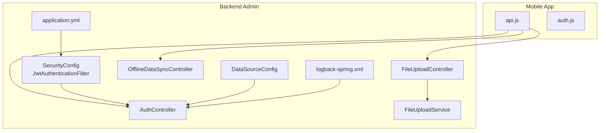
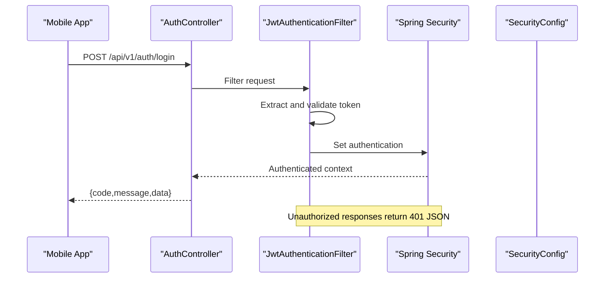
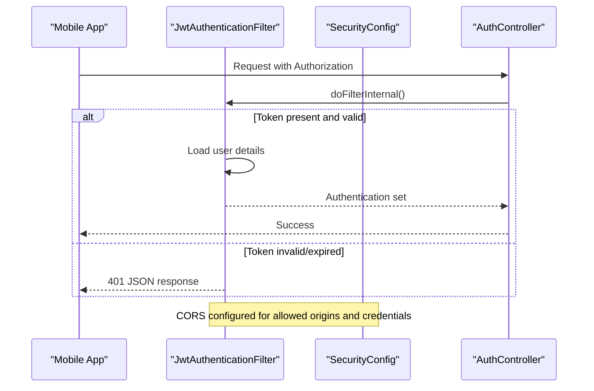
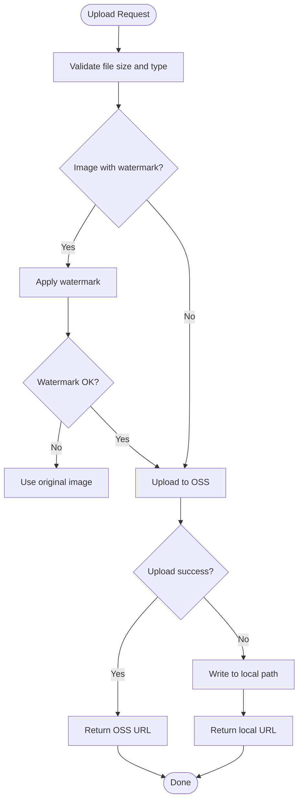
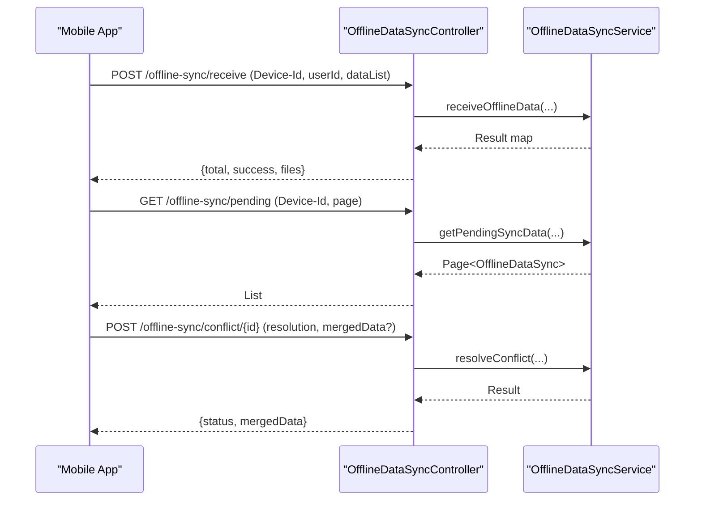
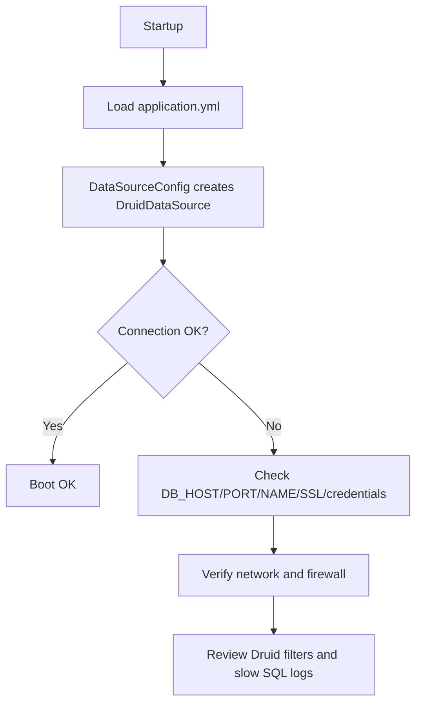
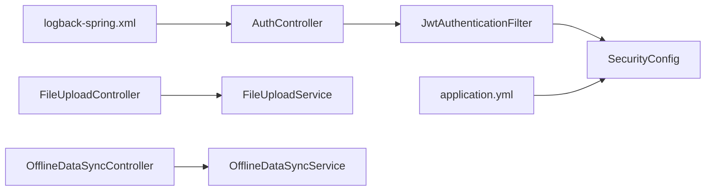

# Troubleshooting & FAQ

<cite>
**Referenced Files in This Document**
- [GlobalExceptionHandler.java](file://admin-backend/src/main/java/com/qhiot/survey/common/GlobalExceptionHandler.java)
- [BusinessException.java](file://admin-backend/src/main/java/com/qhiot/survey/common/BusinessException.java)
- [application.yml](file://admin-backend/src/main/resources/application.yml)
- [logback-spring.xml](file://admin-backend/src/main/resources/logback-spring.xml)
- [SecurityConfig.java](file://admin-backend/src/main/java/com/qhiot/survey/security/SecurityConfig.java)
- [JwtAuthenticationFilter.java](file://admin-backend/src/main/java/com/qhiot/survey/security/JwtAuthenticationFilter.java)
- [AuthController.java](file://admin-backend/src/main/java/com/qhiot/survey/controller/AuthController.java)
- [FileUploadController.java](file://admin-backend/src/main/java/com/qhiot/survey/controller/FileUploadController.java)
- [FileUploadService.java](file://admin-backend/src/main/java/com/qhiot/survey/service/FileUploadService.java)
- [DataSourceConfig.java](file://admin-backend/src/main/java/com/qhiot/survey/config/DataSourceConfig.java)
- [OfflineDataSyncController.java](file://admin-backend/src/main/java/com/qhiot/survey/controller/OfflineDataSyncController.java)
- [OfflineDataSyncService.java](file://admin-backend/src/main/java/com/qhiot/survey/service/OfflineDataSyncService.java)
- [api.js](file://mobile-app/src/utils/api.js)
- [auth.js](file://mobile-app/src/utils/auth.js)
- [HealthController.java](file://admin-backend/src/main/java/com/qhiot/survey/controller/HealthController.java)
- [05-database-indexes.sql](file://admin-backend/init-data/05-database-indexes.sql)
- [add-database-indexes.sql](file://admin-backend/add-database-indexes.sql)
</cite>

## Table of Contents
1. [Introduction](#introduction)
2. [Project Structure](#project-structure)
3. [Core Components](#core-components)
4. [Architecture Overview](#architecture-overview)
5. [Detailed Component Analysis](#detailed-component-analysis)
6. [Dependency Analysis](#dependency-analysis)
7. [Performance Considerations](#performance-considerations)
8. [Troubleshooting Guide](#troubleshooting-guide)
9. [Conclusion](#conclusion)
10. [Appendices](#appendices)

## Introduction
This document provides comprehensive troubleshooting and frequently asked questions for Survey-App. It focuses on diagnosing and resolving common issues across the backend, frontend, and mobile client, including database connectivity, authentication failures, file upload errors, and mobile synchronization. It also documents centralized exception handling, logging configuration, debugging techniques, performance tuning, network and CORS concerns, SSL considerations, monitoring and alerting, and security-related troubleshooting.

## Project Structure
Survey-App consists of:
- Backend admin service (Spring Boot): authentication, file upload, offline data sync, security, logging, and configuration.
- Frontend admin web (Vue): administrative UI.
- Mobile app (UniApp): field data collection and offline sync.
- Initialization and maintenance scripts for database optimization.

**Diagram sources**
- [SecurityConfig.java:39-98](file://admin-backend/src/main/java/com/qhiot/survey/security/SecurityConfig.java#L39-L98)
- [JwtAuthenticationFilter.java:44-81](file://admin-backend/src/main/java/com/qhiot/survey/security/JwtAuthenticationFilter.java#L44-L81)
- [AuthController.java:138-238](file://admin-backend/src/main/java/com/qhiot/survey/controller/AuthController.java#L138-L238)
- [FileUploadController.java:25-43](file://admin-backend/src/main/java/com/qhiot/survey/controller/FileUploadController.java#L25-L43)
- [FileUploadService.java:39-96](file://admin-backend/src/main/java/com/qhiot/survey/service/FileUploadService.java#L39-L96)
- [DataSourceConfig.java:13-17](file://admin-backend/src/main/java/com/qhiot/survey/config/DataSourceConfig.java#L13-L17)
- [logback-spring.xml:1-125](file://admin-backend/src/main/resources/logback-spring.xml#L1-L125)
- [application.yml:1-149](file://admin-backend/src/main/resources/application.yml#L1-L149)
- [api.js:76-101](file://mobile-app/src/utils/api.js#L76-L101)
- [auth.js:104-115](file://mobile-app/src/utils/auth.js#L104-L115)

**Section sources**
- [SecurityConfig.java:39-98](file://admin-backend/src/main/java/com/qhiot/survey/security/SecurityConfig.java#L39-L98)
- [JwtAuthenticationFilter.java:44-81](file://admin-backend/src/main/java/com/qhiot/survey/security/JwtAuthenticationFilter.java#L44-L81)
- [AuthController.java:138-238](file://admin-backend/src/main/java/com/qhiot/survey/controller/AuthController.java#L138-L238)
- [FileUploadController.java:25-43](file://admin-backend/src/main/java/com/qhiot/survey/controller/FileUploadController.java#L25-L43)
- [FileUploadService.java:39-96](file://admin-backend/src/main/java/com/qhiot/survey/service/FileUploadService.java#L39-L96)
- [DataSourceConfig.java:13-17](file://admin-backend/src/main/java/com/qhiot/survey/config/DataSourceConfig.java#L13-L17)
- [logback-spring.xml:1-125](file://admin-backend/src/main/resources/logback-spring.xml#L1-L125)
- [application.yml:1-149](file://admin-backend/src/main/resources/application.yml#L1-L149)
- [api.js:76-101](file://mobile-app/src/utils/api.js#L76-L101)
- [auth.js:104-115](file://mobile-app/src/utils/auth.js#L104-L115)

## Core Components
- Centralized exception handling: catches business exceptions, validation errors, missing parameters, unsupported methods, resource not found, access denied, and unknown exceptions, returning standardized Result payloads.
- Authentication and authorization: JWT-based stateless authentication with per-request filters, CORS configuration, and explicit handling of expired or invalid tokens.
- File upload: supports OSS-backed storage with fallback to local storage, with optional image watermarking.
- Offline data sync: endpoints for receiving, querying, syncing, conflict resolution, retry, and cleanup of offline records.
- Logging and observability: structured rolling logs, dedicated operation logs, async appenders, and health endpoints.

**Section sources**
- [GlobalExceptionHandler.java:25-102](file://admin-backend/src/main/java/com/qhiot/survey/common/GlobalExceptionHandler.java#L25-L102)
- [BusinessException.java:8-27](file://admin-backend/src/main/java/com/qhiot/survey/common/BusinessException.java#L8-L27)
- [SecurityConfig.java:39-98](file://admin-backend/src/main/java/com/qhiot/survey/security/SecurityConfig.java#L39-L98)
- [JwtAuthenticationFilter.java:44-81](file://admin-backend/src/main/java/com/qhiot/survey/security/JwtAuthenticationFilter.java#L44-L81)
- [FileUploadService.java:39-96](file://admin-backend/src/main/java/com/qhiot/survey/service/FileUploadService.java#L39-L96)
- [OfflineDataSyncController.java:26-93](file://admin-backend/src/main/java/com/qhiot/survey/controller/OfflineDataSyncController.java#L26-L93)
- [logback-spring.xml:85-122](file://admin-backend/src/main/resources/logback-spring.xml#L85-L122)
- [HealthController.java:44-59](file://admin-backend/src/main/java/com/qhiot/survey/controller/HealthController.java#L44-L59)

## Architecture Overview
The backend enforces stateless JWT authentication, applies CORS policies, and exposes REST endpoints. The mobile app communicates via HTTPS with Authorization headers and standardized JSON responses. Logs are captured to console and rolling files, with asynchronous operation logs.

**Diagram sources**
- [AuthController.java:138-238](file://admin-backend/src/main/java/com/qhiot/survey/controller/AuthController.java#L138-L238)
- [JwtAuthenticationFilter.java:44-81](file://admin-backend/src/main/java/com/qhiot/survey/security/JwtAuthenticationFilter.java#L44-L81)
- [SecurityConfig.java:39-61](file://admin-backend/src/main/java/com/qhiot/survey/security/SecurityConfig.java#L39-L61)

**Section sources**
- [AuthController.java:138-238](file://admin-backend/src/main/java/com/qhiot/survey/controller/AuthController.java#L138-L238)
- [JwtAuthenticationFilter.java:44-81](file://admin-backend/src/main/java/com/qhiot/survey/security/JwtAuthenticationFilter.java#L44-L81)
- [SecurityConfig.java:39-61](file://admin-backend/src/main/java/com/qhiot/survey/security/SecurityConfig.java#L39-L61)

## Detailed Component Analysis

### Authentication Troubleshooting
Common symptoms:
- 401 Unauthorized after login or token expiration.
- 403 Forbidden when accessing protected endpoints.
- Incorrect CORS behavior causing preflight failures.

Resolution steps:
- Verify Authorization header presence and Bearer token format.
- Confirm token validity and expiration; refresh tokens when needed.
- Check allowed origins and credentials policy in CORS configuration.
- Inspect security filter chain and permitted paths.

**Diagram sources**
- [JwtAuthenticationFilter.java:44-81](file://admin-backend/src/main/java/com/qhiot/survey/security/JwtAuthenticationFilter.java#L44-L81)
- [SecurityConfig.java:69-89](file://admin-backend/src/main/java/com/qhiot/survey/security/SecurityConfig.java#L69-L89)
- [AuthController.java:138-238](file://admin-backend/src/main/java/com/qhiot/survey/controller/AuthController.java#L138-L238)

**Section sources**
- [JwtAuthenticationFilter.java:44-81](file://admin-backend/src/main/java/com/qhiot/survey/security/JwtAuthenticationFilter.java#L44-L81)
- [SecurityConfig.java:69-89](file://admin-backend/src/main/java/com/qhiot/survey/security/SecurityConfig.java#L69-L89)
- [AuthController.java:138-238](file://admin-backend/src/main/java/com/qhiot/survey/controller/AuthController.java#L138-L238)

### File Upload Troubleshooting
Common symptoms:
- Upload fails with “upload failed” or exception messages.
- Mixed success/failure in bulk uploads.
- OSS availability issues leading to fallback behavior.

Resolution steps:
- Validate file size limits and multipart configuration.
- Confirm OSS credentials and bucket configuration; fallback to local storage is automatic.
- Check server logs for watermarking exceptions and storage paths.

**Diagram sources**
- [FileUploadService.java:52-96](file://admin-backend/src/main/java/com/qhiot/survey/service/FileUploadService.java#L52-L96)
- [FileUploadController.java:25-43](file://admin-backend/src/main/java/com/qhiot/survey/controller/FileUploadController.java#L25-L43)

**Section sources**
- [FileUploadService.java:39-96](file://admin-backend/src/main/java/com/qhiot/survey/service/FileUploadService.java#L39-L96)
- [FileUploadController.java:25-43](file://admin-backend/src/main/java/com/qhiot/survey/controller/FileUploadController.java#L25-L43)
- [application.yml:18-23](file://admin-backend/src/main/resources/application.yml#L18-L23)
- [application.yml:97-104](file://admin-backend/src/main/resources/application.yml#L97-L104)

### Offline Data Sync Troubleshooting
Common symptoms:
- Batch receive returns partial success.
- Pending sync pagination yields unexpected counts.
- Conflict resolution not applied or merged data ignored.

Resolution steps:
- Ensure Device-Id header is present for all offline endpoints.
- Use sync endpoints to mark records processed.
- Apply conflict resolution with supported strategies.
- Retry failed syncs and clean up old records periodically.

**Diagram sources**
- [OfflineDataSyncController.java:26-78](file://admin-backend/src/main/java/com/qhiot/survey/controller/OfflineDataSyncController.java#L26-L78)
- [OfflineDataSyncService.java:12-83](file://admin-backend/src/main/java/com/qhiot/survey/service/OfflineDataSyncService.java#L12-L83)

**Section sources**
- [OfflineDataSyncController.java:26-78](file://admin-backend/src/main/java/com/qhiot/survey/controller/OfflineDataSyncController.java#L26-L78)
- [OfflineDataSyncService.java:12-83](file://admin-backend/src/main/java/com/qhiot/survey/service/OfflineDataSyncService.java#L12-L83)

### Database Connectivity Troubleshooting
Common symptoms:
- Application startup fails due to datasource initialization.
- Runtime SQL errors or slow queries.
- Connection pool exhaustion or leaks.

Resolution steps:
- Verify JDBC URL, credentials, and SSL settings in environment variables.
- Confirm Druid pool settings and slow SQL thresholds.
- Check for connection leak detection and abandoned timeouts.
- Review logs for SQL exceptions and slow query warnings.

**Diagram sources**
- [DataSourceConfig.java:13-17](file://admin-backend/src/main/java/com/qhiot/survey/config/DataSourceConfig.java#L13-L17)
- [application.yml:24-44](file://admin-backend/src/main/resources/application.yml#L24-L44)

**Section sources**
- [DataSourceConfig.java:13-17](file://admin-backend/src/main/java/com/qhiot/survey/config/DataSourceConfig.java#L13-L17)
- [application.yml:24-44](file://admin-backend/src/main/resources/application.yml#L24-L44)
- [logback-spring.xml:109-115](file://admin-backend/src/main/resources/logback-spring.xml#L109-L115)

## Dependency Analysis
- Controllers depend on services and security filters.
- SecurityConfig defines CORS and filter order.
- FileUploadService depends on OSS client availability and local filesystem.
- OfflineDataSyncController delegates to OfflineDataSyncService.
- Logging configuration centralizes appenders and async operation logs.

**Diagram sources**
- [AuthController.java:138-238](file://admin-backend/src/main/java/com/qhiot/survey/controller/AuthController.java#L138-L238)
- [JwtAuthenticationFilter.java:44-81](file://admin-backend/src/main/java/com/qhiot/survey/security/JwtAuthenticationFilter.java#L44-L81)
- [SecurityConfig.java:39-98](file://admin-backend/src/main/java/com/qhiot/survey/security/SecurityConfig.java#L39-L98)
- [FileUploadController.java:25-43](file://admin-backend/src/main/java/com/qhiot/survey/controller/FileUploadController.java#L25-L43)
- [FileUploadService.java:39-96](file://admin-backend/src/main/java/com/qhiot/survey/service/FileUploadService.java#L39-L96)
- [OfflineDataSyncController.java:26-78](file://admin-backend/src/main/java/com/qhiot/survey/controller/OfflineDataSyncController.java#L26-L78)
- [OfflineDataSyncService.java:12-83](file://admin-backend/src/main/java/com/qhiot/survey/service/OfflineDataSyncService.java#L12-L83)
- [logback-spring.xml:85-122](file://admin-backend/src/main/resources/logback-spring.xml#L85-L122)
- [application.yml:135-149](file://admin-backend/src/main/resources/application.yml#L135-L149)

**Section sources**
- [AuthController.java:138-238](file://admin-backend/src/main/java/com/qhiot/survey/controller/AuthController.java#L138-L238)
- [JwtAuthenticationFilter.java:44-81](file://admin-backend/src/main/java/com/qhiot/survey/security/JwtAuthenticationFilter.java#L44-L81)
- [SecurityConfig.java:39-98](file://admin-backend/src/main/java/com/qhiot/survey/security/SecurityConfig.java#L39-L98)
- [FileUploadController.java:25-43](file://admin-backend/src/main/java/com/qhiot/survey/controller/FileUploadController.java#L25-L43)
- [FileUploadService.java:39-96](file://admin-backend/src/main/java/com/qhiot/survey/service/FileUploadService.java#L39-L96)
- [OfflineDataSyncController.java:26-78](file://admin-backend/src/main/java/com/qhiot/survey/controller/OfflineDataSyncController.java#L26-L78)
- [OfflineDataSyncService.java:12-83](file://admin-backend/src/main/java/com/qhiot/survey/service/OfflineDataSyncService.java#L12-L83)
- [logback-spring.xml:85-122](file://admin-backend/src/main/resources/logback-spring.xml#L85-L122)
- [application.yml:135-149](file://admin-backend/src/main/resources/application.yml#L135-L149)

## Performance Considerations
- Database queries: apply recommended indexes for list endpoints and frequent filters. Use EXPLAIN plans to validate index usage.
- API response times: reduce payload sizes, avoid N+1 queries, and leverage pagination.
- Memory usage: tune JVM heap and thread pools; monitor GC logs and container limits.
- Logging overhead: keep SQL logging at DEBUG only during diagnostics; rely on async appenders for operation logs.

Practical actions:
- Run the provided index creation scripts to add missing indexes.
- Monitor slow SQL via Druid filters and adjust thresholds.
- Enable profiling in development to identify hotspots.

**Section sources**
- [05-database-indexes.sql:1-99](file://admin-backend/init-data/05-database-indexes.sql#L1-L99)
- [add-database-indexes.sql:1-108](file://admin-backend/add-database-indexes.sql#L1-L108)
- [application.yml:39-44](file://admin-backend/src/main/resources/application.yml#L39-L44)
- [logback-spring.xml:77-83](file://admin-backend/src/main/resources/logback-spring.xml#L77-L83)

## Troubleshooting Guide

### Database Connectivity Problems
Symptoms:
- Startup failure with datasource errors.
- Runtime SQL exceptions or timeouts.

Checklist:
- Confirm DB_HOST, DB_PORT, DB_NAME, DB_USERNAME, DB_PASSWORD, DB_USE_SSL environment variables.
- Validate network reachability and SSL/TLS settings.
- Review Druid pool configuration and slow SQL logs.

**Section sources**
- [application.yml:24-44](file://admin-backend/src/main/resources/application.yml#L24-L44)
- [DataSourceConfig.java:13-17](file://admin-backend/src/main/java/com/qhiot/survey/config/DataSourceConfig.java#L13-L17)
- [logback-spring.xml:109-115](file://admin-backend/src/main/resources/logback-spring.xml#L109-L115)

### Authentication Failures
Symptoms:
- 401 Unauthorized after login.
- 403 Forbidden on protected endpoints.
- CORS preflight blocked.

Checklist:
- Ensure Authorization: Bearer <token> header is present.
- Verify token validity and expiration; refresh if needed.
- Confirm allowed origins and allowCredentials(true) compatibility.
- Check character encoding filter and session policy.

**Section sources**
- [JwtAuthenticationFilter.java:44-81](file://admin-backend/src/main/java/com/qhiot/survey/security/JwtAuthenticationFilter.java#L44-L81)
- [SecurityConfig.java:69-89](file://admin-backend/src/main/java/com/qhiot/survey/security/SecurityConfig.java#L69-L89)
- [AuthController.java:138-238](file://admin-backend/src/main/java/com/qhiot/survey/controller/AuthController.java#L138-L238)

### File Upload Errors
Symptoms:
- Upload returns “upload failed”.
- Mixed success/failure in bulk uploads.
- OSS unavailable causes fallback to local.

Checklist:
- Validate multipart limits and file types.
- Confirm OSS endpoint, access keys, and bucket name.
- Inspect logs for watermark exceptions and local path creation.

**Section sources**
- [FileUploadController.java:25-43](file://admin-backend/src/main/java/com/qhiot/survey/controller/FileUploadController.java#L25-L43)
- [FileUploadService.java:39-96](file://admin-backend/src/main/java/com/qhiot/survey/service/FileUploadService.java#L39-L96)
- [application.yml:97-104](file://admin-backend/src/main/resources/application.yml#L97-L104)

### Mobile Synchronization Issues
Symptoms:
- Offline data not received or partially processed.
- Pending sync counts incorrect.
- Conflict resolution not applied.

Checklist:
- Ensure Device-Id header is included in requests.
- Use sync endpoints to mark records processed.
- Apply conflict resolution with supported strategies.
- Retry failed syncs and clean up old records.

**Section sources**
- [OfflineDataSyncController.java:26-78](file://admin-backend/src/main/java/com/qhiot/survey/controller/OfflineDataSyncController.java#L26-L78)
- [OfflineDataSyncService.java:12-83](file://admin-backend/src/main/java/com/qhiot/survey/service/OfflineDataSyncService.java#L12-L83)

### Network Connectivity, SSL, and CORS
Symptoms:
- Mixed content or blocked requests.
- CORS preflight failures.
- Certificate errors in HTTPS.

Checklist:
- Configure allowed-origins and exposed headers in application.yml.
- Use allowedOriginPatterns when allowing credentials.
- Validate SSL certificates and serverTimezone settings.
- Ensure Content-Type and Authorization headers are set by the client.

**Section sources**
- [application.yml:135-137](file://admin-backend/src/main/resources/application.yml#L135-L137)
- [SecurityConfig.java:69-89](file://admin-backend/src/main/java/com/qhiot/survey/security/SecurityConfig.java#L69-L89)
- [api.js:24-38](file://mobile-app/src/utils/api.js#L24-L38)

### Logging Configuration and Debugging
Symptoms:
- Missing logs or insufficient detail.
- High disk usage from logs.

Checklist:
- Adjust root and logger levels in logback-spring.xml.
- Use async appenders for operation logs.
- Route SQL logs to DEBUG only during diagnostics.
- Tail logs and correlate timestamps with request IDs.

**Section sources**
- [logback-spring.xml:85-122](file://admin-backend/src/main/resources/logback-spring.xml#L85-L122)
- [application.yml:129-132](file://admin-backend/src/main/resources/application.yml#L129-L132)

### Monitoring and Alerting
Symptoms:
- No visibility into service health.
- No early warning on DB/Redis/Disk issues.

Checklist:
- Use health endpoints to confirm service readiness and liveness.
- Integrate with platform monitoring to track CPU/memory/network.
- Alert on elevated error rates, slow response times, and log spikes.

**Section sources**
- [HealthController.java:44-59](file://admin-backend/src/main/java/com/qhiot/survey/controller/HealthController.java#L44-L59)

### Security-Related Troubleshooting
Symptoms:
- Access denied errors.
- Authentication token issues (expired, invalid).
- Role/permission mismatches.

Checklist:
- Verify user roles and permissions are loaded correctly.
- Ensure tokens are refreshed before expiration.
- Confirm method-level security and permitted paths.

**Section sources**
- [AuthController.java:489-550](file://admin-backend/src/main/java/com/qhiot/survey/controller/AuthController.java#L489-L550)
- [JwtAuthenticationFilter.java:44-81](file://admin-backend/src/main/java/com/qhiot/survey/security/JwtAuthenticationFilter.java#L44-L81)
- [SecurityConfig.java:39-61](file://admin-backend/src/main/java/com/qhiot/survey/security/SecurityConfig.java#L39-L61)

## Conclusion
This guide consolidates actionable steps to troubleshoot Survey-App across authentication, file upload, offline synchronization, database connectivity, network/CORS, logging, performance, and security. Use the provided references to locate relevant configuration and code, and adopt the recommended practices for resilient operations and proactive monitoring.

## Appendices

### Centralized Exception Management
- Business exceptions are mapped to user-friendly messages with consistent Result payloads.
- Validation and binding errors are aggregated and returned with BAD_REQUEST.
- Unknown exceptions are logged and returned as generic internal errors in production.

**Section sources**
- [GlobalExceptionHandler.java:25-102](file://admin-backend/src/main/java/com/qhiot/survey/common/GlobalExceptionHandler.java#L25-L102)
- [BusinessException.java:8-27](file://admin-backend/src/main/java/com/qhiot/survey/common/BusinessException.java#L8-L27)

### Mobile Client Behavior
- Automatically attaches Authorization header and sets Content-Type.
- Handles 401 by clearing auth state and redirecting to login.
- Parses unified response format and extracts data field.

**Section sources**
- [api.js:24-71](file://mobile-app/src/utils/api.js#L24-L71)
- [auth.js:104-115](file://mobile-app/src/utils/auth.js#L104-L115)