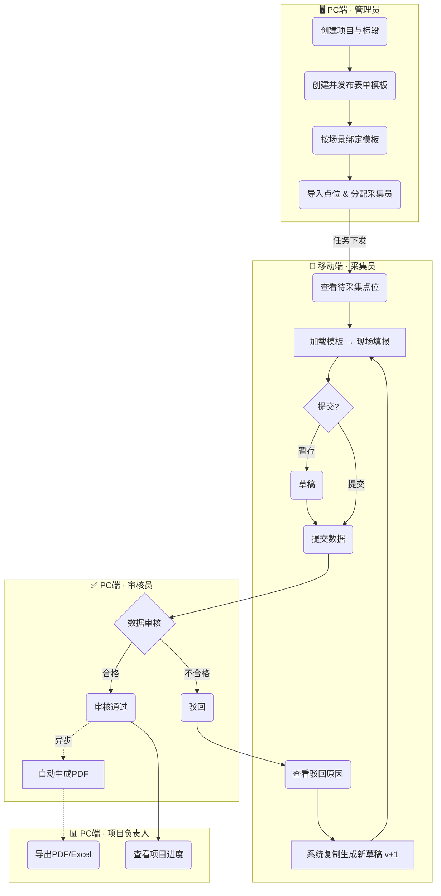
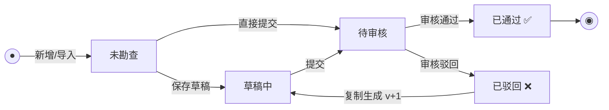
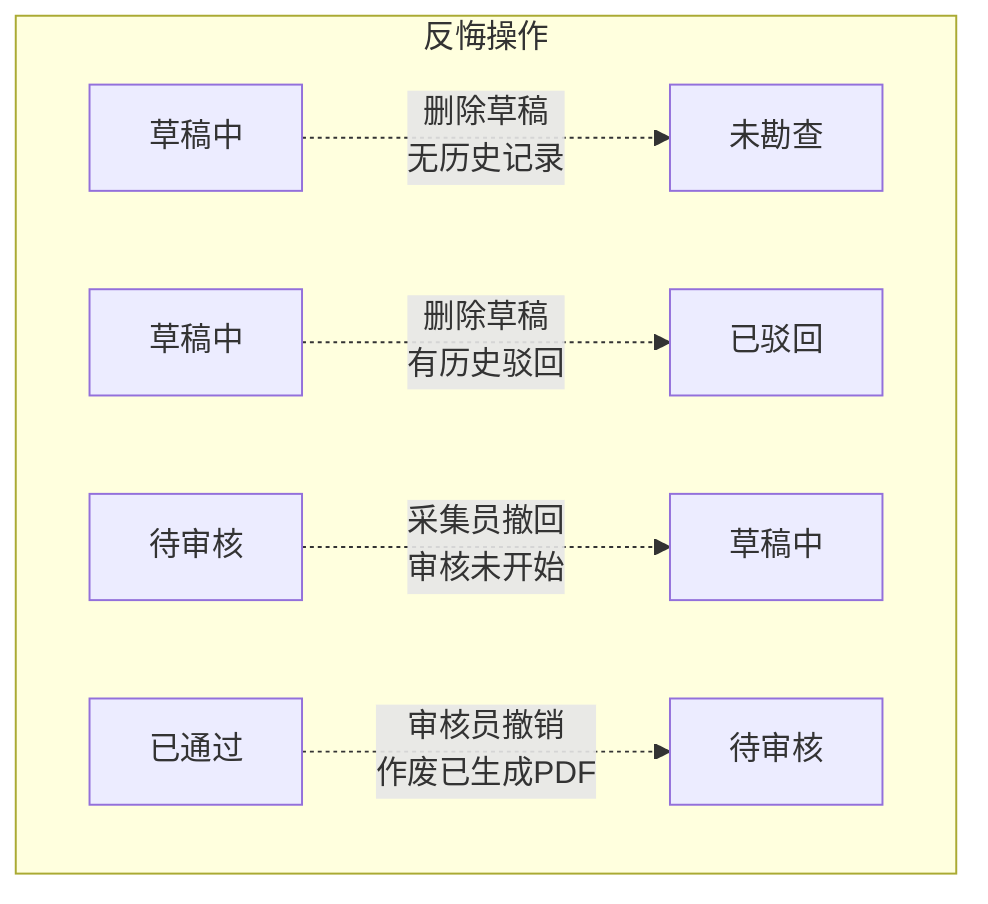
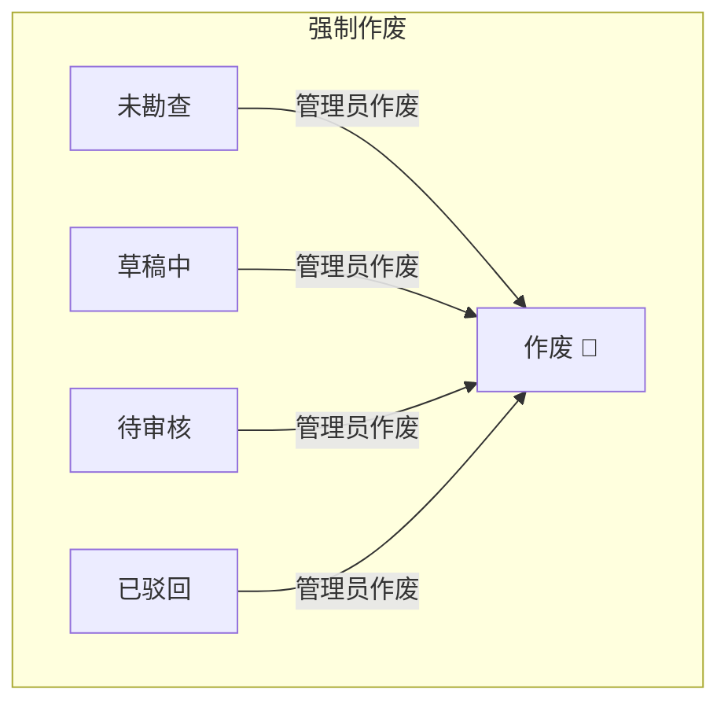
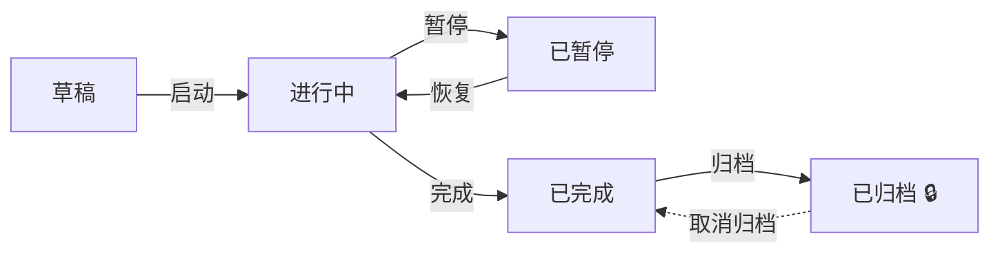

# 青泓勘察系统 - 业务流程与状态变更（终版）

---

## 1. 核心业务泳道图

---

## 2. 点位状态机

### 2.1 主流程（日常 95% 的场景）

### 2.2 边缘场景（反悔 + 作废）

> [!IMPORTANT]
> **已通过的点位不可直接作废**。如需纠错，须先由审核员「撤销通过」退回待审核，再走作废流程。

---

## 3. 用户故事：每条状态转换的真实场景

为了让评审团队快速理解每一条线"为什么存在"以及"什么时候会发生"，以下用具体的人物和场景来描述。

---

### 3.1 主流程用户故事

#### 📖 故事1：未勘查 → 草稿中（保存草稿）

> 采集员**张三**到达了深圳湾01号排口现场，打开手机 App 开始填写表单。填到一半突然下起大雨，拍照拍不清楚。张三点击「暂存」按钮，**数据保存为草稿**，等雨停了再继续。
>
> 📌 此时 01号排口 的状态从 `未勘查` 变为 `草稿中`。

#### 📖 故事2：未勘查 → 待审核（直接提交）

> 采集员**李四**到达了科技园02号排口，天气晴朗、信号良好。他一口气填完了所有字段、拍好了照片，直接点击「提交审核」。**数据跳过草稿阶段，直接提交**。
>
> 📌 此时 02号排口 的状态从 `未勘查` 直接变为 `待审核`。

#### 📖 故事3：草稿中 → 待审核（提交数据）

> 雨停了，张三打开之前暂存的01号排口草稿，补拍了清晰的照片，确认数据无误后点击「提交审核」。
>
> 📌 此时 01号排口 的状态从 `草稿中` 变为 `待审核`。

#### 📖 故事4：待审核 → 已通过（审核合格）

> 审核员**王工**在 PC 端打开审核中心，看到01号排口的提交数据。他逐项检查：坐标准确、照片清晰、表单完整。王工点击「通过」，系统记录审核人和通过时间，**后台自动开始生成该点位的 PDF 报告**。
>
> 📌 此时 01号排口 的状态从 `待审核` 变为 `已通过`。

#### 📖 故事5：待审核 → 已驳回（审核不合格）

> 王工继续审核02号排口，发现李四拍的照片里排口编号被树枝挡住了，无法辨认。王工点击「驳回」，并在必填的驳回原因框里写道：*"现场照片中排口编号被遮挡，请重新拍摄"*。
>
> 📌 此时 02号排口 的状态从 `待审核` 变为 `已驳回`。

#### 📖 故事6：已驳回 → 草稿中（系统生成新版本草稿）

> 李四在手机上收到通知："02号排口审核被驳回"。他点进去查看驳回原因，系统自动将上次提交的数据（v1）复制了一份，生成了新的草稿（v2）。李四只需要去现场重新拍一张照片，其他已填的数据都还在，不用重头再来。
>
> 📌 此时 02号排口 的状态从 `已驳回` 变为 `草稿中`（版本号从 v1 升级到 v2）。
> 📌 v1 的数据变为只读历史记录，永久保存用于审计追溯。

---

### 3.2 反悔操作用户故事

#### 📖 故事7：草稿中 → 未勘查（删除草稿，无历史记录）

> 新来的实习生**小刘**不小心点进了03号排口，手滑按了一下保存，产生了一条空白草稿。小刘发现后立刻点击「删除草稿」。由于这是03号排口**有史以来的第一条记录**，删除后状态恢复到最初的干净状态。
>
> 📌 此时 03号排口 的状态从 `草稿中` 退回 `未勘查`。就像什么都没发生过。

#### 📖 故事8：草稿中 → 已驳回（删除草稿，有历史驳回记录）

> 接故事6：李四看到02号排口被驳回后，系统自动生成了 v2 草稿。但今天李四请假了，不想带着一个未完成的草稿在列表里碍眼，于是他**删除了这个 v2 草稿**。
>
> 此时02号排口的状态不能回到 `未勘查`——因为历史上确实有一条 v1 被驳回的记录存在。状态应该退回到 `已驳回`，等李四哪天方便了，再重新生成草稿去现场补拍。
>
> 📌 此时 02号排口 的状态从 `草稿中` 退回 `已驳回`（而不是 `未勘查`）。

#### 📖 故事9：待审核 → 草稿中（采集员撤回提交）

> 张三提交了04号排口的数据后，突然发现把排口直径写成了"50cm"，实际应该是"500mm"。他赶紧打开 App，发现王工还没开始审核这条数据，于是点击「撤回」按钮。**数据从待审核退回草稿**，张三修改了直径后重新提交。
>
> 📌 此时 04号排口 的状态从 `待审核` 退回 `草稿中`。
> ⚠️ **前提条件**：审核员尚未开始审核。一旦审核员已打开/锁定该记录，则不可撤回。

#### 📖 故事10：已通过 → 待审核（审核员撤销通过）

> 周五下午5点半，审核员王工赶着下班，快速点了好几个「通过」。系统也已经为这些点位自动生成了 PDF 报告。
>
> 周一早上，王工仔细复查时发现：05号排口的 GPS 坐标明显偏移了500米，定位在了河对岸，昨天手滑点错了通过。王工点击「撤销通过」，系统**同时将已生成的那份错误 PDF 标记为作废**，05号排口退回待审核状态，王工可以重新审核并驳回。
>
> 📌 此时 05号排口 的状态从 `已通过` 退回 `待审核`，之前自动生成的 PDF 同步作废。

---

### 3.3 强制作废用户故事

#### 📖 故事11：任意未通过状态 → 作废（管理员强制终止）

> 项目经理**赵总**接到甲方通知：由于市政规划变更，06号排口已经被填平拆除，不再需要勘察。
>
> 此时06号排口可能处于任何状态——也许还没人去采（`未勘查`），也许张三存了个草稿（`草稿中`），也许李四已经提交了等着审（`待审核`），也许之前被驳回了（`已驳回`）。
>
> 无论处于哪个状态，赵总在 PC 后台点击「作废」按钮，06号排口立即变为 `作废` 终态。**此后任何人都无法再对该点位进行采集或审核操作。**
>
> 📌 作废是终态，不可逆。
> ⚠️ **已通过的点位不可直接作废**（因为已生成正式交付物）。如确需作废，须先由审核员撤销通过，再由管理员执行作废。

---

## 4. 项目状态流转

### 4.1 状态定义

| 值 | 状态 | 说明 | 可编辑？ | 可删除？ |
|:---:|:---|:---|:---:|:---:|
| 0 | 草稿 | 刚创建，配置阶段（标段/模板/点位/人员） | ✅ | ✅ |
| 1 | 进行中 | 外业采集中，采集员可操作 | ✅ | ❌ |
| 2 | 已暂停 | 暂停外业，采集员收到通知 | ✅ | ❌ |
| 3 | 已完成 | 全部点位完成，可导出交付物 | ⚠️ 受限 | ❌ |
| 4 | 已归档 | 正式归档锁定，只读 | ❌ | ❌ |

### 4.2 状态流转图

### 4.3 项目状态转换权限矩阵

| # | 转换 | 触发角色 | 前置条件 | 前端操作 |
|:---:|:---|:---|:---|:---|
| 1 | 草稿 → 进行中 | 管理员/项目负责人 | 无强制校验（建议检查标段/点位/采集员/模板） | 「启动项目」按钮 + 启动检查弹窗 |
| 2 | 进行中 → 已暂停 | 管理员/项目负责人 | 无 | 「暂停项目」按钮 + 确认弹窗 |
| 3 | 已暂停 → 进行中 | 管理员/项目负责人 | 无 | 「恢复项目」按钮（无确认） |
| 4 | 进行中 → 已完成 | 管理员/项目负责人 | 无强制校验（建议完成率100%） | 「完成项目」按钮 + 完成率确认弹窗 |
| 5 | 已完成 → 已归档 | 管理员 | 仅已完成状态可归档 | 「归档项目」按钮 + 只读警告弹窗 |
| 6 | 已归档 → 已完成 | 管理员 | 仅已归档状态可恢复 | 「取消归档」按钮 + 确认弹窗 |

### 4.4 启动检查清单（建议项，不强制阻止）

| 检查项 | 说明 |
|:---|:---|
| 已创建标段 | 项目下至少有一个标段 |
| 已导入点位 | 项目下至少有一个点位 |
| 已分配采集员 | 项目下至少有一名采集员 |
| 已配置模板 | 项目下至少绑定了一个模板 |

> [!NOTE]
> 归档是**项目级操作**，不是点位级。项目归档后，其下所有点位自动变为只读。
> 已归档项目可以取消归档恢复为「已完成」状态，操作会记录审计日志。

---

## 5. 状态转换权限矩阵

| # | 转换 | 触发角色 | 前置条件 | 对应故事 |
|:---:|:---|:---|:---|:---:|
| 1 | 未勘查 → 草稿中 | 采集员 | 点位已分配给该采集员 | 故事1 |
| 2 | 未勘查 → 待审核 | 采集员 | 填写完毕直接提交 | 故事2 |
| 3 | 草稿中 → 待审核 | 采集员 | 必填项校验通过 | 故事3 |
| 4 | 待审核 → 已通过 | 审核员 | 数据审核合格 | 故事4 |
| 5 | 待审核 → 已驳回 | 审核员 | 必填驳回原因 | 故事5 |
| 6 | 已驳回 → 草稿中 | 系统自动 | 复制旧版数据，版本号 +1 | 故事6 |
| 7 | 草稿中 → 未勘查 | 采集员 | 删除草稿，且无任何历史记录 | 故事7 |
| 8 | 草稿中 → 已驳回 | 采集员 | 删除草稿，但存在历史驳回记录 | 故事8 |
| 9 | 待审核 → 草稿中 | 采集员 | 审核员尚未开始审核 | 故事9 |
| 10 | 已通过 → 待审核 | 审核员 | 同时作废已生成的 PDF | 故事10 |
| 11 | 任意未通过 → 作废 | 管理员 | 点位尚未进入「已通过」 | 故事11 |

---

## 6. 设计要点

| 决策 | 理由 |
|:---|:---|
| 驳回后必须经过草稿 | PRD 要求复制生成新版本，确保采集员看到驳回原因 |
| 删除草稿按上下文回退 | 首次 → 未勘查；驳回后 → 已驳回，防止丢失审计链 |
| 归档是项目级操作 | 避免逐个点位手动归档，项目完结后统一锁定 |
| 已通过不可直接作废 | 已生成交付物(PDF)，如需纠错走撤销→重审流程 |
| 采集员撤回有时间窗口 | 审核员开始审核即锁定，防止数据被撤走 |
