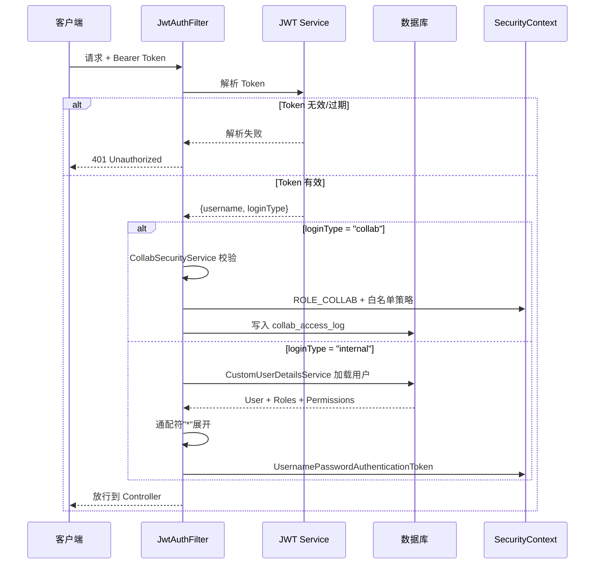

# 青泓项目勘察信息采集与审核系统 - 权限体系设计

## 版本信息

- 当前版本：V1.0
- 更新日期：2026-06-04
- 适用范围：PC 后台、移动采集端、第三方协作入口

---

## 1. 权限体系总览

系统采用 **RBAC（基于角色的访问控制）** 模型，结合 **前后端双重校验 + 数据级隔离 + 第三方白名单策略**，形成五层纵深防御体系：

```
┌─────────────────────────────────────────────────────────────────┐
│                    五层权限纵深防御体系                            │
├─────────────────────────────────────────────────────────────────┤
│                                                                 │
│   Layer 1  认证层    JWT 双通道（内部用户 / 协作令牌）              │
│              ↓                                                  │
│   Layer 2  路由层    前端路由守卫 + meta.roles 过滤               │
│              ↓                                                  │
│   Layer 3  接口层    @PreAuthorize 注解 + hasRole/hasAuthority   │
│              ↓                                                  │
│   Layer 4  数据层    project_member 项目隔离 + collab_entry 范围  │
│              ↓                                                  │
│   Layer 5  审计层    @OperationLog + collab_access_log 全留痕     │
│                                                                 │
└─────────────────────────────────────────────────────────────────┘
```

---

## 2. RBAC 数据模型

### 2.1 核心五表设计

```
                          sys_user_role
              ┌──────────────────────────────┐
              │  user_id (FK → sys_user.id)  │
  sys_user    │  role_id (FK → sys_role.id)  │    sys_role
  ┌────────┐  │  UNIQUE(user_id, role_id)    │    ┌───────────────────┐
  │ id      │──┼──────────────────────────────┼────│ id                │
  │ username│  └──────────────────────────────┘    │ role_code         │
  │ password│                                       │ role_name         │
  │ real_   │    sys_role_permission               │ permissions (JSON)│
  │  name   │  ┌──────────────────────────────┐    │ status            │
  │ phone   │  │  role_id (FK → sys_role.id)  │    │ sort              │
  │ status  │  │  perm_code                   │────│                   │
  └────────┘  │  UNIQUE(role_id, perm_code)   │    └───────────────────┘
              └──────────────┬───────────────┘
                             │
                    sys_permission
                    ┌───────────────────┐
                    │ id                │
                    │ perm_code (UNIQUE)│
                    │ perm_name         │
                    │ module            │
                    │ description       │
                    │ status            │
                    └───────────────────┘
```

### 2.2 角色定义

| 角色编码 | 角色名称 | 权限范围 | 使用场景 |
|---------|---------|---------|---------|
| `admin` | 超级管理员 | `*`（通配符，拥有全部权限） | 系统全局配置、用户/角色管理、所有项目 |
| `project_manager` | 项目负责人 | 项目管理 + 点位查看/编辑 + 模板绑定 + 项目导出 | 管理所属项目的配置、成员、进度 |
| `auditor` | 审核员 | 点位查看 + 审核查看/通过/驳回 + 审核导出 | 处理待审核记录、版本对比、生成 PDF |
| `surveyor` | 采集员 | 点位查看 + 勘查创建/编辑/提交 | 移动端采集、草稿管理、提交审核 |
| `collab` | 第三方协作 | 点位查看 + 勘查协助 | 受限协作入口，仅可查看授权点位并协助填报 |

### 2.3 权限码全量清单

#### 项目管理
| 权限码 | 名称 | 说明 |
|-------|------|------|
| `project:view` | 查看项目 | 项目列表、项目详情查看 |
| `project:edit` | 编辑项目 | 创建、修改、归档项目 |
| `template:bind` | 绑定模板 | 为项目/标段绑定模板版本 |

#### 点位管理
| 权限码 | 名称 | 说明 |
|-------|------|------|
| `point:view` | 查看点位 | 点位列表、地图视图、点位详情 |
| `point:edit` | 编辑点位 | 创建、导入、编辑、分配、作废点位 |

#### 勘查管理
| 权限码 | 名称 | 说明 |
|-------|------|------|
| `survey:create` | 创建勘查 | 开始新的勘查记录 |
| `survey:edit` | 编辑勘查 | 修改已有勘查草稿 |
| `survey:submit` | 提交勘查 | 提交勘查结果等待审核 |
| `survey:assist` | 协助勘查 | 第三方协助填报（受限于协作入口范围） |

#### 审核管理
| 权限码 | 名称 | 说明 |
|-------|------|------|
| `audit:view` | 查看审核 | 审核列表、审核详情、版本对比 |
| `audit:pass` | 审核通过 | 通过审核记录（含批量通过） |
| `audit:reject` | 审核驳回 | 驳回审核记录（须填写原因） |

#### 系统管理
| 权限码 | 名称 | 说明 |
|-------|------|------|
| `system:log` | 系统日志 | 查看操作日志、审计日志 |

#### 导出管理
| 权限码 | 名称 | 说明 |
|-------|------|------|
| `export:project` | 项目导出 | 导出项目数据（Excel/PDF/ZIP） |
| `export:audit` | 审核导出 | 导出审核记录与报告 |

### 2.4 角色-权限映射矩阵

| 权限码 | admin | project_manager | auditor | surveyor | collab |
|-------|:-----:|:---------------:|:-------:|:--------:|:------:|
| `project:view` | ✅ | ✅ | — | — | — |
| `project:edit` | ✅ | ✅ | — | — | — |
| `template:bind` | ✅ | ✅ | — | — | — |
| `point:view` | ✅ | ✅ | ✅ | ✅ | ✅ |
| `point:edit` | ✅ | ✅ | — | — | — |
| `survey:create` | ✅ | — | — | ✅ | — |
| `survey:edit` | ✅ | — | — | ✅ | — |
| `survey:submit` | ✅ | — | — | ✅ | — |
| `survey:assist` | ✅ | — | — | — | ✅ |
| `audit:view` | ✅ | — | ✅ | — | — |
| `audit:pass` | ✅ | — | ✅ | — | — |
| `audit:reject` | ✅ | — | ✅ | — | — |
| `system:log` | ✅ | — | — | — | — |
| `export:project` | ✅ | ✅ | — | — | — |
| `export:audit` | ✅ | — | ✅ | — | — |
| 用户管理 | ✅ | — | — | — | — |
| 角色管理 | ✅ | — | — | — | — |

---

## 3. 认证流程

### 3.1 JWT 双通道认证



### 3.2 登录流程

```
┌──────────┐    POST /auth/login     ┌──────────┐    BCrypt验证    ┌──────────┐
│  客户端   │ ──────────────────────> │ 后端服务  │ ─────────────> │ sys_user  │
│          │                         │          │                │           │
│          │    { token,             │          │   加载角色+权限  │           │
│          │     refreshToken,       │          │ <───────────── │ sys_role  │
│          │     expiresIn,          │          │                │           │
│          │     userInfo: {         │          │                └──────────┘
│          │       roles[],          │          │
│          │       permissions[]     │          │
│          │     }                   │          │
│          │ <────────────────────── │          │
└──────────┘                         └──────────┘
```

**关键安全机制：**
- 密码 BCrypt 加密存储，不可逆
- 账号锁定：5 次登录失败锁 30 分钟
- 图形验证码防暴力破解
- 首次登录强制修改密码
- 敏感角色变更后 Token 立即失效（需重新登录）

---

## 4. 授权机制

### 4.1 后端接口级授权

后端通过 Spring Security `@PreAuthorize` 注解实现方法级权限控制：

| 授权方式 | 语法 | 适用场景 |
|---------|------|---------|
| 单角色 | `@PreAuthorize("hasRole('ADMIN')")` | 仅管理员可访问 |
| 多角色 | `@PreAuthorize("hasAnyRole('ADMIN', 'AUDITOR')")` | 管理员或审核员可访问 |
| 权限码 | `@PreAuthorize("hasAuthority('system:log')")` | 按操作粒度控制 |

**各 Controller 权限分布：**

```
SysUserController     ─── hasRole('ADMIN')                    [10处]
SysRoleController     ─── hasRole('ADMIN')                    [ 6处]
ProjectController     ─── hasRole('ADMIN')                    [ 6处]
SurveyTemplateCtrl    ─── hasRole('ADMIN')                    [ 7处]
SurveyResultCtrl      ─── hasAnyRole('ADMIN','COLLECTOR',     [10处]
                                  'AUDITOR') + hasRole(...)
SysTaskController     ─── hasAnyRole('ADMIN',                 [ 5处]
                                  'PROJECT_MANAGER')
ProjectMemberCtrl     ─── hasRole('ADMIN')                    [ 4处]
OperationLogCtrl      ─── hasAuthority('system:log')          [ 6处]
LoginLogController    ─── hasRole('ADMIN')                    [ 2处]
SysDictController     ─── hasRole('ADMIN')                    [ 4处]
MessageCenterCtrl     ─── hasRole('ADMIN')                    [ 2处]
```

### 4.2 前端路由级授权

```
                      router.beforeEach
                            │
               ┌────────────┼────────────┐
               │            │            │
         未初始化路由    未登录访问    已登录正常
               │            │            │
         初始化常量路由   跳转/login    meta.roles 检查
          + 权限路由         │            │
               │            │     ┌──────┴──────┐
         重定向重试          │   有roles配置   无roles配置
                             │     │              │
                             │  角色命中?      所有人可访问
                             │   │     │
                             │  通过   不通过
                             │   │     │
                             │  放行   403
```

**路由角色配置示例（`generatedRoutes`）：**

```typescript
// 仅管理员可访问
{ name: 'system_user',  path: '/system/user',  meta: { roles: ['admin'] } }
{ name: 'system_role',  path: '/system/role',  meta: { roles: ['admin'] } }
{ name: 'template_list', path: '/template/list', meta: { roles: ['admin'] } }

// 管理员 + 审核员
{ name: 'audit_detail', path: '/audit/detail/:id', meta: { roles: ['admin', 'auditor'] } }

// 管理员 + 项目负责人
{ name: 'export_list',  path: '/export/list',  meta: { roles: ['admin', 'project_manager'] } }
```

### 4.3 前端 UI 级权限

**方式一：`hasPermission()` 函数（推荐）**

```html
<!-- 按钮控制 -->
<a-button v-if="hasPermission('user:create')" type="primary">
  新增用户
</a-button>

<!-- 表格操作列 -->
<a-button v-if="hasPermission('user:edit')" type="link">
  编辑
</a-button>
```

**方式二：`v-permission` 指令**

```html
<button v-permission="'user:create'">新增用户</button>
<button v-permission="['user:create', 'user:update']">操作</button>
<!-- 数组表示任一满足即可（OR 逻辑） -->
```

**权限 Hook 核心逻辑：**

```typescript
// useAuth() hook
function hasPermission(permission: string): boolean {
  if (!permission) return true;
  // admin / project_manager 自动放行所有权限
  if (roles.includes('admin') || roles.includes('project_manager')) return true;
  return permissions.includes(permission);
}
```

---

## 5. 数据级权限隔离

### 5.1 项目成员隔离

```
project_member 表结构：
┌────────────┬──────────┬──────────┬──────────┐
│ project_id │ user_id  │  role    │  status  │
├────────────┼──────────┼──────────┼──────────┤
│     1      │    2     │ surveyor │    1     │  ← 采集员隶属项目1
│     1      │    5     │ auditor  │    1     │  ← 审核员隶属项目1
│     2      │    3     │ surveyor │    1     │  ← 采集员隶属项目2
│     2      │    5     │ auditor  │    0     │  ← 禁用（不可访问项目2）
└────────────┴──────────┴──────────┴──────────┘
```

项目内角色：
- `admin`：项目经理（可管理项目配置）
- `collector`：采集员（可查看分配的采集任务）
- `auditor`：审核员（可审核本项目点位）
- `viewer`：查看者（只读查看）

### 5.2 第三方协作隔离

第三方通过 `collab_entry` 入口访问，具有严格的数据范围限制：

```
collab_entry 授权范围：
┌──────────────────────────────────────────────────┐
│  project_ids: [1, 2]     ← 仅可访问指定项目      │
│  point_ids: [101, 102]   ← 仅可访问指定点位      │
│  permissions: ['survey:assist']  ← 仅可协助填报  │
│  expire_time: 2026-06-07  ← 72小时默认有效期     │
└──────────────────────────────────────────────────┘
```

**第三方安全策略（CollabSecurityService）：**

```
请求进入
    │
    ├── 黑名单拦截 ── 直接拒绝 ──▶ 以下路径不可访问：
    │   - DELETE 所有请求         /api/v1/audit/pass|reject
    │   - POST 写入操作            /api/v1/export/*
    │   - 系统管理接口             /api/v1/user|role|dict|log|collab/*
    │
    └── 白名单放行 ── 仅允许 GET ──▶ 以下路径可访问：
        - /api/v1/point/*           （查看授权点位）
        - /api/v1/result/*          （查看勘查结果）
        - /api/v1/template/*        （查看模板）
        - /api/v1/project/*         （查看授权项目）
        - /api/v1/section/*         （查看标段）
        - /api/v1/file/*            （查看文件）
        - /api/v1/health/*          （健康检查）
```

---

## 6. 权限码注册与同步机制

### 6.1 自动注册流程

```
应用启动
    │
    ▼
PermissionRegistry (BeanPostProcessor)
    │  扫描所有 @RestController
    │  提取 @PreAuthorize 中的 hasAuthority/hasAnyAuthority
    │  注册到全局 ALL_PERMISSIONS 集合
    │
    ▼
PermissionInitializer (ApplicationReadyEvent)
    │  对比 ALL_PERMISSIONS 与 sys_permission 表
    │
    ├── 新增权限码 ──▶ INSERT INTO sys_permission
    ├── 废弃权限码 ──▶ UPDATE sys_permission SET status = 0
    └── 已有权限码 ──▶ 跳过
```

### 6.2 通配符机制

角色 `permissions` 字段包含 `*` 时，自动展开为所有已注册权限码：

```java
// PermissionRegistry.expandWildcard()
if (rawPermissions.contains("*")) {
    return new HashSet<>(ALL_PERMISSIONS); // 拥有所有权限
}
```

当前仅 `admin` 角色使用 `*` 通配符。

### 6.3 权限码双写机制

角色权限同时存储在两部分，保持数据一致性：

```
角色权限变更
    │
    ├──▶ sys_role.permissions (JSON 字符串，向后兼容)
    │    如: '["project:view","point:view"]'
    │
    └──▶ sys_role_permission (关联表，便于查询)
         如: (role_id=1, perm_code='project:view')
             (role_id=1, perm_code='point:view')
```

---

## 7. 完整权限校验流程图

```mermaid
flowchart TD
    A[用户发起请求] --> B{JWT Token 有效?}
    B -->|无效/过期| C[401 未授权]
    B -->|有效| D{Token 类型?}

    D -->|internal| E[加载 UserDetails]
    D -->|collab| F[CollabSecurityService]

    E --> G[获取角色 + 权限码]
    G --> H{permissions 含 *?}
    H -->|是| I[展开为全部权限码]
    H -->|否| J[使用原始权限码]
    I --> K[设置 SecurityContext]
    J --> K

    F --> L{请求路径在黑名单?}
    L -->|是| M[403 禁止访问 + 记录日志]
    L -->|否| N{请求方法为 GET?}
    N -->|否| M
    N -->|是| O[设置 ROLE_COLLAB + 记录日志]

    K --> P[@PreAuthorize 校验]
    O --> P

    P --> Q{角色/权限匹配?}
    Q -->|不匹配| R[403 禁止访问]
    Q -->|匹配| S[进入 Controller]

    S --> T{数据级权限?}
    T -->|是| U[project_member / collab_entry 过滤]
    T -->|否| V[返回数据]
    U --> V

    S --> W{@OperationLog 注解?}
    W -->|是| X[异步写入操作日志]
    W -->|否| V
    X --> V
```

---

## 8. Token 生命周期管理

### 8.1 Token 刷新机制

```
Token 即将过期
    │
    ▼
请求失败 (后端返回过期码)
    │
    ▼
前端拦截器捕获 (handleExpiredRequest)
    │
    ▼
使用 refreshToken 请求 /auth/refresh
    │
    ├── 刷新成功 ──▶ 更新 localStorage token
    │               └──▶ 重试原请求
    │
    └── 刷新失败 ──▶ 清除所有认证状态
                    └──▶ 跳转登录页
```

### 8.2 Token 安全策略

| 策略 | 说明 |
|------|------|
| 短期有效期 | accessToken 短时效（默认 2 小时） |
| 刷新 Token | refreshToken 用于无感续期 |
| 角色变更即时失效 | 角色修改后，用户下次请求 Token 失效 |
| 账号禁用即时生效 | 禁用账号的 Token 立即失效 |
| 并发刷新防护 | 前端互斥锁机制，防止并发刷新 Token |
| 协作入口过期 | 默认 72 小时，到期自动失效 |

---

## 9. 操作审计日志

### 9.1 日志覆盖范围

| 日志类型 | 记录内容 | 风险等级 | 存储位置 |
|---------|---------|---------|---------|
| 登录日志 | 登录/登出、IP、设备、成功/失败 | 中 | operation_log |
| 审核日志 | 通过/驳回、审核人、时间、原因 | 高 | operation_log |
| 导出日志 | 导出类型、范围、格式、文件大小 | 高 | operation_log |
| 权限变更 | 角色分配/移除、权限修改 | 高 | operation_log |
| 协作访问 | 第三方每次请求（路径、IP、时间） | 高 | collab_access_log |
| 风控拦截 | 越权访问、异常请求 | 高 | operation_log |
| 纠偏操作 | 坐标修改前后值、修改人 | 中 | location_correction_log |
| 配置变更 | 系统参数修改、字典变更 | 中 | operation_log |

### 9.2 日志记录机制

```java
// 使用 @OperationLog 注解标记需要审计的方法
@OperationLog(module = "审核管理", type = "审核通过", riskLevel = "高")
@PostMapping("/pass")
@PreAuthorize("hasAnyRole('ADMIN', 'AUDITOR')")
public Result pass(@RequestBody AuditPassDTO dto) {
    // 业务逻辑...
}

// OperationLogAspect 切面异步记录
// 自动提取：用户ID、用户名、IP地址、操作时间、模块、类型、风险等级
```

---

## 10. 前后端权限对接

### 10.1 登录响应数据结构

```json
{
  "code": 0,
  "data": {
    "token": "eyJhbGciOi...",
    "refreshToken": "eyJhbGciOi...",
    "expiresIn": 7200,
    "userInfo": {
      "userId": "1",
      "userName": "admin",
      "realName": "系统管理员",
      "roles": ["admin"],
      "permissions": [
        "project:view", "project:edit",
        "point:view", "point:edit",
        "template:bind",
        "survey:create", "survey:edit", "survey:submit", "survey:assist",
        "audit:view", "audit:pass", "audit:reject",
        "system:log",
        "export:project", "export:audit"
      ]
    }
  }
}
```

### 10.2 前端权限常量定义

```typescript
// src/constants/permission.ts - 与后端 Permissions.java 保持一致
export const PERMISSION = {
  PROJECT_VIEW: 'project:view',
  PROJECT_EDIT: 'project:edit',
  TEMPLATE_BIND: 'template:bind',
  POINT_VIEW: 'point:view',
  POINT_EDIT: 'point:edit',
  SURVEY_CREATE: 'survey:create',
  SURVEY_EDIT: 'survey:edit',
  SURVEY_SUBMIT: 'survey:submit',
  SURVEY_ASSIST: 'survey:assist',
  AUDIT_VIEW: 'audit:view',
  AUDIT_PASS: 'audit:pass',
  AUDIT_REJECT: 'audit:reject',
  SYSTEM_LOG: 'system:log',
  EXPORT_PROJECT: 'export:project',
  EXPORT_AUDIT: 'export:audit',
} as const;
```

---

## 11. 安全加固要点

| 层面 | 措施 | 状态 |
|------|------|:----:|
| 传输安全 | 全站 HTTPS | ✅ |
| 密码存储 | BCrypt 加密，不可逆 | ✅ |
| 防暴力破解 | 5 次失败锁 30 分钟 + 图形验证码 | ✅ |
| Token 安全 | JWT 双类型 Token + 短期有效 + 刷新机制 | ✅ |
| 接口鉴权 | 所有业务接口（除白名单）均需认证 | ✅ |
| 越权防护 | 前后端双重校验 + 第三方黑名单策略 | ✅ |
| 数据隔离 | 项目成员范围 + 协作入口范围 | ✅ |
| 操作留痕 | @OperationLog 全覆盖 + 协作访问逐条记录 | ✅ |
| 并发控制 | 数据版本号校验，乐观锁防冲突 | ✅ |
| SaaS 预留 | 数据库、实体、接口预留 tenant_id | 🔜 |
| 部门级数据隔离 | 暂无 sys_dept/sys_org 表 | ❌ |

---

## 12. 扩展建议

### 12.1 短期优化
- 实现部门/组织架构树级联权限（`sys_dept` 表 + 数据权限注解）
- 增加按钮级权限码自动注册到权限目录
- 前端路由从后端动态加载（当前已预留 `dynamic` 模式配置）

### 12.2 中期优化
- 多租户数据隔离（tenant_id 已预留字段）
- 权限变更实时推送（WebSocket 通知前端刷新权限）
- 基于 IP 的地理位置异常登录检测

### 12.3 长期优化
- 基于属性的访问控制（ABAC），支持动态策略引擎
- 权限审批工作流（高危权限需二次审批）
- 统一权限中心（支持微服务间权限同步）
